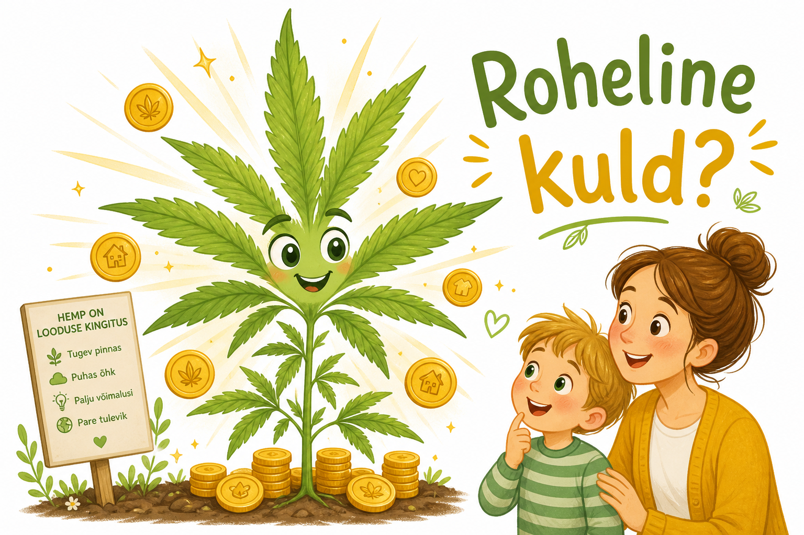
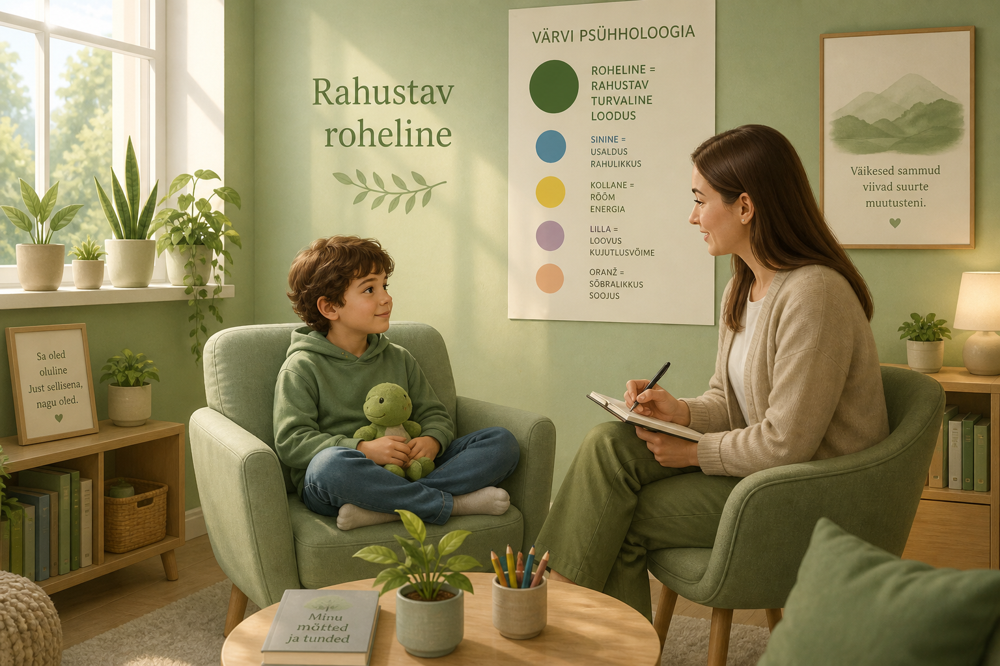
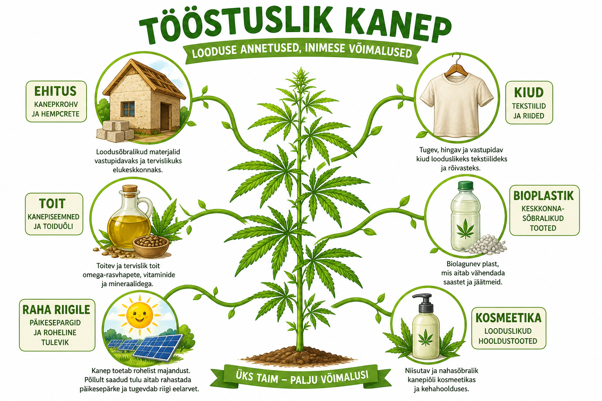
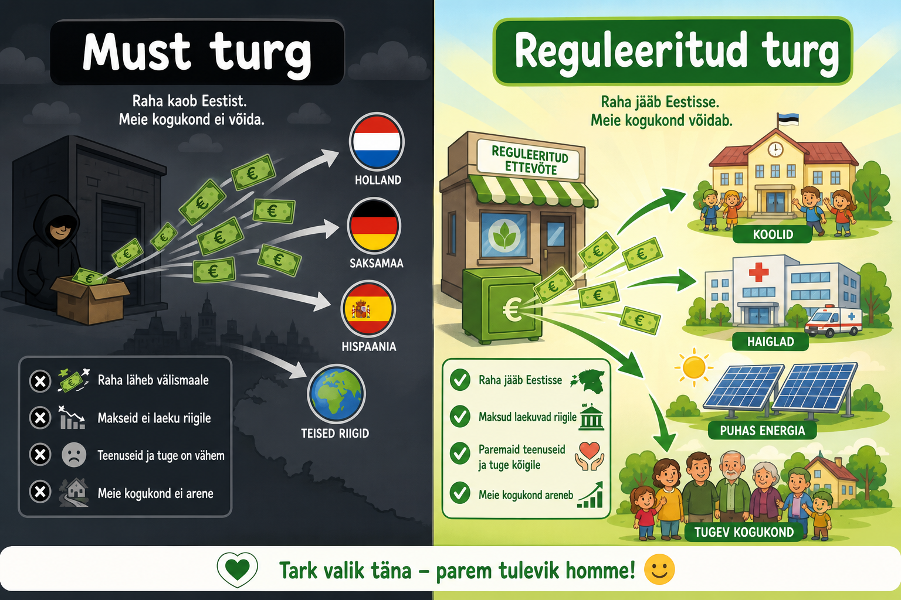
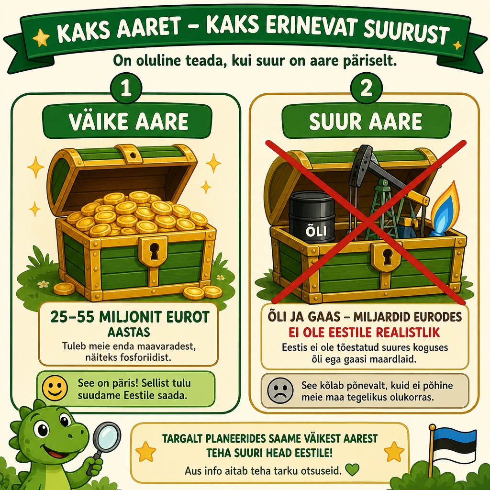
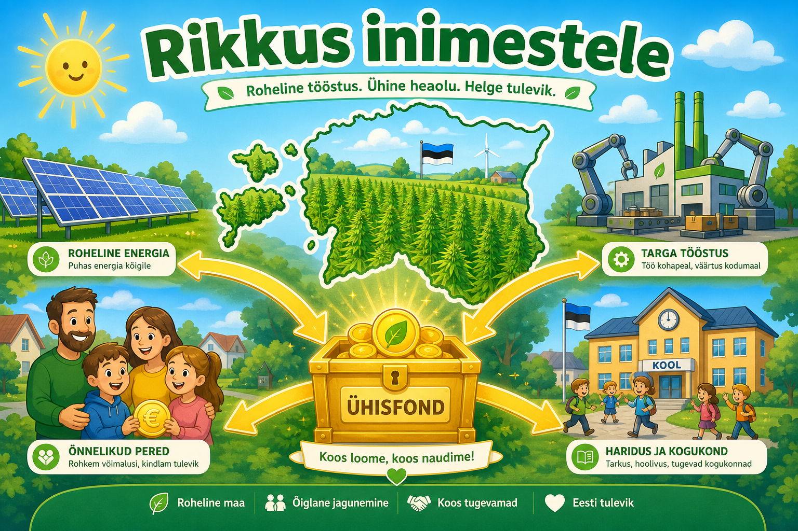
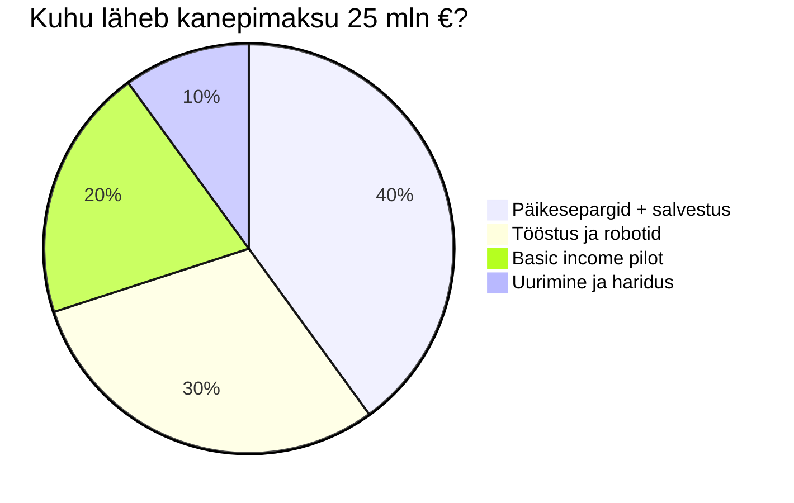

# 🌿 Roheline kuld — kanep Eestis
### Koolikraamatu stiilis raport kõigile (ka lastele!)

> *"Takistus on tee."* — Kui midagi on keeruline, võib see olla just see, mis meid edasi viib.

---

## 📖 Mis see raport on?

See on **aus lugu** kanepist Eestis — ilma hirmuta, ilma reklaamita, ilma valetamata.

- **Lapsele:** lihtsad kastid 🟢
- **Täiskasvanule:** numbrid ja strateegiad 📊
- **Kõigile:** pildid ja joonised, et näha, mis on **reaalsus**

---

## 🖼️ Pilt 1 — Kas kanep on roheline kuld?



### 👶 Lapsele selgitatud

Kujuta ette, et sul on aias taim, mis kasvab **väga kiiresti**, ei vaja palju kemikaale ja temast saab teha **palju erinevaid asju**: riiet, maja seinu, õli, kreemi.

Kui keegi ütleb *"see on roheline kuld"*, siis ta mõtleb:
> 🌱 Roheline = loodus, kasv, tervis  
> 🪙 Kuld = väärtus, raha, rikkus

**Aga!** See ei tähenda, et homme hommikul leiame maa alt kullakaevu. See tähendab, et **taim võib olla väga kasulik** — nagu õunapuu, mis annab nii toitu kui ka puid.

### ✅ Kas "roheline kuld" vastab tõele?

| Küsimus | Vastus |
|---------|--------|
| Kas kanep on väärtuslik? | **JAH** — eriti tööstuskanep (kiud, ehitus, toit, kosmeetika) |
| Kas see on päris kuld? | **EI** — see on kujund, metafoor |
| Kas Eestis kasvab see hästi? | **JAH** — Eesti on Euroopas kanepi kasvatamise tipus |
| Kas see teeb meid üleöö rikkaks? | **EI** — aga see võib tuua **miljoneid eurosid aastas** riigikassasse |
| Kas see on "roheline"? | **JAH** — keskkonna mõttes on kanep üks vähem saastavaid taimi |

### 🎯 Aus kokkuvõte

> **"Roheline kuld" on pooltõde, mis on kasulik metafoor.**
> Tõde on see: kanep on **roheline ressurss**, mis võib tuua **rohelist raha** — kui me seda targalt kasutame.

See ei ole maagia. See on **töö, reeglid ja nutikas majandus**.

---

## 🎨 Roheline värv — miks haiglad seda kasutavad?



### 👶 Lapsele selgitatud

Kas sa oled märganud, et mõned toad on **rohelised või rohelisega**? Arstid ja psühholoogid teavad:

| Värv | Tunne |
|------|-------|
| 🔴 Punane | kiire, elevil, hoiatus |
| 🔵 Sinine | rahulik, külm |
| 🟢 **Roheline** | **turvaline, loodus, hingamine, rahu** |
| ⚪ Valge | puhas, lihtne |

Roheline meenutab meile **metsa, muru, aeda**. Kui inimene on stressis, aitab roheline värv **rahuneda**.

See **ei ole** kanepi reklaam. See on **värvipsühholoogia** — teadus sellest, kuidas värvid meid mõjutavad.

### 🏥 Mida haiglad tegelikult teevad?

- Vaimse tervise kabinettides kasutatakse **pehmeid rohelisi toone**
- Lastehaiglad panevad seinale **loomade ja looduse pilte**
- Taastusravi ruumides on **taimed ja looduslik valgus**

**Tähtis eristada:**
- 🟢 Roheline **värv** = rahustav keskkond (teaduslikult tõestatud)
- 🌿 Kanep **taime meditsiiniline kasutus** = eraldi teema, vajab arsti ja reegleid
- 🚫 Lapsed ei tohi **ei kanepit ega muid uimasteid** kasutada — nende aju areneb

---

## 🌱 Mis on kanep tegelikult?

```
        🌿 KANEP (Cannabis)
              │
    ┌─────────┼─────────┐
    │         │         │
 TÖÖSTUS   MEDITSIIN  TÄISKASVANUTE
 kanep     (retseptiga)  turg
    │         │         (reguleeritud)
    ▼         ▼              ▼
  LEGAALNE  OSALISELT    EESTIS PRAEGU
  TÄNA      LEGAALNE     EBASEADUSLIK
```

### 👶 Lapsele: kolm erinevat asja

1. **Tööstuskanep** 🏭 — nagu lina või kanepikiust riie. **Lubatud.**
2. **Ravikanep** 💊 — arst kirjutab retsepti. **Mõnes riigis lubatud.**
3. **Täiskasvanute kanep** 🔞 — nagu alkohol, ainult täiskasvanutele. **Eestis praegu keelatud.**

Meie raport räägib peamiselt **tööstuskanepist** ja sellest, miks **maksud ja reeglid** on targem kui must turg.

---

## 🖼️ Pilt 2 — Millest kanepist saab teha?



| Mida saab? | Näide | Kas laps võib? |
|------------|-------|----------------|
| **Kiud** | T-särk, kott, auto osad | ✅ Jah — tavaline riie |
| **Ehitus** | Hampcrete sein (soe maja) | ✅ Jah — see on betooni asemel |
| **Seemned** | Õli, valgupulber | ✅ Jah — toidupoes müüakse |
| **Kosmeetika** | Kreem, seep (CBD) | ✅ Jah — ema/isal kapis |
| **Ravim** | Valu, epilepsia (arsti järelvalve) | ⚕️ Ainult arst otsustab |
| **Täiskasvanute toode** | — | 🔞 Ei — ainult 18+ riikides |

---

## 💰 Kuhu raha praegu läheb?



### 👶 Lapsele selgitatud

Kujuta ette mündi viskamist:

```
  SINA annad 15 €
        │
        ▼
  ┌─────────────┐
  │  MUST TURG  │  → raha kaob ära
  └─────────────┘     (keegi teine rikas saab)
        │
        ▼
  ❌ Kool ei saa
  ❌ Haigla ei saa  
  ❌ Päikesepark ei saa
  ❌ Politsei kulutab aega jälitamiseks
```

Kui sama asi oleks **reguleeritud** (nagu pood, kus on arved):

```
  SINA annad 15 €
        │
        ▼
  ┌──────────────────┐
  │ REGULEERITUD POOD │
  └──────────────────┘
        │
   ┌────┼────┬────────┐
   ▼    ▼    ▼        ▼
  📚   🏥   ☀️       🤖
 Kool Haigla Päike   Robotid
```

### 🔢 Sinu reaalsus numbrites

Sa maksad: **15 € / 1,33 g** = **~11,28 € grammi kohta**

| Kui palju ostad | Aasta kulutus | Riigile (reguleeritud turul ~20%) |
|-----------------|---------------|-----------------------------------|
| 1× kuus | ~180 € | ~36 € |
| 1× nädalas | ~720 € | ~144 € |
| 25 000 inimest × 2g/kuu | ~6,8 mln € turul | **~1,4 mln €/a** ainult sellest grupist |

Korruta see kümnete tuhandete inimeste ja tööstuse peale → **miljonid eurod aastas**.

---

## 🖼️ Pilt 3 — Kui suur see "aare" on?



### 👶 Lapsele selgitatud

See on nagu **kooli mündi kogumine**:

- 🪙 **Väike salv** = 25–55 miljonit eurot aastas (kanepitööstus + maksud)
- 🏦 **Suur pank** = nafta ja gaas (Eestil seda pole)

Me ei valetame: kanep **ei tee Eestist Kuveiti**.  
Aga see **võib osta**:
- mitu päikeseparki ☀️
- tuhandeid töökohti 👷
- robotite pilootprojekte 🤖
- basic income katset 10 000 inimesele 💶

### 📊 Kolm stsenaariumi (täiskasvanutele)

| Stsenaarium | Aasta turumaht | Riigile kokku |
|-------------|----------------|---------------|
| 🟡 Väike | 15–25 mln € | 8–15 mln € |
| 🟢 Realistlik | 30–50 mln € | 20–35 mln € |
| 🟢🟢 Suur | 60–90 mln € | 40–55 mln € |

*Riigile = maksud + säästud (politsei, kohtud)*

---

## 🖼️ Pilt 4 — Rikkus inimestele



### "Eesti Tuleviku Fond" — kuidas jagada?



#### 📊 Finantsstrateegia: Ray Dalio põhimõte (Tony Robbins *All Seasons*)

Investeerimisguru **Ray Dalio** (Bridgewater) — ja **Tony Robbins**, kes seda eesti lugejale tutvustas — ütleb:

> *Leia **15–20 mitte-korrelatsioonset** varaklassi ja investeeri neisse. Kui üks langeb, teised ei kukuvad koos.*

Eesti mudelis see tähendab: **ära pane kogu kanepimaksu ühte asja** (ainult growshop või ainult päike). Jaota **18 erinevat tuluvoogu** — energia, tootmine, maaelu, haridus, sotsiaal, teadus, kriisivarud — nii et üks poliitiline või majanduslik kriis ei võtab kõike ära.

| Macro-kott | % | Näide voogudest (mitte-korrelatsioon) |
|------------|---|--------------------------------------|
| Päike + salvestus | 40% | Elekter ≠ börs, ≠ tarbimine |
| Tööstus + robotid | 30% | Liising, eksport, growshop, hampcrete |
| Basic income | 20% | Sotsiaal ≠ tootmine |
| Haridus + uurimus | 10% | Inimkapital, patendid |

Täpne 18-voogude tabel: `riiklik-kanepiettevotte-mudel.md` §2.1 · Excel: `Finantsstrateegia` leht.

### 👶 Lapsele

Kui riik saab raha, siis targad inimesed otsustavad:
- osa paneb **päikeseenergiasse** (et elekter oleks odavam)
- osa **töökohtadesse** (et ema ja isa saaksid palka)
- osa **inimestele otse** (väike tugi neile, kellel on raske)

See on nagu **kooli kook**, mida jagatakse — aga kõigepealt ostetakse ahju ja õpetaja palgatakse, siis alles jagatakse tükke.

---

## 🛤️ "Obstacle Is The Way" — takistus on tee

### Joonis: kuidas takistused saavad plaaniks

```
    TAKISTUS                    TEE EDASI
    ────────                    ──────────

  EL keelab CBD toidu    →    Tööstuskanep + kosmeetika + eksport
  Must turg eksisteerib  →    Maksud + kvaliteedikontroll
  Poliitika on kuum      →    "Tööstusstrateegia", mitte "lubame narko"
  Maapiirkond tühene     →    Farmid + tööstus + töökohad
  Energia kallis         →    Päikesepargid kanepimaksust
```

### Nelja sammu plaan

| Aeg | Mida teeme | Miks |
|-----|------------|------|
| **Kohe** | Tööstuskanepi klaster (Jõgeva, Tartu) | Juba legaalne ✅ |
| **6 kuud** | Uuring + numbrid | Poliitikud vajavad fakte |
| **12 kuud** | Piloot: kiud + eksport | Raha sisse, töökohad |
| **2–3 aastat** | Reguleeritud täiskasvanute turg | Must turg väheneb, maksud tulevad |

---

## 🧠 Vaimne tervis — ausalt ja täpselt

### Mis on tõsi?

| Väide | Tõde? |
|-------|-------|
| Roheline värv rahustab | ✅ **JAH** — haiglad kasutavad seda tahtlikult |
| Loodus ja taimed aitavad stressis | ✅ **JAH** — jalutuskäigud metsas aitavad |
| Kanep "ravib kõike" | ❌ **EI** — see on liialdus |
| Kanep võib aidata mõnel haigusel | ⚠️ **OSALISELT** — vajab arsti, uuringuid, reegleid |
| Laste aju on kanepile haavatav | ✅ **JAH** — alla 25-aastastel on risk suurem |

### Mida me tegelikult vajame (sinu teistest dokumentidest)

Raha robotitele on üks pool. Teine pool on **inimene**:

- 🪞 Trauma töötlemine (EMDR, ohvriabi 116 006)
- 🏥 Vaimse tervise rahastamine
- 🎓 Inimesekeskne juhtimine
- 🏛️ Šveitsi mudel — otsused lähemal inimesele

**Roheline tuba + roheline taim + roheline majandus** — kolm erinevat asja, mis kõik võivad aidata, aga ei asenda üksteist.

---

## ❓ Korduma kippuvad küsimused (lapsed ja täiskasvanud)

### "Kas kanep on ohtlik?"

Nagu **alkohol ja sigaretid**:
- Täiskasvanutele reguleeritud kasutus ≠ ohutu
- Noortele **alati halb** — aju areneb
- Autojuhtimine kanepiga = nagu joobes juhtimine 🚫

### "Miks see pole juba tehtud?"

Sest:
1. Poliitikud kardavad hääli kaotada
2. EL reeglid segavad
3. Keegi peab esimesena **ausad numbrid** lauale panema ← *see raport*

### "Kas ma pean kanepit ostma?"

**EI.** See raport ei ütle kellelegi "osta". See ütleb: **kui turg juba eksisteerib**, siis targem on see reguleerida ja maksustada.

---

## 🎯 Lõppsõna — üks lause igale vanusele

| Kes | Sõnum |
|-----|-------|
| 👶 **6-aastane** | Kanep on taim, millest saab teha palju kasulikke asju, aga see ei ole kommi ega mänguasi. |
| 🧒 **12-aastane** | "Roheline kuld" tähendab, et loodus võib olla väärtuslik — aga ainult siis, kui me seda targalt kasutame. |
| 🧑 **Täiskasvanu** | Eesti võib tuua 25–55 mln €/a kanepitööstusest — see on reaalne, mitte müüt. |
| 👴 **Otsustaja** | See on tööstus-, maksu- ja regionaalpoliitika. Mitte moraalne kampaania. |

---

## 📎 Lisa: kiire numbritabel

| Näitaja | Väärtus |
|---------|---------|
| Sinu hind | 15 € / 1,33 g (~11,28 €/g) |
| Eesti elanikke | ~1,37 mln |
| Kanepi kasutanud (elu jooksul) | ~29% |
| Viimase aasta kasutajad | ~6% |
| Realistlik maksutulu | **25–35 mln €/a** |
| 10 aasta kogum | **250–350 mln €** |
| Päikesepark (5 MW) | ~3–4 mln € |
| Basic income pilot (10k × 200€) | ~24 mln €/a |

---

*Raport koostatud: august 2026*  
*Põhimõte: ausus enne unistust. Unistus pärast plaani.*  
*Visuaalid: hariduslikud illustratsioonid*

---

> 🌿 **"Roheline kuld" ei ole kullakaev maa all.**  
> **See on taim, mis kasvab päikese käes — ja kui me oleme targad, kasvab temast ka see, mis meid kõiki toetab.**
