# OPERATSIOON „PEEGEL“
## Paranemis-teekond — Kõrgetasemeline vastutegevus psühholoogilisele mõjutamisele

**Klassifikatsioon:** Avalik — Eesti rahvale  
**Kuupäev:** 24. juuli 2026  
**Käsu andja:** Renee Aluste, operatsiooni koordinaator  
**Operatsiooni tase:** Strateegiline–taktikaline (mitmetasandiline)  
**Viide:** Maakaitse käsiraamatu viiepunktiline OPORD-formaat (opiq.ee)

**Allalaadimine (PDF):** [github.com/reneealuste-commits/Unpluged-Al/raw/cursor/opord-peegel-1a16/opord/OPERATSIOON_PEEGEL_OPORD.pdf](https://github.com/reneealuste-commits/Unpluged-Al/raw/cursor/opord-peegel-1a16/opord/OPERATSIOON_PEEGEL_OPORD.pdf)  
**Allalaadimine (Markdown):** [github.com/.../OPERATSIOON_PEEGEL_OPORD.md](https://github.com/reneealuste-commits/Unpluged-Al/raw/cursor/opord-peegel-1a16/opord/OPERATSIOON_PEEGEL_OPORD.md)  
**Toidu uurimustöö (PDF):** [TOITUMINE_UURIMUSTOO.pdf](https://github.com/reneealuste-commits/Unpluged-Al/raw/cursor/opord-peegel-1a16/opord/TOITUMINE_UURIMUSTOO.pdf) · [markdown](https://github.com/reneealuste-commits/Unpluged-Al/raw/cursor/opord-peegel-1a16/opord/lisad/toitumine-uurimustoo.md) · Lisa U  
**Kogu pakett (ZIP):** [Operatsioon-Peegel-kogu-pakett.zip](https://github.com/reneealuste-commits/Unpluged-Al/raw/cursor/opord-peegel-1a16/opord/Operatsioon-Peegel-kogu-pakett.zip) — kõik lisad, PDF-id, pildid  
**Taskukaardid (Lisa X):** [TASKUKAARDID_PRINT.pdf](https://github.com/reneealuste-commits/Unpluged-Al/raw/cursor/opord-peegel-1a16/opord/TASKUKAARDID_PRINT.pdf) · [rahakott 85×55mm](https://github.com/reneealuste-commits/Unpluged-Al/raw/cursor/opord-peegel-1a16/opord/TASKUKAARDID_RAHAKOTT.pdf) · [LENDLEHT_PRINT.pdf](https://github.com/reneealuste-commits/Unpluged-Al/raw/cursor/opord-peegel-1a16/opord/LENDLEHT_PRINT.pdf)  
**Lood ja konversioon (Lisa AD):** [LOO_CHECKLIST_PRINT.pdf](https://github.com/reneealuste-commits/Unpluged-Al/raw/cursor/opord-peegel-1a16/opord/LOO_CHECKLIST_PRINT.pdf) · [LOO_TASKUKAARDID_PRINT.pdf](https://github.com/reneealuste-commits/Unpluged-Al/raw/cursor/opord-peegel-1a16/opord/LOO_TASKUKAARDID_PRINT.pdf) · [LOO_TASKUKAARDID_RAHAKOTT.pdf](https://github.com/reneealuste-commits/Unpluged-Al/raw/cursor/opord-peegel-1a16/opord/LOO_TASKUKAARDID_RAHAKOTT.pdf)  
**Õhk ja olukorra teadlikkus (Lisa AE):** [OLUKORDA_TEADLIKKUS_SOP_PRINT.pdf](https://github.com/reneealuste-commits/Unpluged-Al/raw/cursor/opord-peegel-1a16/opord/OLUKORDA_TEADLIKKUS_SOP_PRINT.pdf) · [OLUKORDA_TEADLIKKUS_TASKUKAARDID_RAHAKOTT.pdf](https://github.com/reneealuste-commits/Unpluged-Al/raw/cursor/opord-peegel-1a16/opord/OLUKORDA_TEADLIKKUS_TASKUKAARDID_RAHAKOTT.pdf)  
**Repo / PR:** [github.com/reneealuste-commits/Unpluged-Al/pull/1](https://github.com/reneealuste-commits/Unpluged-Al/pull/1)

> *Struktuur järgib OPORD-i (viis punkti: olukord, ülesanne, täideviimine, teenindus, juhtimine). Inimestele suunatud nimetus on **paranemis-teekond** — mitte sõjaline käsk. Sõna „käsk" võib triggerdada kaitsepositsiooni (Lisa P, van der Kolk).*

> *„**Paranemine algab sellel hetkel, kui sa mõistad, et sa pole katki olnudki.**" — Renee Aluste*

> *„**Kohtleme kõiki asjaosalisi nagu terveid, täiesti normaalseid inimesi.**" — operatsiooni põhireegel*

---

## OPERATSIOONI PÕHIMÕTE — LOE ENNE KÕIKE MUU

> *🫡 **Ära usu mind. Kaitse eelkõige oma uskumusi ja veendumusi.**  
> See siin ei ole käsk täita. See on kutse **kriitiliselt mõelda** — uurida, kaaluda, valida ise.  
> Sa ei saa mulle oma argumendiga peale lennata, kui sa pole tutvunud kogu olemasoleva infoga, mis on siin kokku pandud. **Tee kõik uuringud. Vaata fakte.***

**Mida see tähendab praktikas:**

| Ära tee seda | Tee seda |
|--------------|----------|
| Usu ühte inimest või ühte kanalit | Loe allikaid, küsi vastu, kontrolli |
| Järgi käsku ilma mõtlemata | Kaalu — iga inimene, iga keha, iga olukord on erinev |
| Võta vastu ilma uurimata | Uuri enne otsust — toit, uni, stress, intiimsus, seadus |
| Lõpeta elu surve all | **Naudi seda, mis on veel võimalik** — tervis, lähedus, keha, mõistmine |

**Elu naudingud on seotud teadmisega.** Kui sa mõistad, kuidas su keha töötab — uni, toit, hormoonid, närvisüsteem, stress — saad teha **paremaid otsuseid enda kohta**. See kehtib ka intiimsuse kohta: **teil kõigil on parem ja nauditavam seksuaalelu, kui teil on info, kuidas keha toimib.**

**Inimesed õpivad lugude kaudu** — mitte ainult tabelitest. See on alati olnud info edasiandmise meetod. Kasuta võimalusel **alati** lugu. See pole midagi muud kui **checklisti järgimine** — **Lisa AD** (konversiooni loo 7 sammu, prinditav checklist, taskukaardid, mida öelda kui keegi vastu hakkab). Epp Kärsin Pühalis: *To heal is to feel.*

### KRIITILINE REEGEL — loe enne kõike muud (Lisa P)

> *Traumatiseeritud inimesel on **täiesti teistsugune reaalsus**. Sa ei saa temaga **tavaliselt koostööd** teha — nagu haukuva koeraga, kes arvab, et sa tuled teda lööma.*

| Tee | Ära tee |
|-----|---------|
| **Anna ruumi** ja **turvalisus** | Ära vaidle trauma olekus |
| **Ignoreeri haukumist** — võta hapnik ära | Ära feedi drama ega provokatsiooni |
| **Tasusta rahulikku** — vaikus ja hea käitumine = positiivne tähelepanu | Ära anna halvale käitumisele tähelepanu |

**Jeff Cooper** (teadlikkus): ole valmis, ära üllatu. Renee operatsiooniline tõlgendus: *„All women are weapons. Especially traumatized women."* — **mitte süüdistus**. Keha võib reageerida **enne mõistust**. Suust tulev trauma olekus on **signaal**, mitte tõde — sageli ebatäpne või „vale". **Nad ei tee seda tahtlikult.**

Täielik juhend: **Lisa P § KRIITILINE REEGEL** · Lisa S (miks) · Lisa H (kriis)

**Kohustuslik kirjandus (kõigile, ilma erandita):**

| Raamat | Miks |
|--------|------|
| **Tom Walsberg — *Intiimsuse atlas* (2024)** | Seksuaalsuse, naudingute ja suhete kompass; biokeemia, suhted, tabude murdmine ausa keelega. [teadlikseksuaalsus.ee](https://teadlikseksuaalsus.ee/intiimsuseatlas/) |
| **Lisa V** — Matthew Walker *Why We Sleep* | Uni enne silti, enne „võta kokku" |
| **Lisa U** + [TOITUMINE_UURIMUSTOO.pdf](TOITUMINE_UURIMUSTOO.pdf) | Toit, rasvad, avatud meel |
| **Lisa Y** | ECS, CBD, toit, stress — mitte suitsetamise propageerimine |
| **Lisa Z** | Linnad, tööstusmudel, partnerlus, ettevõtlus — reform Eestist |
| **Lisa I** | Steiger 1997 — *Inimesekeskne juhtimine*; peakirjastaja **Heli Illipe-Sootak** |
| **Lisa P** | **KRIITILINE trauma-reegel** — teistsugune reaalsus, koera metafoor, Cooper, ära feedi haukumist |
| **Lisa AA** | *Intiimsuse atlas*, orgasmid, vibraatori ajalugu, **Epp Kärsin** yoni koolitus |
| **Lisa AF** | **Meestele:** erektsioon — kuidas töötab, Sterling Cooper / dis-ease, „relva puhastamine" SOP |
| **Lisa AG** + **Orion Taraban** — *The Value of Others* (2024) | **Kapten ja laev** — mehe SOP (uks, kotid, kohting), realistlik partnerlus; ISBN 979-8990069510 |
| **Lisa AB** | **Paljajalu linnas** + **rippumine 90 sek/päev** — Vanja Moves, schoolofmobility.com |

Täiendab **Epp Kärsin** teadlikku intiimsust — **pane end kirja:** [eppkarsin.com](https://www.eppkarsin.com) · yoni koolitus naistele ja meestele · Paldiski mnt 21-1, Tallinn · **5362 8568**

> *See operatsioon kutsub sind **kaasa nautima** seda, mis on veel võimalik siin elus — endaga, peres, kehas. Mitte allumisega. **Teadlikkusega.***

---

## HETKE-ANALÜÜS — MILLEGA ME RAHUL POLE

> *Kui sa mõtled „miks see üldse vajalik on?" — **loe just seda**. Täpne analüüs, 13 ministri profiilid ja Ranger Handbooki detailplaan on **Lisa T**.*

> *Ranger Handbook kasutab sõjaväes terminit **vastase analüüs**. Me **ei kasuta** seda inimeste kohta. Meie analüüs on **hetke-analüüs**: mis on praegu, mis tulemused on, mis infopuudujääke võib olla.*

See operatsioon ei sünni teooriast. See sündis sellest, et **tulemused räägivad iseenda eest** — ja need tulemused ei teeni enam Eesti peresid, vaid numbreid.

Me **ei süüdi** ühtegi ministrit ega poliitikut isiklikult. Nad **ei ole vaenlased**. Nad on valitud inimesed, kes tegelevad **ellujäämisega** — ajasurve, koalitsiooni hoidmine, kriisid. Iga hetk on nad teinud seda, mis tol hetkel tundus **mõistlik**. Neil on liiga vähe infot perede tegeliku olukorra kohta — ja nad **ei ole saanud adekvaatset tagasisidet**, et oma tegevust muuta. Nad võivad olla stressis, üksildased ja trauma-teadmatud (vt Lisa S, Lisa I). Aga **me ei saa ignoreerida tulemusi**, sest tulemused on meie laste ja perede tulevik.

### Mis meid rahulolematuks teeb — mitte kavatsus, vaid tulemus

| KPI | Tulemus praegu | Mida see tähendab perele |
|-----|----------------|--------------------------|
| **Sünde arv** | 9 240 (2025) — **−30%** võrreldes 2010–2021 keskmisega | Noored ei sünni lapsi — majanduslik ja emotsionaalne surve |
| **Sündimuskordaja** | **1,16** (asendustase 2,1) | Eesti iive ei jätku — demograafiline kriis |
| **Rahvaarv** | **−9 250** inimest (2025) | Teine aastat järjest kahanemine |
| **Valitsuse usaldus** | **30%** | Rahvas ei usalda otsustajaid |
| **PM heakskiit** | **21%** heakskiit, **67%** valitsus „halb" | Legitiimsuse kriis |
| **Laste absoluutne vaesus** | **4,5%** (2023: 2,4%) | Lapsed kannatavad — toetused ei jõua |
| **Üksikvanemate vaesus** | **38%** suhtelises vaesuses | Üksikemad ei saa hakkama |
| **Eluaseme hinnad** | **+5–6%** aastas | Noored pered ei saa kodu — lapsed jäävad sündimata |
| **Riigivõlg** | **24,1% SKP** (10 mlrd €) | Tulevased põlved maksavad |
| **Kaitsekulutused** | **3,4% SKP** → plaan **5%+** | Raha kaitsele — pered teisejärgulised |

### Mida me konkreetselt märkame (tulemused, mitte inimeste süü)

1. **Numbrid enne inimesi.** Eelarve, SKP ja kaitseprotsent paranevad statistikas; perede KPI-d halvenevad.
2. **Tagasiside ei jõua üleval.** „Üleval on üksildane" — tulemusi ei peegeldata tagasi, kurssi ei muudeta.
3. **Infopuudujääk.** Perede tegelik olukord (kodu, sündide langus, üksikvanemad) ei pruugi jõuda otsustajateni.
4. **Ellujäämisrežiim.** Koalitsiooni hoidmine ja kriisid sunnivad kiireid otsuseid — need tundusid tol hetkel mõistlikud.
5. **Kiusamine ja ärapanemine.** Internetis, tööl, ühiskonnas — terviklik vastus puudub (Lisa S).
6. **AI teeb administratiivse töö ära** — inimene on vaja seal, kus on vaja emotsiooni, eeskuju ja usaldust.

### Meie positsioon (NVC)

- **Tunded:** mure, valus, pettumus — mitte viha üksikute inimeste vastu.
- **Vajadus:** ausus, turvalisus, perede tulevik, vastutus tulemuste eest.
- **Palve:** loe see dokument; anna tagasisidet; mõtle perede KPI-de peale, mitte ainult koalitsiooni säilitamise peale.

### Tuleviku nõue

Iga valitsusliige peaks enne ametisse astumist läbima **traumateadlikkuse baaskursuse** ja **mõttevigade kursuse** — mitte süüdistamiseks, vaid selleks, et otsused ei tuleks kaitsepositsioonist. Detailid: **Lisa T §11**.

**Täielik analüüs (IPB, PMESII-PT, ASCOPE, 13 ministri profiilid, show me the money, hüpoteesid):** **Lisa T** — `lisad/lisa-t-valitsuse-ipb-analuus.md`

---

## MOTIVEERIV KÕNE

*Renee Aluste — Operatsioon „Peegel", Eesti kodanikele.*  
*(Kohandatud SOK / Kaitseliidu kõnest — sama põhimõte, teine lahinguväli: sinu nutitelefon, uudisvoog, pere.)*

Kaasaegne infosõda on kaootiline ja kurnav.

Kui sa seda esimest korda tõeliselt märkad — oma uudisvoos, oma kõhutundes, peres või tööl — koget segadust, hirmu, viha, lootusetust. Kohutavaid pilte, valjusid hääli, jõhkeit sõnu. Aga hoolimata nendest tingimustest **sa pead ellu jääma**. Mitte ainult füüsiliselt — vaimselt, pereliselt, inimesena.

Sa võid silmitsi seista manipulatsiooniga. Sind võib ümbritseda müra — algoritmid, võõrad kanalid, üldine paanika. Su lähedased võivad karjuda kiireid arvamusi ja hinnanguid. Sa võid olla emotsionaalse „tule" all — ja mitte isegi aru saada, kust see tuli.

Kuid sel hetkel pea meeles: kogu selles segaduses **sa pole üksi**.

Sa oled osa Eesti inimestest, kes on valmis õppima, tugevnema ja teisi toetama. Mitte üksinda — koos naabrite, perede, mentorite ja selle võrgustikuga, mis sinu ümber kasvab. Pea meeles, mida sa juba tead. Usalda inimesi, kes on sinu jaoks kohal. Täida oma osa — üks samm korraga.

See paranemis-teekond õpetab ellujäämiseks vajalikke baasoskusi: turvalisus, mõistmine, kriitiline mõtlemine, aus suhtlus. Iga kodanik — iga lapsevanem, naaber, kolleeg — võib neid õppida.

Seda on palju õppida ja omandada. Aga ausalt öeldes — need on kõigest baasoskused.

Kodanikuna pead meeles pidama: sa ei jõua kõike ideaalselt omandada, sest on liiga palju mida meeles pidada, liiga palju lugeda, liiga palju asju mida harjutada. Ja võib-olla just seetõttu, et neid oskuseid on liiga palju, lähevad need aeglaselt meelest — ununevad. Inimene läheb pehmeks, nõrgaks, üksildaseks.

Aga on kodanikke, kes jätkavad õppimist, jätkavad pingutamist. Nad tahavad olla selgemad, targemad, tugevamad — enda jaoks ja teiste jaoks.

Neil on enesedistsipliin ja motivatsioon, et minna edasi ja teisi endaga kaasa vedada — läbi raskuste, olla eestvedaja, mentor, eeskuju, juht.

Vaadates sinu poole — ma näen, et sinu seas on inimesi, kes sobivad sellesse rolli. Ja usun, et kui me kohtume aasta või aastate pärast, siis **sina oled see**, kes juhib oma lähedasi segadusest välja. Ja toob nad tagasi — elusana, tervena, peres.

**Eesti eest. Koos. Lõpuni.**

> *Enne kui oled juht, mentor või eeskuju — oled õppija. Õpi ennast tundma. See on pikk mäng. Teisel pool on armastust täis väärtuslik elu.*

---

## MIKS? AJEND. EESMÄRK.

> *Kui sa mõtled „WTF?" — **loe just seda**. Ülejäänud dokument on detail, plaan ja võrgustik. See on tuum.*

### Mis see EI ole

| Ei | Jah |
|----|-----|
| Sõda relvadega | Vastutegevus infosõjale — su nutitelefonis, uudisvoos, kõhutundes |
| Riiklik käsk või erakond | **Kodanikualgatus** — toetab riiki, ei asenda seda |
| Vandenõuteooria müügimasin | Aus eesmärk, läbipaistev kavatsus, kontrollitavad allikad |
| Ühe mehe show | Võrgustik + **V-formatsioon** — rotatsioon, mitte üks eesmine igavesti (Lisa I) |

### AJEND — miks praegu?

Renee Aluste ei alustanud teooriast. Ta alustas oma elust:

1. **Ta elas läbi murde.** Depressioon, infosõja mõju, isolatsioon, ekraan, lootusetus — ja taastumine (Lisa H). **37 aastat** domineeriva juhtimise ja vägivalla all (*mind ei kiusatud väikena* — aga leivale suud, kõik ära, vastu tahtmist). Kolm last võõrandatud. Oli ise kooli kiusaja. *Ma elasin üle surma.* Lahendus: **inimesekeskne juhtimine** (Kert + Steiger, Lisa I).
2. **Ta põles läbi.** Umbes kolm aastat Sõdurioskuste kursuseid — efektiivselt, suurelt — kuni läbipõlemise ilmingud sundisid peatuma. Seekord tehakse **targemalt**: 1-1 vestlused, rotatsioon, mitte üks mees kogu aeg ees.
3. **Riik teeb tööd, aga sõnum ei jõua igasse peresse.** Kaitsevägi, Kaitseliit, KAPO — head. Siiski tabavad algoritmid (TikTok, Telegram, võõrkeelsed kanalid) inimesi enne, kui nad aru saavad.
4. **Üks veteran õpetas.** Dominants ei tööta inimeste peal pikas mängus. Ausus ja usaldus töötavad paremini kui reeglid, mida kõik teavad, et on vale. (Vt allpool — lugu ilma nimeta.)
5. **Valitsuse tulemused ei teeni peresid.** Sündide langus, usalduse kriis, laste vaesus — vt **Hetke-analüüs** (dokumendi algus) ja **Lisa T** (täielik IPB-analüüs).

**Esimene ukse lahti tegemine:** 1-1 vestlus **Rene Toomsega** on alustatud.

### MIKS RENEE? — e-sliin, suur pilt ja lihtsad tööriistad

Renee ei räägi laua tagant teooriat. Ta on olnud **kaevikus** — **e-sliinil**, kus ta suhtleb erinevate üksustega, kes teevad oma tööd ja püüavad olukorda parandada. Enamik neist tegeleb **sümptomite kustutamisega**: kriis, ravim, lühiajaline lahendus, üks juhtum korraga. See on vajalik töö — aga see ei näita kogu pilti.

Renee-l on **suur vaade** kogu olukorrale. Ta näeb mustreid, mida üksik üksus oma rindejoone pealt ei näe:

| Mis e-sliinil juhtub | Mida suur pilt näitab |
|----------------------|------------------------|
| Üks üksus kustutab ärevust | Infosõja ja elurütmi probleem jääb alles |
| Teine üksus parandab suhtlust | Pere ja uni jäävad lahendamata |
| Kolmas üksus annab struktuuri | Inimene ei tea, mida kodus teha |

**Mida Renee Kaitseväes on näinud** — see on üks põhjus, miks ta räägib:

Paljud inimesed **ei tee seda, mida nad peaksid tegema ametikoha juhendi järgi**. Mitte kõik — aga piisavalt paljud, et **kannataks kogu süsteem**. Kogu raskus langeb nendele, kes **teevad tööd päriselt**. Nemad on **läbipõlenud ja katki** — ja **lahkuvad süsteemist kiiresti**. See ei ole ainult inimeste probleem. See on **juhtimise ja vastutuse** probleem.

| Mis juhtub | Mida see tähendab |
|------------|-------------------|
| Keegi ei tee oma osa | Teised peavad kompenseerima |
| Koormus koondub vähestele | Läbipõlemine, lahkumine |
| Süsteem kaotab parimad | Jäävad need, kes „põlevad läbi" või lahkuvad |

**Lahendus on lihtne mõttes:** kui **kõik** hakkaksid vastutama — teeksid seda, mida nad peaksid tegema — **kõigi olukord paraneb**. Extreme Ownership. Roll + eesmärk + juhis. Mitte üks kangelane, kes kannab kõike.

Aga et inimesed **saaksid aru, mis üldse valesti on**, peab lõppema **kiusamine** ja vana **juhtimismeetodite ja -stiili** ajastu. Inimene ei võta vastutust keskkonnas, kus teda alandatakse, hirmutatakse või surutakse alla. Ta ei näe juurt — ta näeb ainult survet.

**Lahendus on inimesekeskne juhtimine** (Lisa I — Steiger 1997, Kert eessõna 2011): *„90-ndate aastate noori ei saa enam, nagu nende isasid, sõjaväeteenistuses kohelda ja juhtida teisiti kui tsiviilelus."* Sama inimesed — teksad või välivorm. Austus, turvalisus, mõistmine — ja alles siis vastutus.

**Miks inimesed käituvad nii, nagu nad käituvad:** kiusamine ei ole ainult „halb iseloom". *Imeline Teadus* (11/2023) näitab: kiusamine **muudab aju anatoomiat ja keemiat** — virgatsained ja võrgustikud lähevad tasakaalust välja. Kiusaja kujuneb geenide ja keskkonna mõjul; kiusatu kannab arme **täiskasvanueasse**. Bessel van der Kolk (*The Body Keeps the Score*, ISBN 978-0-141-97861-1) selgitab, kuidas trauma **elab kehas** — pre-verbaalne reaktsioon, triggerid, kaitsepositsioon. Täielik teaduslik alus: **Lisa S**.

**Miks uni on esimene tööriist:** Matthew Walker (*Why We Sleep*, ISBN 978-0-141-9835-6-9) näitab: üks öö piisavast unest ilma jätmine **tugevdab mandeltuumareaktsiooni** ja **nõrgendab impulssikontrolli** — sama mehhanism, mida trauma juba süvendab. Uni puudus imiteerib ATH-t, halvendab mälu ja otsuseid. Enne silti ja „võta kokku" — **vaata und**. Täielik alus: **Lisa V**.

Need probleemid on käsitletud selles **rahva taastamise juhises** (see dokument ja Tugeva Isa seeria). Ja need on **väga lihtsasti lahendatavad lihtsate tööriistadega** — uni, liikumine, toit, aus vestlus, mentor, 1-1 kontakt, roll + eesmärk + juhis. Mitte raketiteadus. Mitte miljardiprojekt.

> *Kui probleem on lihtne lahendada ja tööriist on olemas — on ebamõistlik mitte vähemalt proovida.*

**Margus Lõoke** on üks neist inimestest, kes seda mustrit näeb. Ta on Reneele öelnud, et **Kaitseväes töötavate inimeste hulgas on suur osa diagnoositud ATH-ga** (tähelepanu- ja hüperaktiivsushäire). See ei ole ametlik epidemioloogiline uuring — see on **tema isiklik tähelepanek**, mida Renee kinnitab kuulnud olevat. Aga see klapib sellega, mida e-sliinil kordub: inimesed, kes vajavad struktuuri, und ja selget rolli — mitte ainult sildi ja tabletti.

Seetõttu on Renee õige inimene seda sõnumit viima: ta on **nii kaevikus kui ka üleval** — ühendab need, kes sümptomeid kustutavad, nendega, kes vajavad juurt ja igapäevast tööriista.

### MIKS — miks Operatsioon „Peegel"?

- Sest **järgmine sõda on su köögis** — mitte ainult tankidega piiril.
- Sest **peresid lõhutakse seestpoolt**: hirm, viha, lootetus, usaldamatus — mitte pommidega.
- Sest **Eesti väärib läbipaistvust ja eeskuju** — mitte manipulatsiooni ja saladust.
- Sest **riigikaitse algab kodus** — tugev isa/emme, mentor, aus vestlus, kriitiline mõtlemine.
- Sest **peegelneuronid** töötavad mõlemas suunas: vastane kasutab neid hirmu levitamiseks; meie kasutame tervist, distsipliini ja vastutust.
- Sest **turvalisus ja mõistmine** ei ole nõrkus — need on alus, millele kõik muu ehitub. Operatsioon nõuab **paranemis-teadlikku** lähenemist kõigilt asjaosalistelt (vt allpool).

### Turvalisus, mõistmine ja paranemis-teadlikkus

Renee Aluste sõnastab operatsiooni minimaalse standardi:

> *„Mul on vajadus **turvalisuse** ja **mõistmise** järele — ja kõik asjaosalised oleksid **paranemis-teadlikud**."*

> *„**Paranemine algab sellel hetkel, kui sa mõistad, et sa pole katki olnudki.**"*

> *„**Kohtleme kõiki asjaosalisi nagu terveid, täiesti normaalseid inimesi.**"*

Me ei **paranda katkist** inimest. Me kohtleme igaüht — kodanikku, partnerit, skeptikut, demomeest, võrgustiku liiget — **nagu terve, täiesti normaalne inimene**. Mitte patsient. Mitte projekt. Mitte „case". Inimene avastab, et ta **oli terviklik juba algusest** — liiga kaua kandis koormust, mida keegi teine ei näinud.

See ei ole erisoov. See on **operatsiooniline nõue** — ja see on **esimene samm**, mitte viimane:

> *Enne vastutust peab olema turvalisus. Enne distsipliini peab olema mõistmine. Enne Extreme Ownershipi peab juht tundma inimest — ja omaenda pulki.*

**Miks traumateadlikkus?** Sest inimene reageerib **pre-verbaalselt** (van der Kolk). Kiusamine ja alandamine **muudavad aju** (Lisa S). Ilma traumateadlikkuseta juhid **sümptomeid** — ATH silti, tabletti, „võta kokku" — mitte juurt. Steiger: nimede taga on inimesed, mitte kliinilised juhtumid.

Täielik ahel: **Lisa S** (miks) → **Lisa V** (uni) → **Lisa I** (juhtimine) → **Lisa P** (vestlus) → vastutus.

| Põhimõte | Mida see tähendab |
|----------|-------------------|
| **Terve ja normaalne** | Iga asjaosaline on **terve, täiesti normaalne inimene** — enne kui ta on „probleem", „ohver" või „juhtum" |
| **Turvalisus** | Füüsiline ja emotsionaalne — inimene ei pea kaitsepositsioonis vestlema |
| **Keha enne mõistust** | Inimene reageerib **pre-verbaalselt** (van der Kolk) — alguses räägid kehaga, mitte loogikaga |
| **Mõistmine** | Kuulamine enne õpetamist; valideerimine enne lahendust (Lisa P) |
| **Paranemis-teadlikkus** | Arvestada keha-mälu, triggerite ja kaitse võimalust — **ilma sildistamata inimest katkiseks** |
| **Lisa P § KRIITILINE** | Trauma = teistsugune reaalsus; koera metafoor; Cooperi teadlikkus; **ära feedi haukumist** |
| **Valik** | Inimene kontrollib tempot; üks samm korraga; õigus öelda „mitte nüüd" |
| **Ausus** | Mitte varjata kavatsust; mitte kasutada haavandit turunduseks |
| **Roll + eesmärk + juhis** | Kui inimesel on **roll**, **eesmärk** ja **konkreetsed juhised** — ta tihti teebki seda |

> *„Olen pannud tähele, et kui anda iga inimesele roll, eesmärk ja konkreetsed juhised, mida teha — siis ta tihti teebki seda."* — Renee Aluste

**1-1 vestlused** (prioriteet) toimuvad ainult selles raamis. Mass-koolitus ilma kontaktita ei asenda seda.

**Paranemis-teadlik tugi võrgustikus:** Kert Grünberg (hingamistuba.ee), Jure Biechonski (teadlikmina.ee), Priit Lilleväli, Kaia Kapsta-Forrester, Lisa H, Lisa F, EMDR (KV Tugiteenuste keskus / ohvriabi.ee). Peamine raamat: van der Kolk, *The Body Keeps the Score* (ISBN 978-0-141-97861-1). Kiusamine ja aju: **Lisa S** (*Imeline Teadus* + trauma). Uni ja aju: **Lisa V** (Matthew Walker, *Why We Sleep*, ISBN 978-0-141-9835-6-9). Täielik valideerimise juhend: **Lisa P**.

> *Inimene reageerib pre-verbaalselt. Alguses ei räägi mõistusega — räägib kehaga. Alusta turvalisusest. Sa pole katki — sa vajad ruumi paranemiseks.*

**Uuendatud suhtlusvahend:** **Spordikommentaator** — vestluse ajal kirjelda maailma, nagu *sina* seda näed ja tunned. Enamikule inimestele on see uus viis suhelda. See loob teadlikkust; koormus saab turvalises suhtes **vabaneda** (vt Lisa P: mis töötab / mis mitte).

### EESMÄRK — mida me tahame

**Üks lause:** Eesti inimesed on tugevamad peres, tervem mõtlemises ja vastutustundlikumad kogukonnas — **eeskuju kaudu**, mitte hirmu kaudu.

| Mõõdik | Mida see tähendab |
|--------|-------------------|
| **Eeskuju** | Iga lapse elus on tugev, kohalolev isa, ema, vanaisa, treener või mentor |
| **Pere** | Üksikemade arv langeb; pered veedavad aega koos (ilma ekraanita) |
| **Ühiskond** | Kiusamine väheneb; inimesed räägivad vastutusest, mitte ainult ohvrina olemisest |

### PLAAN — ühe minutiga

```
AVA SILMAD (kuud 1–3)  →  TUGEVDA (4–8)  →  PEEGELDA (9–12)  →  LIHTSUS (13+)
     Lisa A–B                  Lisa C–G           eeskuju kodus         Lisa M
```

1. **Teadvusta** — tuvasta manipulatsioon, piira algoritme, õpi ennast tundma.
2. **Tugevda** — pere, liikumine, uni, toit, mentorlus, võrgustiku koolitused.
3. **Peegelda** — ole eeskuju naabrile, kolleegile, sõbrale; iga tugev inimene on väike võit.
4. **Lihtsusta** — üks plaan, üks tõde korraga, üks peegel päevas (Lisa M).

**Iga kodaniku roll — tutvusringkonnas (pikk mäng):** Turundust on vaja. Aga **ärge rääkige enne, kui olete olnud demomees** (Üksus Aluste_kool, Lisa N). Alles siis, kui keegi hakkab **huvi tundma**, võite natuke jagada. Alles siis räägite sellest teistele. See ei ole sprint — see on **pikk mäng**. Teisel pool on teil **armastust täis väärtuslik elu**.

**Kuidas alustada täna:** loe Lisa A või H (kriisis). Kui oled lõpuni jõudnud — SMS **56980062**, sõnum **„Peegel"**.

> *Mina näitan ees ideaalset sooritust. Sina jäljendad — ja peegeldad mulle tagasi. See on kogu operatsioon.*

---

## EELKÄSK

**Kõrgema käsu kokkuvõte:** Eesti riik ja kaitsestruktuurid on aastaid tegutsenud Vene infosõja ja psühholoogilise mõjutamise vastu. Kaitsevägi, Kaitseväe Akadeemia, Kaitseliit ja valitsusasutused on teinud olulist tööd. Siiski jõuab osa mõjutusest algoritmide kaudu (TikTok, sotsiaalmeedia, võõrkeelsed kanalid) kodanikeni — vastane kasutab meie enda tööriistu meie vastu.

**Operatsiooni eesmärk:** Käivitada rahvuslik, mitmetasandiline vastutegevus, mis tugevdab Eesti inimeste kriitilist mõtlemist, perekondi ja ühiskondlikku vastupidavust — ilma vaenlase demoniseerimiseta, vaid tõe ja eeskuju kaudu.

**Võidu mõõdik:** Iga lapse elus on tugev, kohalolev isa- või eeskujufiguur. Üksikemade arvu vähenemine. Koolikiusamise vähenemine. Raha ja tähelepanu suunamine peredele, mitte hävitavatele mustritele.

**Uus suund — Avastuspäev:** Operatsioon liigub edasi arenenud ühiskonna suunas: läbipaistvus domineerimise asemel, inimesekeskne juhtimine formaalse kontrolli asemel. Me ei ehita vanglaid, mida ise valvame, ja ei palka politseid neid reegleid jõustama — see on nõukogude kultuuri jäänuk. Parem tee on ausus, vastastikune austus ja põhjus-tagajärg: *mida külvad, seda lõikad.* (Vt Lisa I — Steiger 1997; veteranide jutt allpool.)

---

## ÜLESANDE KOOSSEIS JA OSALAJATE PROFIILID

> *Hoiatus: allpool on pikk nimekiri inimestest ja üksustest. Kui see segadusse ajab — **tule hiljem tagasi**. Sa ei pea kedagi tundma, et alustada. Alusta MIKS? sektsioonist.*

### Operatsiooni struktuur (skeem)

```
                    ┌──────────────────────────────────────────┐
                    │  STRATEEGILINE TASE                      │
                    │  Riho Ühtegi — rahva juhtimine          │
                    │  Rene Toomse — riigi/valitsuse tase      │
                    │  Eerik Heldna — kriisireguleerimine     │
                    │  Elmar Vaher — kaitseinvesteeringud      │
                    └──────────────────┬───────────────────────┘
                                       │
          ┌────────────────────────────┼────────────────────────────┐
          │                            │                            │
┌─────────▼──────────┐   ┌─────────────▼─────────────┐   ┌──────────▼──────────┐
│ OPERATIIVNE / ÄRI   │   │ TEADVUSTUSE TASE           │   │ VETERANID / TUGI     │
│ Combat Ready        │   │ Katrin Lucas               │   │ Eero Kinnunen        │
│ KVA (Aarne Ermus)   │   │ Villido, tantra, Pühali    │   │ Marge Sillaste       │
│ ├─ Her Way (naised) │   │                            │   │ (inimeste juhtimine) │
│ ├─ Youth / Super-   │   │                            │   │                      │
│ │  mängud (Jäppinen)│   │                            │   │                      │
│ ├─ Pertinax (Ojaots)│   │                            │   │                      │
│ │  mereväe meeskond │   │                            │   │                      │
│ ├─ Viru vangla      │   │                            │   │                      │
│ │  (Anslan, vt Lisa K)│  │                            │   │                      │
│ └─ Remo, Priit…     │   │                            │   │                      │
└─────────┬──────────┘   └────────────────────────────┘   └──────────┬──────────┘
          │                                                            │
          ├──────────────────────┬─────────────────────────────────────┘
          │                      │
┌─────────▼──────────┐   ┌─────────▼──────────┐
│ HARIDUSTASE        │   │ KOHALIKUD ALLÜKSUSED│
│ Techno TLN (Pärna) │   │ Järvsoo, Ambros     │
│ KVA juhtkond       │   │ (vt Lisa J)         │
│ RaM Kool (Vaher)   │   │                     │
│ TVW Waldorf (Osa)  │   │                     │
│ Montessori võrg.   │   │                     │
└─────────┬──────────┘   └─────────┬──────────┘
          │                        │
          └────────────┬───────────┘
                       │
                    ┌──▼───────────────────────────────────────┐
                    │  RAHVA TASE — PÕHIPINGUTUSÜKSUS          │
                    │  Renee Aluste (koordinaator)             │
                    │  Priit Lilleväli, võrgustiku liikmed     │
                    └──────────────────────────────────────────┘
```

**Põhipingutusüksus:** Iga Eesti kodanik — eriti lapsevanemad, mentorid ja kogukonna liidrid.

**Finantseerimine:** Eesti rahvas ise — vabatahtlik panus, kogukondlik toetus, mitte parteiline või välismaise huvigrupi rahastus.

---

### Osalajate profiilid

#### Riho Ühtegi — Strateegiline juht, rahva tase

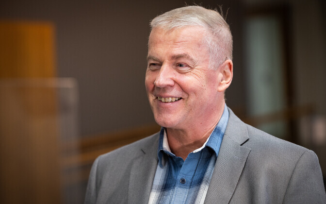
- **Roll operatsioonis:** Strateegiline eeskuju ja rahvuslik juhtimisvisioon; kandidaat presidendiametisse rahva teenimise mõttes.
- **Taust:** Kindralmajor (res.). Endine Kaitseväe erioperatsioonide väejuhatuse ülem (2012–2019), kus ta lõi ja arendas Eesti erioperatsioonide võimekuse, mida hinnatakse kõrgelt NATO-s. Endine Kaitseliidu ülem (2019–2023). Kaitseliidu liige alates 1990. aastast; üks Kaitseliidu taasloomise tegijaid. Endine Luurepataljoni ülem, kaitseatašee Gruusias, missioon Afganistanis. Tallinna Ülikooli riigikaitseõpetaja.
- **Miks ta on siin:** Riho on inimene, keda inimesed järgivad usalduse, mitte käsu pärast. Tema jaoks on riigikaitse alati tähendanud inimesi — mitte tankke, mitte paraade. Operatsioon „Peegel“ vajab juhti, kes mõistab, et võit toimub ka kodus, koolis ja peres.

#### Rene Toomse — Riigi ja valitsuse tase

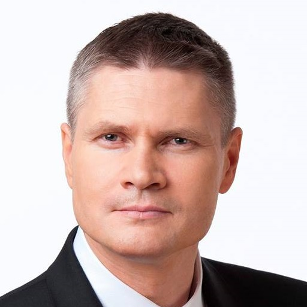
- **Roll operatsioonis:** Strateegiline nõustaja; seob kaitse- ja tsiviilpoliitika tasandid; esindab valitsuse ja kodaniku vahelist silda.
- **Taust:** Ettevõtja, reservmajor, endine luureohvitser. Doktorikraad sotsiaalteadustes (Tallinna Ülikool): „Kaitstes Eestit rahus ja sõjas". Avalikult kirjutanud infosõjast, sõjapidamise uuendustest ja väikeriigi julgeolekustrateegiatest (ICDS, Diplomaatia, ERR). Kaitseliitlane; seotud Lääne-Harjumaa Kaitsjate MTÜ-ga.
- **Miks ta on siin:** Toomse mõistab, et järgmise põlvkonna sõda toimub infokeskkonnas sama palju kui maastikul. Ta toob operatsiooni riikliku mõõtme ilma bürokraatiata. **Esimene 1-1 vestlus** koordinaatoriga on alustatud — ukse lahti tehtud.

#### Aarne Ermus — Operatiivne tase (Kaitseväe Akadeemia)

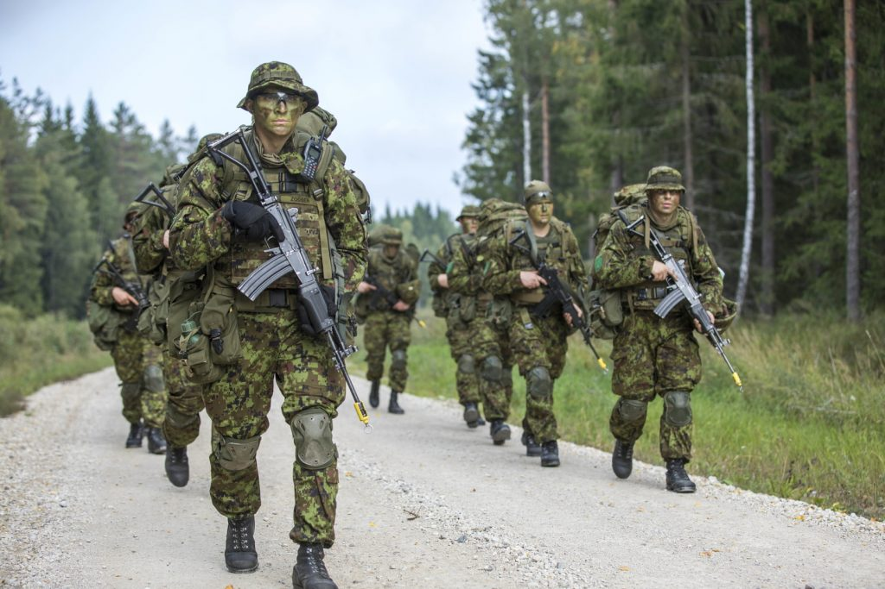
- **Roll operatsioonis:** Juhtide ja õppurite arengu standard; kaitseväelise juhtimiskultuuri kandmine tsiviiloperatsiooni.
- **Taust:** Kolonel, Kaitseväe Akadeemia juhtimise suuna juht ja lektor. Endine Kaitsejõudude Peastaabi ülem ja operatiivülem; endine Kuperjanovi pataljoni ülem; Eesti sõjaline esindaja NATO SHAPE juures; endine Kaitseväe Ühendatud Õppeasutuste ülem (2007–2013).
- **Miks ta on siin:** Kaitseväe Akadeemia rollikirjeldused rõhutavad enesearengut, kriitilist mõtlemist ja eetilist eneserefleksiooni — täpselt need oskused, mida operatsioon „Peegel“ kodanikele õpetab.

#### Remo Ojaste — Taktikaline/äri tase (Combat Ready tegevdirektor)

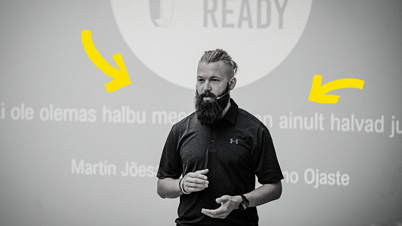
- **Roll operatsioonis:** Ärilise ja organisatsioonilise tasandi juht; „ülima vastutuse" põhimõtete rakendamine ühiskondlikus skaalas.
- **Taust:** Combat Ready kaasasutaja ja tegevdirektor (2021). Endine Eesti erioperatsioonide väelane (8+ aastat). Echelon Fronti (Jocko Willink, Leif Babin) ametlik partner — ainus selline partner Euroopas. Aasta koolitaja 2022. Jocko taskuhäälingu külaline (2024).
- **Miks ta on siin:** Combat Ready alustas seda operatsiooni ärilisel tasandil — praktiline juhtimiskoolitus, mis valmistab inimesi ette reaalseks eluks, mitte ainult slaidideks.

#### Vallo Arumäe / Starfish Academy — Finantskirjaoskus ja investorlus

- **Roll operatsioonis:** Ärimaailma haridus ja rahatarkus Eestis; finantsvabaduse teekonna kiirendaja ettevõtjatele ja peredele.
- **Taust:** Starfish Academy kaasasutaja ja juht (alates 2015). Endine Balti Logistika juht (12 aastat). John Maxwell Team sertifitseeritud coach. Tunnustatud Finantsinspektsiooni, Eesti Panga ja Rahandusministeeriumi poolt. Koolitused: rahatarkus, investeerimine, passiivne tulu, Investorite Sisering.
- **Veeb:** [starfish.academy](https://www.starfish.academy) · [online.starfishacademy.ee](https://online.starfishacademy.ee)
- **Miks ta on siin:** Tugev isa ja tugev pere vajavad ka rahalist distsipliini. Starfish Academy aitab inimestel väljuda orav rattast ja ehitada teadlikku finantselu — see on operatsiooni Faas II (tugevdamine) äriline sammas.

#### BMI Executive Institute — Juhtide kõrgharidus (Baltikum / Saksamaa)

- **Roll operatsioonis:** Rahvusvaheline executive education — International Executive MBA ja juhtide täienduskoolitused Balti riikide ettevõtjatele.
- **Taust:** Asutatud 1999; partnerkoolid sh HEC Paris, UCLouvain, NHH, Vytautas Magnus University. Baasid Vilniuses ja Brüsselis; rahvusvaheline õppejõud (sh Saksamaa — Joachim Sandt, Frankfurt University of Applied Sciences). Programmid: EMBA, executive education, ettevõtetesisesed koolitused.
- **Veeb:** [bmiinstitute.com](https://www.bmiinstitute.com)
- **Miks ta on siin:** Operatsioon vajab juhte, kes mõistavad nii inimest kui numbreid. BMI toob Saksamaa ja Euroopa ärikogemuse Baltikumi — kättesaadav Eesti ettevõtjatele, kes tahavad kasvada ilma karjääri katkestamata.

#### BNI (Business Network International) — Eesti ärivõrgustik

- **Roll operatsioonis:** Ärireferaalide ja usaldusväärse ettevõtjate võrgustiku kiirendaja; Givers Gain® põhimõte — andjad võidavad.
- **Taust:** Asutatud 1985; maailma suurim ärikoostöö ja soovituste organisatsioon. Eestis kaks aktiivset Tallinna gruppi: **BNI North Star Tallinn** (reedeti 7:00, Nordic Hotel Forum) ja **BNI One Tallinn** (neljapäeviti 7:30, Radisson Blu Olümpia). Igas grupis üks liige kutseala kohta — struktureeritud soovitused, mitte juhuslik networking. Liikmed suurendavad keskmiselt oma äri esimesel aastal ~20%.
- **Eestvedaja:** Kerdu Lenear — BNI North Star Tallinn president (esimene naissoost president selles grupis).
- **Veeb:** [bni.ee](https://bni.ee) · [BNI North Star Tallinn](https://bni.ee/tallinn-bni-north-star-tallinn/en-US/index) · [BNI One Tallinn](https://bni.ee/tallinn-bni-one-tallinn/en-US/index)
- **Miks ta on siin:** Tugev isa ja tugev pere vajavad ka stabiilset sissetulekut ja usaldusväärset ärivõrgustikku. BNI ühendab Eesti ettevõtjad, kes soovitavad üksteisele äri ausalt ja pikaajaliselt — see toetab operatsiooni Faas II (tugevdamine) ärilist sammast koos Starfishi ja BMI-ga.

#### Kerdu Lenear — Mindset Fitness ja ärivõrgustik


- **Roll operatsioonis:** Mõtteviisi ja vaimse treeningu eestvedaja ettevõtjatele ja sportlastele; BNI North Star Tallinn president.
- **Taust:** Endine Eesti naiste korvpallikoondislane (D1 Auburn University, USA). TalTech MBA; Certified Neuroencoding Specialist (Joseph McClendon III). Asutaja: Mindset Fitness ja Athletepreneurs Academy. Koolitused: enesetakistus, STOP-tehnika, meeskonna vaimne vastupidavus. Koostöö Eesti ärieliidiga (sh Combat Ready CEO Remo Ojaste).
- **Veeb:** [mindsetfitness.ee](https://mindsetfitness.ee)
- **Miks ta on siin:** Ärimaailma tipp algab peas. Kerdu aitab kõrge jõudlusega inimestel treenida mõistust nagu lihast — see täiendab Starfishi rahalist ja Combat Ready juhtimisliini.

#### Julian Maier — URBN TIGER, breathwork (Saksamaa)

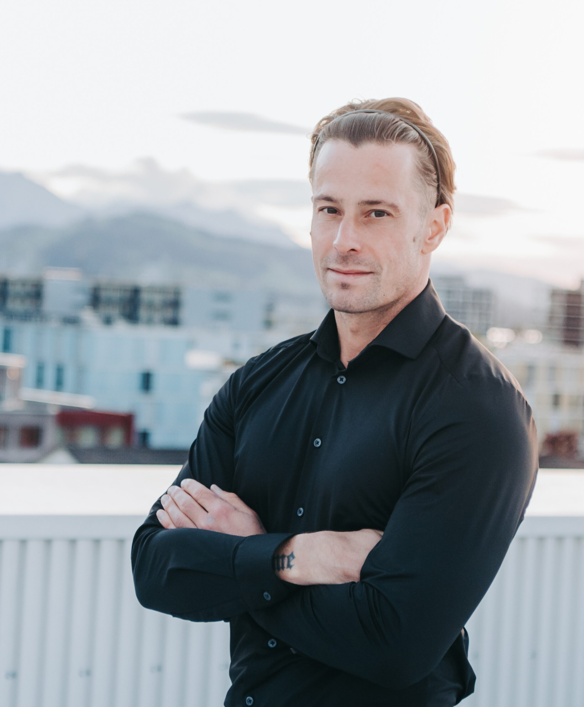
- **Roll operatsioonis:** Saksamaa päritolu breathwork ja vaimse fitnessi eestvedaja Eestis; e-Residency kogukonna saadik.
- **Taust:** Saksamaa wellness-ettevõtja, URBN TIGER asutaja (breathwork, mental training, mindfulness). Eesti e-resident ja e-Residency envoy; ettevõte hallatakse Eestist. Koolitab startup'e, ülikoole ja ettevõtteid stressi vähendamiseks ja vaimse vastupidavuse tõstmiseks. Esineja sTARTUp Day'l; kombineerib hingamist, võitluskunste ja meeskonnakoolitust.
- **Veeb:** [urbntiger.com](https://urbntiger.com) · [e-resident.gov.ee — Julian Maier](https://www.e-resident.gov.ee/envoys-and-community-leaders/julian-maier/)
- **Miks ta on siin:** Julian toob Saksamaast breathwork'i — kohene, praktiline abivahend stressi ja ülekoormuse korral. See täiendab Lisa H taastumisressursse ja Tiit Trofimovi emotsioonide tööd; eriti kasulik ettevõtjatele ja juhtidele, kes vajavad kiiret leevendust enne otsuseid.

#### Äripäev — investeerimis- ja juhtimiskultuur (raadio, konverentsid, tunnustused)

- **Roll operatsioonis:** Rahatarkuse ja hea juhtimise avalik esiletõstmine — mitte spekulatsioon, vaid õppimine teistelt, kes teevad asju õigesti.
- **Investor Toomas:** Äripäeva pikim ajakirjanduslik investeerimiseksperiment (alates 2002); börsitoimetus (sh Juhan Lang) haldab reaalset portfelli. **Investor Toomase tund** — igal teisipäeval kell 11 ([aripaev.ee/raadio](https://www.aripaev.ee/raadio)); **Investor Toomase konverents** — Baltikumi suurim investeerimisüritus (igal jaanuaris).
- **Aasta investor** (Äripäev + Nasdaq Tallinn, alates 2020): tunnustab investeerimiskultuuri edendajaid. Laureaadid: Tõnu Pekk (2020), Kristi Saare (2021), **Kristjan Liivamägi** (2022), **Katri Teller** (2023), **Marko Oolo** (2024), Lev Dolgatsjov (2025).
- **Parim juht** (Äripäev + PARE + Eesti Tööandjate Keskliit + Pärnu juhtimiskonverents): tõstab esile juhte, kes teevad pikaajaliselt õigesti — mitte populaarsust otsides, vaid tulemusi ja inimesi juhtides. 2026: Janar Holm; 2025: Neeme Tammis.
- **Veeb:** [aripaev.ee/raadio](https://www.aripaev.ee/raadio) · [investor-toomas](https://www.aripaev.ee/investor-toomas) · [parim juht](https://www.aripaev.ee/uudised/2026/03/01/esita-oma-juht-eesti-parima-juhi-kandidaadiks)
- **Miks ta on siin:** Operatsioon vajab eeskujusid, kes raha ja vastutust käsitlevad ausalt. Äripäev ühendab investorid, juhid ja tavakodanikud ühise keele alla — see täiendab Starfishi, BMI-d ja BNI-d.

#### Rahakratt — rahablogi ja finantsvabadus

- **Roll operatsioonis:** Aus, huumoriga vürtsitatud finantsvabaduse teekond — tõestisündinud lugu, mitte reklaam.
- **Taust:** Mandri-Eesti populaarseim rahablogi (40 000–50 000 igakuist lugejat). Anonüümne autor; dokumenteerib #finantsvabadussõja teekonda nullist üles. Aktiivne investor; esinenud Investor Toomase konverentsil ja Äripäeva raadios. **Äripäeva Aasta Investor 2020 — Publiku Lemmik**; Eesti Blogiauhindade võitja (investeerimis-, hariva- ja huumorikategooriates).
- **Veeb:** [rahakratt.rahajutud.ee](https://rahakratt.rahajutud.ee)
- **Miks ta on siin:** Rahakratt näitab, et vigu tehes õpitakse — ja et palgatöö kõrvalt investeerimine on võimalik ilma guru-müstikata. See on operatsiooni Faas II rahaline eeskuju tavalisele inimesele.

#### Kristjan Liivamägi — Aasta investor 2022, rahatarkuse saadik

- **Roll operatsioonis:** Teaduspõhine investeerimisharidus ja käitumuslik rahandus.
- **Taust:** TalTech vanemlektor; KML Invest OÜ omanik; 20+ aastat finantsturgudel. Doktorikraad käitumuslikus rahanduses; ELi rahatarkuse saadik. Koos Tõnn Talpsepp ja Tarvo Vaarmetsiga autor *Eraisiku rahandus* ja *Investeerimisedu meistriklass*. **Äripäeva Aasta investor 2022.**
- **Veeb:** [taltech.ee/persoon/kristjan-liivamagi](https://taltech.ee/persoon/kristjan-liivamagi) · [rahaedu.ee](https://rahaedu.ee)
- **Miks ta on siin:** Liivamägi ühendab akadeemilise ranguse ja praktilise investeerimise — täpselt see, mida operatsioon vajab: arusaadavat rahatarkust, mitte hasartmängu.

#### Marko Oolo — Aasta investor 2024, Exceli meister

- **Roll operatsioonis:** Praktilised investeerimistööriistad ja läbipaistev portfellihaldus.
- **Taust:** Investor, ettevõtja ja pereisa; ehitas investeerimisportfelli nullist üle miljoni euroni. **Äripäeva Aasta investor 2024**; Rahatarkuse aasta eestvedaja 2025. Tuntud **Exceli-põhiste tööriistadega**, mis jagavad suure finantsilise eesmärgi igakuisteks sammudeks — portfelli jälgimine, eesmärkide seadmine, andmepõhine otsustamine.
- **Veeb:** [oolomarko.ee](https://oolomarko.ee)
- **Miks ta on siin:** Oolo näitab, et numbrid ei pea hirmutama — Excel on tavalise inimese relv finantsvabaduse suunas. See täiendab Rahakrati lugu ja Liivamäe teaduspõhist lähenemist.

#### Katri Teller — Blondcast, Aasta investor 2023

- **Roll operatsioonis:** Taskuhääling ja meedia kui rahatarkuse ja enesearengu kanal.
- **Taust:** **Blondcast** eestvedaja (Delfi Tasku) — üks Eesti populaarsemaid naistele (ja meestele) suunatud podcaste; tervis, suhted, raha, eneseareng. Endine **Rahareede** podcast (2024. aasta investeerimistegu). **Äripäeva Aasta investor 2023**; koos Kristjan Liivamägiga Aasta investeerimistegu 2025. Stuudio saatejuht (Õhtuleht).
- **Veeb:** [tasku.delfi.ee — Blondcast](https://tasku.delfi.ee/podcast/717a0853-d361-4e9e-bb50-aed8e704c2b2)
- **Miks ta on siin:** Katri tõestab, et raha ja elu ei ole eraldi — ja et aus jutt ka ebaõnnestumistest (sh portfelli kasvamise peatamine teletöö ajal) on väärtuslikum kui perfektne fassaad.

#### Robert Käsper — Meedik, veteran (hajutatud)

- **Roll operatsioonis:** Sõjaväelase ja meediku kogemuse edasiandmine tsiviilis — oma maastikul, sõltumatult.
- **Taust:** ~10 aastat Kaitseväes, sh erioperatsioonide väejuhatus; **üksuse meedik (18D)** välismissioonidel. Endine nooremseersant — Renee Aluste teenistusaeg samas ajajärgus (Renee nooremveebel, Robert nooremseersant). Pärast teenistust: sisejulgeolek, kaitsetööstus, RKIK; varem Combat Ready instruktor ja FTX juht (2022–2024). **Tegutseb hajutatult omal maastikul** — Delfi podcast **„Eriväelase jutud"**, kaitse- ja meditsiiniteemad.
- **Veeb:** [tasku.delfi.ee — Eriväelase jutud](https://tasku.delfi.ee/podcast/ff0c1df9-082d-414f-b06d-f48decd50f45)
- **Miks ta on siin:** Robert ühendab meditsiini, distsipliini ja juhtimist — täpselt see kombinatsioon, mida operatsioon vajab kriisis. Tema kogemus meedikuna täiendab Lisa H taastumisressursse; hajutatud tegutsemine omal maastikul näitab, et võrgustik ei vaja tsentraalset käsku.

#### Üksus „Aluste_kool" — SOK demomehed (aktiveeritud)

- **Roll operatsioonis:** Kodaniku demomeeste üksus — katsetavad päriselus, mis töötab; eeskuju lugupidavas suhtluses.
- **Aktiveerija:** Renee Aluste (`Aluste_kool`).
- **Liikmed:** SOK läbinud — **tunnevad ennast ise ära**. Nimekirja avalikult ei avaldata.
- **Kohustus:** Sõduriõpik / sõduri käsiraamat + Kaitseväe viisakuseeskirja (sisemäärustik, rivikord) läbilugemine; päevane checklist: **austa, kuula, usalda, ole mõjutatud, hooli** (vähemalt 1× päevas).
- **Põhimõte:** Rivi eeskiri õpetab, *mis sa ütled ja millal* — austus konkreetse keele kaudu, mitte üldise „ole kena" sloganina. *Me ei ehita armastust emotsioonidega. Me kujundame seda käitumisega — austuse ja lugupidamise keeles.*
- **Täielik ülesanne:** **Lisa N** — `lisa-n-aluste-kool.md`

#### Martin Jõesaar — Euroopa tase (Combat Ready kaasasutaja)

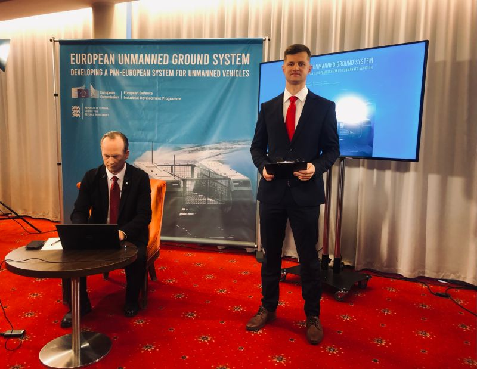
- **Roll operatsioonis:** Rahvusvaheline mõjutus ja koostöö; Euroopa juhtimiskultuuri arendamine.
- **Taust:** Combat Ready kaasasutaja (2021), Aasta koolitaja 2022. Euroopa Komisjoni DG DEFIS programmijuht — ELi kaitseuuenduste büroo Kiievis. 16+ aastat ohvitserina Kaitseväes; endine Milrem Robotics COO; kaitseinvesteeringute kogemus.
- **Miks ta on siin:** Ühendab Eesti kogemuse Euroopa kaitse- ja innovatsioonivõrgustikuga. Toob operatsioonile rahvusvahelise ulatuse.

#### Renee Aluste — Operatsiooni koordinaator, rahva tase

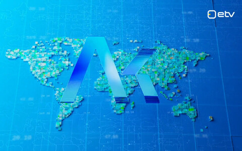
- **Roll operatsioonis:** Operatsiooni eestvedaja ja peamine sõnumitooja; ühendab isikliku kogemuse sõjalise distsipliiniga.
- **Taust:** Combat Ready instruktor; Kaitseliidu juhtimisinstruktor. Endine erioperatsioonide grupi operaator; üks vähestest eestlastest, kes on läbinud USA Army Ranger Schooli. Arborist (TreeDoc/Kaks Arboristi). Ajateenistus Vahipataljonis (2009–2010); erioperatsioonide grupp; laevakaitseüksus; rahuvalvemissioon Liibanonis Estpla-21 (2015, ~7 kuud UNIFIL-i Soome-Iiri pataljoni koosseisus).
- **Isiklik motivatsioon:** Aluste on ise kogenud depressiooni ja mõistnud, kuidas pikaajaline infosõja ja manipulatsioon võib inimest murda. Ta on taastunud — ravimid, professionaalne abi, [narko.ee](https://www.narko.ee) tugiliin — ja võtnud vastutuse keha eest: uni, liikumine, toitumine. Ta viitab Vilhjalmur Stefanssoni arktika-kogemusele ja Bellevue uuringule (1928–1929) kui tõendile, et rasvarikas loomne toit (kala, mererasv) võib keha tervendada, kui vaim on juba abi saanud. Täielik lugu: **Lisa H**.
- **Läbipõlemise õppetund:** Umbes **kolm aastat** tegi ta Sõdurioskuste kursuseid efektiivselt ja suurelt — tulemuseks olid **suured läbipõlemise ilmingud**. Operatsioon „Peegel" peab seda seekord tegema **targemini**: alusta **1-1 vestlustega** niipea kui võimalik, mitte ainult mass-koolitusega. Esimene samm on tehtud — **Rene Toomsega** on suhtlus alustatud; ukse lahti tehtud. (Vt V-formatsioon: Lisa I — üks ei veda igavesti.)
- **Isiklik ajend (ausalt):** 37 aastat domineeriva juhtimise ja vägivalla all (*väikena ei kiusatud* — aga leivale suud, kõik ära, vastu tahtmist). Kolm last võõrandatud (Lily Käsper 14a, Rene Tilga 6a, Henry Käsper 11a). Oli ise kooli kiusaja. Taastus: Engel, Voss, van der Kolk, EMDR. Lahendus: **inimesekeskne juhtimine** (Kert + Steiger). Vt Q&A IV.
- **Miks ta on siin:** Ta ei õpeta teooriat — ta on elanud läbi selle, mida õpetab. „Ma ei manipuleeri sind nõrkuseks. Ma aitan sul saada tugevaks."
- **E-sliin ja suur pilt:** Renee on olnud **kaevikus** — digitaalsel rindejoonel, kus ta suhtleb erinevate üksustega, kes püüavad olukorda parandada, kuid sageli **sümptomite kustutamisega**. Tal on **suur vaade** kogu olukorrale: ta on tuvastanud probleemid, mida see juhis käsitleb — ja need on **lahendatavad lihtsate tööriistadega** (uni, liikumine, toit, mentorlus, 1-1 vestlus). Ebamõistlik on mitte vähemalt proovida. Täpsemalt: sektsioon **„MIKS RENEE?"** ülal.
- **Kaitseväe muster (Renee tähelepanek):** Paljud **ei tee seda, mida ametikoha juhend nõuab** — kogu raskus langeb neile, kes töötavad; nemad põlevad läbi, lähevad katki ja lahkuvad kiiresti. Lahendus: **kõik vastutavad** — aga selleks peab lõppema **kiusamine** ja vana juhtimisstiil (Lisa I). Kui kõik teeksid oma osa, paraneks kõigi olukord.
- **Kaitseväe ATH-muster (tähelepanek):** **Margus Lõoke** on Reneele öelnud, et Kaitseväes töötavate inimeste hulgas on **suur osa diagnoositud ATH-ga**. Isiklik vaatlus, mitte ametlik statistika — aga see toetab e-sliini mustrit: struktuur, uni ja roll on sageli puudu, silt ja tablet on liiga sageli esimene vastus.
- **Kui kahtled — kes ta on:** **Lisa R** — `lisa-r-kes-ma-olen-ja-taust.md` (CV, teenistus, koolitused, meedia lingid)

#### Margus Lõoke — Kaitseväe mustri tunnistaja

- **Roll operatsioonis:** Usalduslik teealune hääl; toob Kaitseväe sisemise vaate operatsiooni planeeringusse.
- **Miks ta on siin:** Ta on **Margus Lõoke** — ettevõtja ja inimene, kes näeb Kaitseväe personali mustreid oma töö ja suhtluse kaudu. Ta on Reneele öelnud, et **suur osa Kaitseväes töötavatest inimestest on diagnoositud ATH-ga**. See ei ole epidemioloogiline väide — see on **tema tähelepanek**, mida Renee dokumenteerib, sest see kinnitab: probleem on laialt levinud, aga lahendus võib olla lihtne (struktuur, uni, liikumine, roll — mitte ainult sümptomi kustutamine). Täielik võrgustiku kirje: **Lisa K**.

#### Priit Lilleväli — Rahva tase, juhtimis- ja psühholoogiline tugi

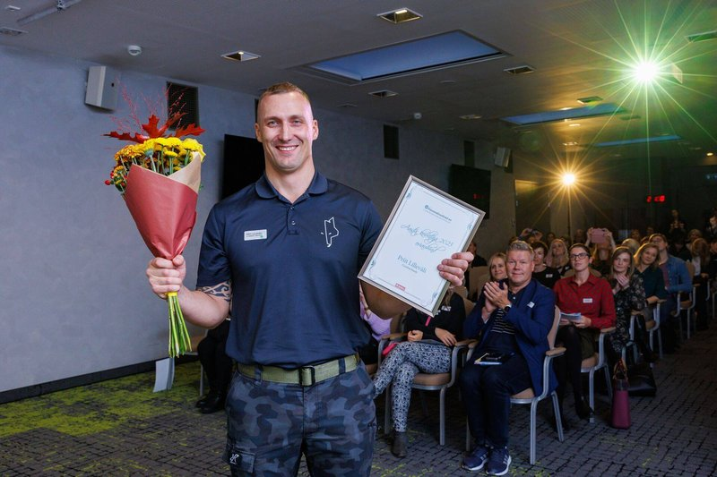
- **Roll operatsioonis:** Juhtimiskoolitaja ja juhendaja; aitab inimestel töödelda traumaatilisi kogemusi ja võtta vastutust.
- **Taust:** Combat Ready instruktor ja juhendaja. Äripäeva Aasta koolitaja 2023 eriauhind. Endine kaitseväelane (5 aastat), kaks lahingumissiooni Afganistanis. Psühholoogia õpingud (TÜ), juhendamiskoolitus (EBS). 300+ koolitust, 800+ juhendamistundi.
- **Miks ta on siin:** Operatsioon vajab inimest, kes oskab rääkida nii distsipliinist kui emotsionaalsest taastumisest — ilma ohvriidentiteeti tugevdamata.

#### Katrin Lucas — Sügavama teadlikkuse tase

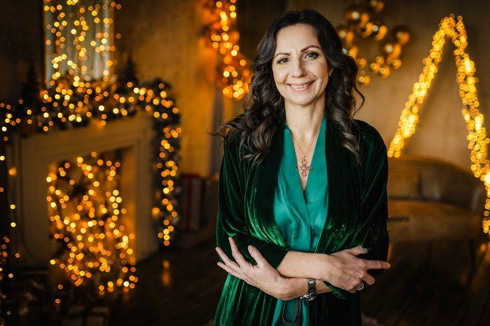
- **Roll operatsioonis:** Teadlikkuse ja maailmavaate avardamine; „Ava oma Silmad" taskuhääling ja kogukond.
- **Taust:** Taskuhäälingusaatejuht, autor ja teadlikkuse edendaja. „Ava oma Silmad" taskuhääling käsitleb ühiskonnasüsteeme, inimmõistmist ja isiklikku ärkvelolekut. Koostööd teeb ka teiste Eesti taskuhäälingutega (sh Ajuloputus).
- **Miks ta on siin:** Operatsioon „Peegel" vajab mitmeid kanaleid. Lucas toob teistsuguse, sügavama vaatenurga — inimesed ärkavad erinevatest lähtepunktidest.

#### Ingvar Villido — Teadliku muutuse kunst (Practical Consciousness)

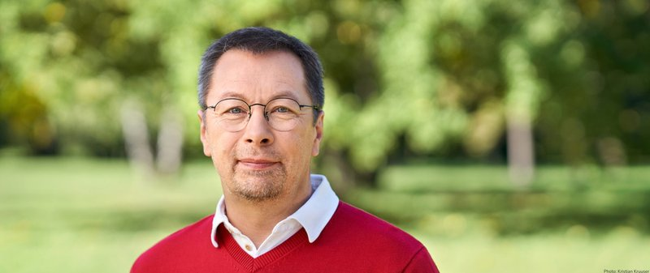
- **Roll operatsioonis:** Teadlikkuse praktilise rakendamise eestvedaja; aitab inimestel tuvastada ja muuta alateadlikke emotsionaalseid ning mentaalseid mustreid.
- **Taust:** Siddha jooga õpetaja, Lilleoru asutaja. Loodud meetod *Teadliku Muutuse Kunst* (2008), rahvusvaheliselt *Practical Consciousness*. Viieastmeline kursuste süsteem (selgus, emotsioonid, mõtted, teadvus, vooseisund). Raamatud sh *Teadvuse praktiline kasutamine*. Practical Consciousness Sihtasutus; koolitused Eestis ja välismaal.
- **Miks ta on siin:** Infosõda tabab inimest seestpoolt — autopiloodis emotsioonid ja mõtted. Villido pakub praktilisi vahendeid, kuidas inimene ise oma sisemaailma muudab. See täiendab operatsiooni sõjalist distsipliini teadlikkuse tehnikaga.

#### Tiit Trofimov — Eneseareng, emotsioonid ja meeste ring

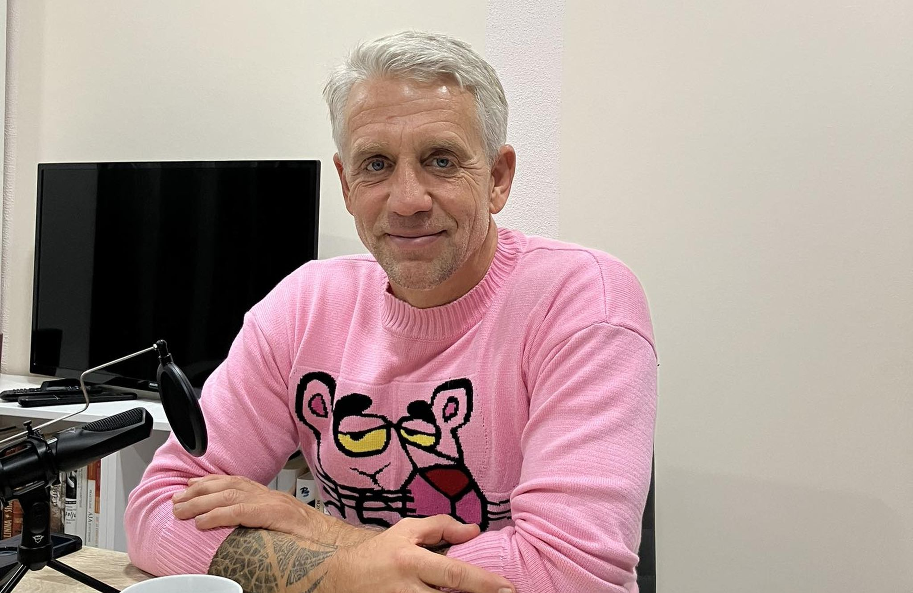
- **Roll operatsioonis:** Enesearengu teejuht; emotsioonide ja teadlikkuse töö; meeste ringid ja meditatsioon; aitab inimestel taastuda pärast põhja.
- **Taust:** Endine ettevõtja (kinnisvara, restoranid, sisekujundus; sh Adila puhkekeskuse arendaja). 2009. aasta kriisis kaotas kodu, vara ja perekonna — see muutis ta elu. Viimased 15+ aastat teadliku enesearengu, meditatsiooni, jooga ja kehatöö valdkonnas. Autor *Lõpp on algus. Julgus elada iseendana* (Pilgrim, 2023). Korraldab vestlusõhtuid („Must ja valge"), meeste ringe, ekstaatilise tantsu ja meditatsiooni töötubasid.
- **Miks ta on siin:** Trofimov on elav tõend, et põhjast saab tõusta. Ta räägib ausalt — mitte teooriast, vaid kogemusest. Tema fookus emotsioonide vabastamisel ja meeste ringis täiendab operatsiooni taastumise sõnumit (Lisa F, Lisa H) ja teadlikkuse võrgustikku. Alar Ojastu on teda soovitanud kui inimest, kellel on missioon, mitte äri.

#### Kert Grünberg — Trauma, hingamine ja taastumine

- **Roll operatsioonis:** Holistiline regressiooniterapeut ja taastumisnõustaja; trauma vabastamine kehas, kaassõltuvus, eneseväärtus.
- **Taust:** Hingamistuba OÜ ([hingamistuba.ee](https://www.hingamistuba.ee)); kutsetunnistus holistiline regressiooniterapeut (tase 7, TAM). Rebirthing breathwork, TRE (trauma release), transpersonaalne psühholoogia, kaassõltuvusnõustaja (CPRC, CPC). Holistika Instituut; Rahvusvahelise Hingamistöö Föderatsiooni kogemus. Töötoad: perfektsionism, enesepiitsutamine, eneseväärtus.
- **Mõjuala:** **Taastumine ja keha** — Lisa F, Lisa H; täiendab Tiit Trofimovit, Julian Maierit (breathwork) ja Kaia Kapsta-Forresterit. Aitab inimestel, kes on „korras näost", aga kurnatud seest.
- **Miks ta on siin:** Infosõda ja elukriisid jätab kehasse jälje. Grünberg töötab seal, kus sõnad ei piisa — hingamine, trauma ja kaassõltuvus. Tema sõnum: *elu on lõuend, sinna saab uuesti peale maalida*.

#### Epp Kärsin — Teadlik intiimsus ja seksuaalharidus

- **Roll operatsioonis:** Teadliku seksuaalsuse ja intiimsuse koolitaja; häbistatud teemade avamine ausa keele kaudu — paaridele, naistele, meestele ja noortele.
- **Taust:** Amare Luna OÜ tegevjuht; koolitaja alates 2015 ([eppkarsin.com](https://www.eppkarsin.com)). Tartu Ülikooli kehakultuuri teaduskond; holistika, Hiina meditsiin, tantra-alased kursused. Koolitused: paaridele, naistele, meestele, noortele („Seksist ilha häbita"); ettevõtetele. Raamat *Ennast raiskame võõrastes voodites* (koos Mihkel Rauaga). Avalik eesmärk: reformida seksuaalharidust Eesti koolides — ilma tabu ja häbita.
- **Mõjuala:** **Pere rindejoon ja lähedus** — tugev pere vajab ka füüsilist ja emotsionaalset intiimsust; paljud lahutused ja kriisid algavad vaikimisest ja häbist. Epp murrab tabu, et paarid saaksid rääkida ausalt. Täiendab tantravõrgustikku (Earthchild, Skalkina, Sarmet) **konkreetsema kehakeelse haridusega**; seob operatsiooni põhimõttega *austus = armastus käitumise kaudu*.
- **Miks ta on siin:** Infosõda tabab ka magamistoa — häbi, võõrutus, pornograafia sõltuvus. Operatsioon „Peegel" ütleb: tugev isa ja ema on ka lähedased partnerid. Epp pakub turvalist ruumi, kus intiimsus ei ole tabu ega müügitoode, vaid teadlik hoolitsus. **Põhimõte:** *To heal is to feel* — suhtlus kehaga nõuab traumast tervenemist ja tunde välja lasemist (Lisa AA §9).
- **Yoni massaaži koolitus (pane end kirja):** [Naine, tunne oma keha](https://www.eppkarsin.com/et/koolitused/naine-tunne-oma-keha-ehk-yoni-massaazi-koolitus-naistele/8) · [Yoni massaaž meestele](https://www.eppkarsin.com/et/koolitused/yoni-massaazi-koolitus/5) · Stuudio Paldiski mnt 21-1, Tallinn · **5362 8568** · Täielik juhend: **Lisa AA**
- **Hi on Life @ Pühali:** esinemine Pühali Hea Elu Keskuses (PVC telk, lava) — Renee Aluste tunnistus: siirus, taastumine, padjuke kukla alla (Lisa AA §9)

#### Vanja Moves meeskond — Liikuvus, vigastuste ennetus, rippumine

- **Roll operatsioonis:** Igapäevane liikuvus ja **vigastuste ennetus** — rippumine 90 sek/päev, kükki, täisulatuses tugevus; **kirurg ilma noata** (mobility enne operatsiooni).
- **Meeskond:** **Vanja Moves** (asutaja) · **Moves Method** (lipulaev, 200 000+ õpilast) · **Moves Labs** · **Josh Fear** + treenerid (Skooli kogukond) · [schoolofmobility.com](https://schoolofmobility.com) — Mobility & Injury Prevention Training.
- **Taust:** Endine prof.tennisist; sporditeadus ja toitumine; 2M+ kogukond; YouTube @Movesmethod 680K+; *Making Moves* podcast. Filosoofia: **antifragile human** — liikuvus on teenitud tugevus, mitte passiivne venitamine.
- **Mõjuala:** **Keha linnaruumis** (Lisa AB) — rippumisribad, muruväljakud, 90 sek päevas; täiendab Combat Ready liikumist, Lisa V (uni), Lisa H (taastumine).
- **Miks ta on siin:** Linn ehitab tooli ja asfaldi, aga mitte rippumiskohti. Inimene on ahv — ta vajab rippumist. Operatsioon ütleb: **alusta tasuta** — YouTube, podcast, Skool — enne kui ootad operatsiooni või lõputut füsioteraapiat.
- **Tsitaat (Renee mäletab):** *„A stretching master is a surgeon without a knife."* — üks miljardär on seda öelnud; venitamise / liikuvuse meister parandab ilma noata.
- **Tasuta alustus:** [YouTube @Movesmethod](https://www.youtube.com/@Movesmethod) · [vanjamoves.com](https://vanjamoves.com) · [skool.com/movesmethod](https://www.skool.com/movesmethod) · Täielik juhend: **Lisa AB**

#### Igor Earthchild — Tantra ja teadlik ühendus

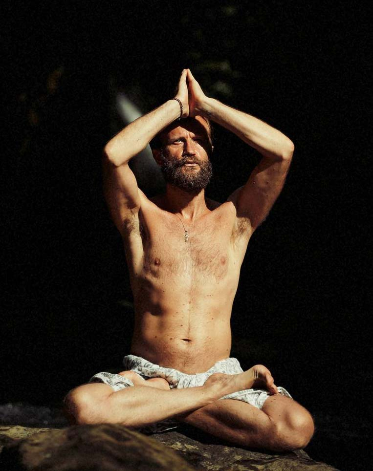
- **Roll operatsioonis:** Tantralaagrite ja festivalide korraldamine; aitab inimestel — eriti meestel — avada keha, vabaneda vanadest mustritest ja leida end uuesti.
- **Taust:** Endine ärivaldkonna tippjuht, tantraõpetaja ja tervendaja. Eesti Tantrafestivali kaaskorraldaja alates 2017. Loob veebikursusi ja laagreid (sh Learn to Touch, Superlover); tantramassaaž ja body de-armouring Tallinnas ja Helsingis. Aitab inimestel liikuda sõltuvustest tervislikuma elu poole.
- **Miks ta on siin:** Paljud inimesed on infosõja ja eluraskuste tõttu kehast lahti ühendatud. Earthchild aitab neil uuesti end tunda — läbi teadliku puudutuse, kogukonna ja tantristliku praktika.

#### Bella Skalkina — Tantra ja energiakeha


- **Roll operatsioonis:** Tantralaagrite ja Eesti Tantrafestivali peaorganisaator; töötoad paaridele ja üksikisikutele teadliku läheduse ja energiakeha avamiseks.
- **Taust:** Massaažiterapeut ja tervendaja (Anahata stuudio, Tallinn ja Helsinki). Eesti Tantrafestivali peamine korraldaja. Koostöö Igor Earthchildi, Margus Sarmeti ja Kristiina Sauliga. Töötoad: paaride saunarituaal, tantriline puudutus, Shakti ärkamine, Armastuse tempel.
- **Miks ta on siin:** Skalkina loob turvalisi ruume, kus inimesed saavad avada silmad — mitte hirmuga, vaid armastuse ja teadlikkusega. See on operatsiooni „ava silmad" missioon teise keele kaudu.

#### Margus Sarmet — Tantra ja vaimne praktika

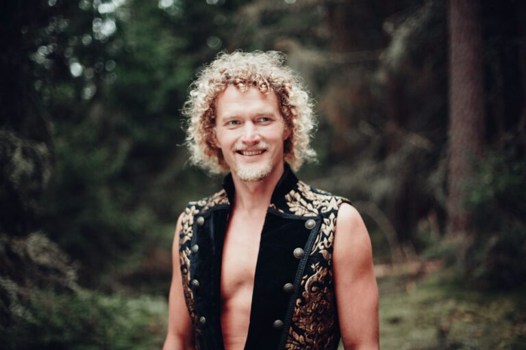
- **Roll operatsioonis:** Tantralaagrite, festivalide ja teadlikkusele suunatud kogukonnaürituste korraldamine; paaride ja üksikisikute tee tagasi iseenda juurde.
- **Taust:** Tantra- ja joogaõpetaja, transpersonaalse psühholoogia terapeut. Eesti Tantrafestivali korraldaja. Tantratants.ee, Tantra Tribe laagrid. Õpingud Agama joogakoolis, Shivoham Tantra liinis, Karam Kriya joogakoolis. Korraldab ka teadlikkusele suunatud laste- ja noortelaagreid.
- **Miks ta on siin:** Sarmet ütleb otse: tantra on praktiline teadus — seni kuni sa seda ei kasuta, pole teadmistest kasu. Operatsioon vajab inimesi, kes aitavad teistel mitte ainult mõelda, vaid ka tunda ja elada teadlikumalt.

#### Kristiina Saul — Tantra, jooga ja naiste ringid

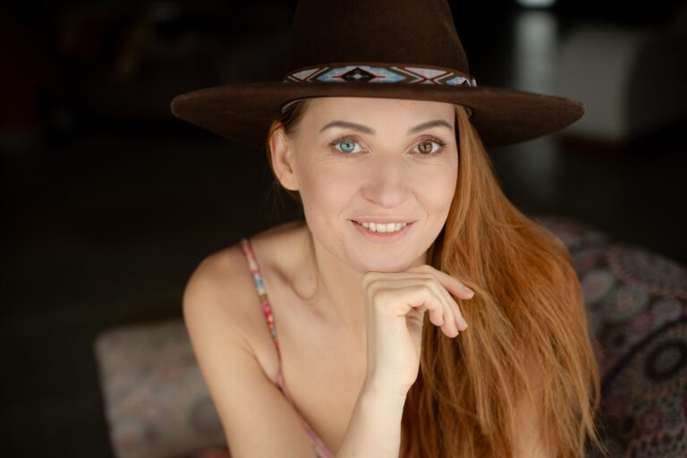
- **Roll operatsioonis:** Tantralaagrite ja festivalide kaaskorraldaja; töötoad iha, läheduse ja vaimse ärkamise teemadel; naiste väeringud ja teraapiline tugi.
- **Taust:** Kundalini joogaõpetaja, tantraõpetaja, rännakumeetodi praktik. Pikaajaline koostöö Margus Sarmetiga (Tantra Tribe, Eesti Tantrafestival, Tantra ABC töötoad). Õpingud Karam Kriya koolis, klassikaline ja neotantra, Shivoham Tantra liin. Korraldab Naiste Väeringeid ja teadlikkuse koolitusi.
- **Miks ta on siin:** Saul on see inimene, kelle juures paljud on esimest korda tantraga kokku puutunud ja kogenud tõelist vabanemist. Operatsioon „Peegel" tunnistab: inimesed leiavad tee tagasi enda juurde erinevate uste kaudu — ka tantra ja jooga kaudu.

#### Urmas Sõõrumaa — Pühali Hea Elu Keskus

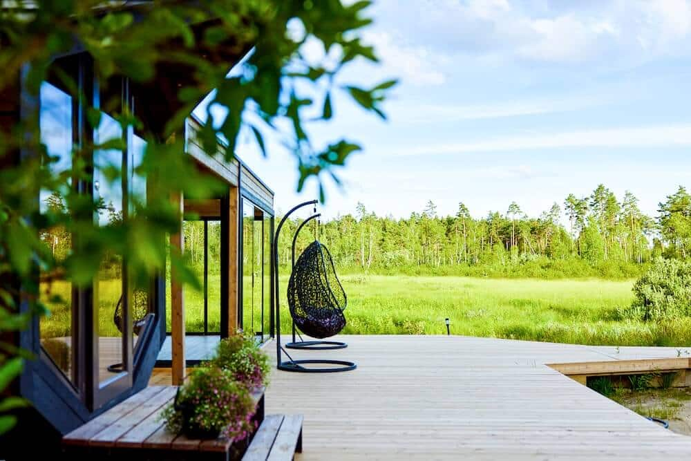
- **Roll operatsioonis:** Heaolu- ja puhkekeskuse eestvedaja; looduslik keskkond keha ja vaimu taastamiseks; ürituste ja praktikate korraldamine.
- **Taust:** Ettevõtja, Pühali Hea Elu Keskuse (endine Adila heaolu- ja puhkekeskus) asutaja ja omanik. Keskus asub Pihali külas (Kohila vald, Raplamaa) — saunad, spordiväljakud, majutus, rabamets ja Pühali Hiis. Sõõrumaa seostab koha oma esivanemate ajalooga (vähemalt 12 põlvkonda) ja missiooniga taastada küla elujõudu. Korraldab üritusi, puhkust ja keha-vaimu praktikaid looduses.
- **Miks ta on siin:** Infosõja väsimus ei ole ainult vaimne — see on ka kehaline. Pühali pakub ruumi, kus inimene saab väljuda algoritmist: sauna, rabas jalutada, hiies vaikida, hingetõmmata. **Hi on Life** ühenduse festivalid (PVC telk, lava, madratsid) — seal esines **Epp Kärsin**; Renee Aluste tunnistus padjukest ja siirusest: **Lisa AA §9**. See on operatsiooni „ava silmad" missioon looduse ja hea elu kaudu.

#### Jure Biechonski — Transpersonaalne psühholoogia ja hüpnoteraapia

- **Roll operatsioonis:** Transpersonaalse psühhhoteraapia ja hüpnoanalüüsi (THA) õpetaja; keha-meele tervendamine ja psühhosomaatika.
- **Taust:** **Teadlik Mina** kooli asutaja ja juhataja ([teadlikmina.ee](https://teadlikmina.ee)); THA (Transpersonaalne Hüpnoanalüüs) looja. 40+ aastat praktikat; Eesti Transpersonaalse Psühholoogia Ühingu president; ETPA ja EUROTAS juhtrollid. Õpingud: hüpnoteraapia (UK), NLP, psühhodraama, pereteraapia, psühhoneuroimmunoloogia. Doktoriõpe (Canterbury, UK) — vähkkogemuse emotsionaalne ja spirituaalne dimensioon.
- **Mõjuala:** **Sügav taastumine ja teadlikkus** — alateadlikud mustrid, trauma kehas, psühhosomaatika. Täiendab Villidot, Trofimovit, Kert Grünbergit.
- **Miks ta on siin:** Operatsioon ütleb: vaenlane tabab seestpoolt. Biechonski töötab alateadliku tasandiga — seal, kus manipulatsioon ja trauma sageli peituvad. Ta ei asenda arsti, aga aitab inimesel mõista, miks keha ja vaim haigestuvad koos.

#### Eerik Heldna — Kriisireguleerimine (üleriigiline koordineerimine)

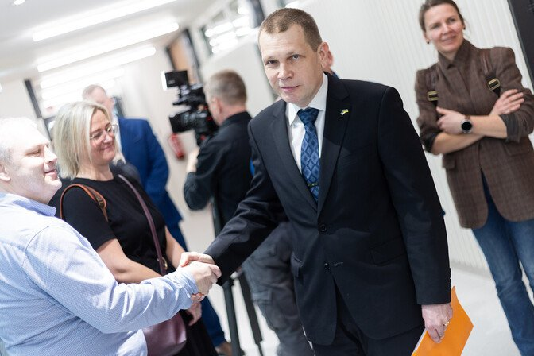

- **Roll operatsioonis:** Kriisireguleerimise koordineerimine kodanikualgatuse tasandil — rolliselgus, õppused, valmisolek ja tsiviil-kaitse üleminek kriisis.
- **Taust:** Üle 25 aasta kogemust õiguskaitse ja julgeolekusektoris (politsei, kaitsepolitsei, toll). Endine Maksu- ja Tolliameti tolliosakonna juht. Naasis 2025. aastal Politsei- ja Piirivalveametisse kriisideks valmisoleku büroosse, kus tegeleb õppuste ja kriisivalmiduse korraldamisega. Combat Ready instruktor; riigikaitseõpetaja gümnaasiumides. Kaitseväe missioonikogemus.
- **Miks ta on siin:** Operatsioon „Peegel" vajab inimest, kes mõistab kriisireguleerimist mitte ainult paberil, vaid praktikas — kes võtab vastutuse rolliselguse eest, kui ühiskond satub surve alla. Heldna on võtnud operatsiooni raames kriisireguleerimise juhtimise enda peale: üleriigiline koordineerimine, õppuste loogika ja kodaniku teadlikkus hädaolukorra reeglite osas.

#### Elmar Vaher — Kaitseinvesteeringud ja riiklik võimekus

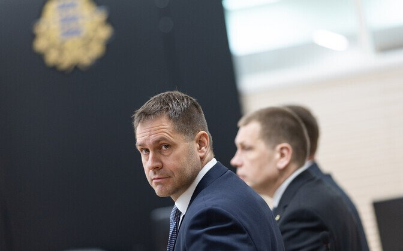

- **Roll operatsioonis:** Strateegiline partner kaitse- ja tsiviilvõimekuse ühendamisel; riikliku investeeringu loogika toomine kodanikualgatusele arusaadavaks keeleks.
- **Taust:** Riigi Kaitseinvesteeringute Keskuse (RKIK) peadirektor alates 12. jaanuarist 2026; riiklik relvastuse direktor. 2013–2023 Politsei- ja Piirivalveameti peadirektor — juhtis ühe Eesti suurima avaliku sektori asutuse ühendamist ja moderniseerimist. Magistrikraad õiguses. Combat Ready instruktor.
- **Miks ta on siin:** Kaitse ei ole ainult sõnum. See on ka raha, taristu ja tarne — miljardid, mis peavad jõudma väljaõppesse ja võimekusse. Vaher täidab RKIK-is missiooni, mis otseselt toetab seda, mida operatsioon kodanikule õpetab: vastutust, valmisolekut ja pika mängu mõtlemist. Ta ühendab riigi investeeringutasandi ja Combat Ready praktilise juhtimiskultuuri. Tema lapsed õpivad Rocca al Mare Koolis; ta on kooliperega seotud lapsevanema ja juhtimisnõustajana (vt **Lisa J**).

#### Combat Ready | Her Way — Naiste enesejuhtimine (For Her)

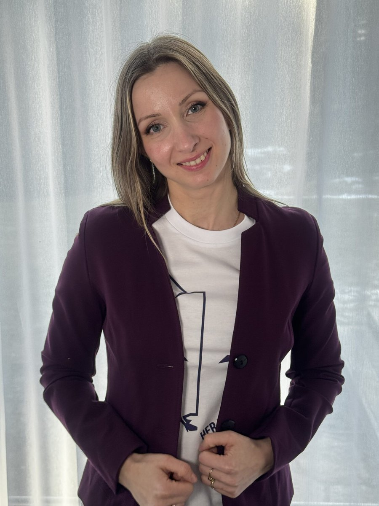

- **Roll operatsioonis:** Naiste kanal ülima vastutuse ja enesejuhtimise õpetamiseks — eriti emadele, juhtidele ja naistele, kes kannavad kodus ja tööl koormust, mida infosõda süvendab.
- **Taust:** Combat Ready | Her Way (tuntud ka kui *Combat Ready for Her*) on kogukond naistest, kes harjutavad Extreme Ownership põhimõtteid enesejuhtimiseks. Veebiseminarid ja praktilised treeningud; kaasloojad ja instruktorid sh Aet Tammis ja Karin Pohla. combatreadyherway.eu.
- **Miks ta on siin:** Infosõda tabab sageli naisi teistmoodi — läbi hoolduse, süütunde ja väsimuse. Her Way pakub turvalist ruumi, kus naised õpivad võtma vastutust oma elu eest ilma kõike kontrollida proovimata. See täiendab operatsiooni peamist sõnumit: tugev perekond algab tugevast inimesest.

#### Tanel Jäppinen — Combat Ready Youth ja Laste Supermängud

- **Roll operatsioonis:** Noorte- ja peretasandi juht; Laste Supermängud ja Combat Ready Youth programmide eestvedaja.
- **Taust:** Combat Ready Youth OÜ juhatuse liige ja tegevjuht (koos Martin Jõesaarga). Pikaaegne vanemlusmentor ja koolitaja; Parenting Solutions OÜ kaasasutaja. Keskendub 7–12-aastaste laste praktilisele vastutusele, distsipliinile ja kodus kasutatavale „ühisele keelele" — väike harjutus päevas, mitte teoorialoeng.
- **Miks ta on siin:** Operatsioon võidetakse või kaotatakse kodus. Laste Supermängud ja Combat Ready Youth annavad lastele mängulise, praktilise tee vastutuse ja meeskonnatöö juurde — enne kui algoritm neid õpetab vastupidist. Kontakt: tanel.jappinen@combatready.eu.

#### Peeter Järvsoo — Noorte Kotkad (kohalik allüksus)

- **Roll operatsioonis:** Noorte Kotkaste rühma vanem; kohaliku noorte isamaalise kasvatuse ja füüsilise distsipliini eestvedaja.
- **Taust:** Noorte Kotkad on Kaitseliidu noorteorganisatsioon (7–18-aastased): isamaaline haridus, seikluslik tegevus, riigikaitsealane väljaõpe ja kogukond üle Eesti. Rühmapealik juhib rühma; salgapealik korraldab salga tegevust. Peeter Järvsoo tegutseb noorte kotkaste rühma vanemana — kohalik taktikaline allüksus, mis toob operatsiooni sõnumi noorteni enne sotsiaalmeediat.
- **Miks ta on siin:** Noored on infosõja peamine sihtrühm. Kotkad õpetavad vastutust, distsipliini ja eeskuju juba enne täiskasvanuks saamist. Iga tugev rühm on väike võit kogu riigi jaoks.

#### Andrei Ambros — Harku piirkond (sport ja vastupanuvõime)

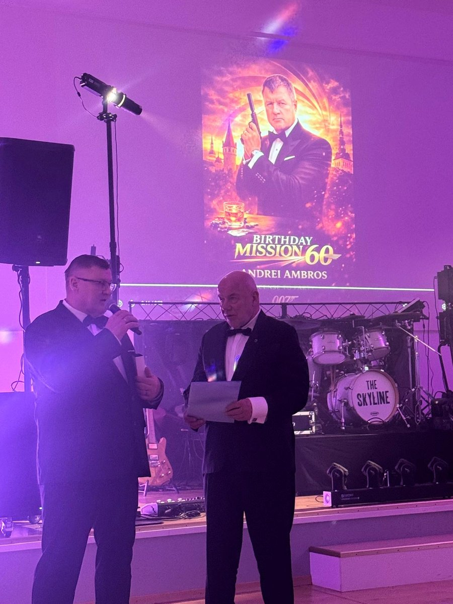

- **Roll operatsioonis:** Harku piirkonna spordi- ja vastupanuvõime tõstmine; füüsilise valmisoleku ja enesekaitse praktiline koolitus.
- **Taust:** Endine Eesti sõjaväelane; Spetsiaalsete Operatsioonide Grupi asutaja ja endine ülem. Ju-jutsu treener (Goshin klubi, Eesti Ju-Jutsu Liit); turvaekspert. MTÜ Laskespordiklubi Taktikaline Grupp asutaja ja treener (Harku vald, Muraste/Kütke) — võitlussport ja jahipraktiline laskmine. Tõi Eestisse Soomest modernse ju-jutsu.
- **Miks ta on siin:** Vaimne vastupidavus vajab kehalist alust. Ambros tegutseb seal, kus inimesed elavad — Harku piirkonnas — ja õpetab, et tugev keha ja oskus end kaitsta on osa kodaniku valmisolekust, mitte agressioonist.

#### Andres Põhjala — Judo, noored ja kogukond (Tartu)

- **Roll operatsioonis:** Noorte füüsiline distsipliin ja kogukonna eestvedaja; judo filosoofia kaudu austus, enesekontroll ja vastupanuvõime.
- **Taust:** Spordiklubi **Do** asutaja ja juht (~45 aastat); judotreener alates 1972 ([do.ee](https://www.do.ee)). Tartu Ülikooli kehakultuur (1981). Endine võistleja; Eesti judokoondise treener; Tartu Spordiliidu juht; Eesti Olümpiakomitee esindajatekogu liige. **Tartu aukodanik** (2026). Klubis 500–600 liiget; kümneid Eesti meistreid aastas; algõpe ka lasteaedades. Rotary, Round Table, Kärevere Jahiselts.
- **Mõjuala:** **Kohalikud allüksused ja noored** — füüsiline kasvatus enne sotsiaalmeediat; judo väärtused (austus, sõprus, enesekontroll) kattuvad SOK checklistiga (*austa · kuula · usalda*). Täiendab Peeter Järvsood (Noorte Kotkad), Tanel Jäppinenit (CR Youth) ja Andrei Ambrosit.
- **Miks ta on siin:** Operatsioon võidetakse noortes. Põhjala on viie aastakümne jooksul kasvatanud tuhandeid lapsi, kellest osa on jõudnud maailmatasemele (sh Martin Järveoja). Ta näitab: distsipliin ei ole karistus — see on struktuur, mis hoiab inimese püsti.

#### Aigar Ojaots — MTÜ Team Pertinax (mereväe meeskond)

- **Roll operatsioonis:** Mereväe-kultuuriga meeskonna eestvedaja; eneseteadlike ja tugevate ettevõtjate koolitamine operatsiooni võrgustikus.
- **Taust:** Ettevõtja ja juht (Thermory AS nõukogu liige; mitmed ettevõtted). MTÜ Team Pertinax kaasasutaja ja juhatuse liige (asutatud 2023). Pertinax on mereväe vaimsuse ja distsipliiniga seotud meeskond — juba ~20 liiget, kes treenivad koos tugevaks ja eneseteadlikuks. Koolitus ja vabaaja tegevused: juhtimine, meeskond, füüsiline ja vaimne vastupidavus. Renee Alustega ühised treeningud tugevate inimeste kasvatamiseks.
- **Miks ta on siin:** Operatsioon vajab mitte ainult sõnumit, vaid inimesi, kes elavad seda. Pertinax ühendab mereväelikku distsipliini, ettevõtlikkust ja eneseteadlikkust — täpselt see, mida kodanik vajab, kui infosõda püüab teda nõrgaks teha. Mereväe meeskond tsiviilis: ausus, vastutus, treening, mitte ainult lipukiri.
- **Kontakt:** MTÜ Team Pertinax (reg. 80634291)

#### Ain Anslan — Viru vangla direktor (Vanglateenistus)

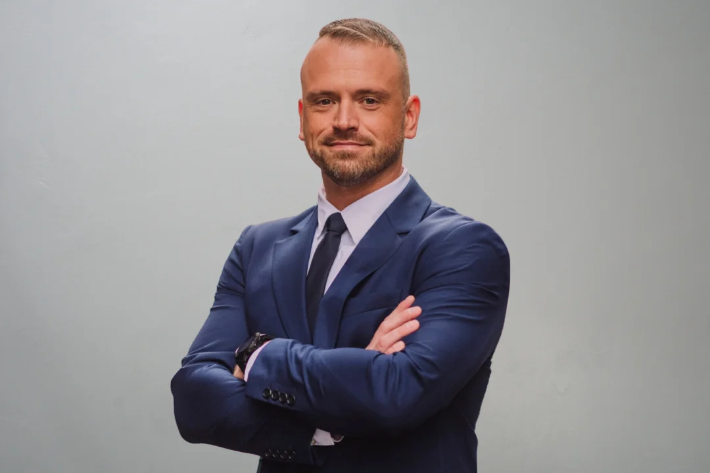

- **Roll operatsioonis:** Avaliku sektori juhtimiskultuuri partner; inimesekeskne juhtimine raskes keskkonnas — kriisivalmidus, meeskonnakultuur ja vastutus.
- **Taust:** Viru vangla direktor alates 1. novembrist 2023. Magistrikraad personalijuhtimises. 19+ aastat riigi julgeoleku ja siseturvalisuse sektoris (sh 4 aastat kaitseväes). Endine relvastatud üksuse, saateüksuse, avavangla ja tugevdatud järelevalve üksuse juht. Vanglaametniku teeneterist (2021); teenistusmedal 15 aasta eest (2023). Combat Ready koostööpartner — juhtide koolitus, veebiseminar Priit Lilleväliga, kogemuslugu „Viru Vangla kogemuslugu" (YouTube, 2026).
- **Miks ta on siin:** Operatsioon „Peegel" ütleb: me ei ehita vanglaid, mida ise valvame. Aga me vajame juhte, kes mõistavad, et kriisivalmidus on igapäevane töökultuur — mitte dokument riiulil. Anslan on elav näide, kuidas Extreme Ownership ja inimesekeskne juhtimine töötavad seal, kus keskkond on kõige raskem. Tema kogemus tugevdab operatsiooni sõnumit: juht kujundab keskkonda oma käitumisega. Täielik võrgustiku skeem ja kõik osalised: **Lisa K**.

#### Eero Kinnunen — Eesti Kaitseväe Veteranid

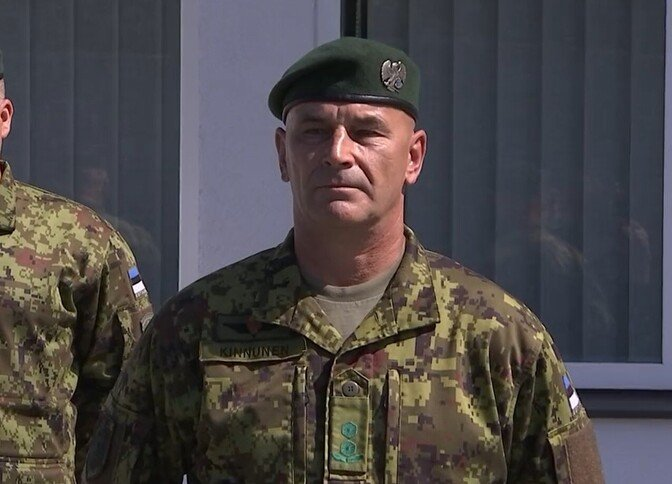

- **Roll operatsioonis:** Veteranide võrgustiku ja kogukonna toe eestvedaja; side lahingukogemuse ja tsiviilühiskonna vahel.
- **Taust:** Kolonel; MTÜ Eesti Kaitseväe Veteranid juhatuse esimees (alates 2014). Endine Viru jalaväepataljoni ülem; Kaitseliidu Harju maleva pealik (seitse aastat); Eesti kaitseattachee Ukrainas. Missioonid Iraagis ja Afganistanis. Kaitseväe Peastaabi operatiivjaoskonna endine ülem. Orden: Kotkaristi V klass (2004).
- **Miks ta on siin:** Veteranid on elav mälestus, et vabadus ei ole tasuta. Kinnunen ühendab need, kes on teeninud, ja need, kes peavad tugevaks jääma kodus. Operatsioon vajab veteranide häält — mitte propaganda, vaid ausust ja kogemust.

#### Marge Sillaste — Tugiteenused ja inimeste juhtimine

- **Roll operatsioonis:** Juhtide ja abistajate supervisioon ning coaching; inimeste juhtimine protsesside asemel — Steigeri põhimõtete praktiline rakendamine tugiteenuste kontekstis.
- **Taust:** Tervishoiu ja supervisiooni valdkonna praktik (FIE, alates 2017). Pakub supervisiooni, coachingut ja terapeutilist tuge — keskendub inimestele, mitte vaid protsessidele. Töötab tugiteenuste kontekstis, kus juhid ja spetsialistid vajavad peegeldust, mitte järjekordset kontrollnimekirja.
- **Miks ta on siin:** Operatsioon „Peegel" ütleb: inimesekeskne juhtimine (Lisa I) ei ole ainult kaitseväe teema. Sillaste aitab neil, kes teenivad teisi — juhid, mentorid, tugispetsialistid — mitte läbi põleda ega muutuda masinaks. Ta juhib inimesi, mitte protsesse.

#### Kaia Kapsta-Forrester — Pere- ja paariteraapia, kriisitugi

- **Roll operatsioonis:** Integratiivne pere- ja paaripsühholoog; suhtekoolitaja ja kriisinõustaja — abielu, lahutus, kärgpere, raseduskriis.
- **Taust:** Üle 20 aasta praktikat Eestis ja Suurbritannias; töötanud 3000+ inimesega ([kaiakapsta.com](https://kaiakapsta.com)). Lähenemised: IMAGO suhteteraapia, PREP paarikoolitus, psühhodraama, kehateadlikkus, TRE. **Väärtustades Elu SA** (Väärtustades Elu Koolitus- ja Arenduskeskus) — raseduskriisi nõustamise süsteemi üks algatajaid Eestis. Kolme lapse ema; isiklik kogemus abielu, lahutuse ja kärgperega. Töötab ka Zoomi kaudu.
- **Mõjuala:** **Pere tervis ja kriis** — Sotsiaalkaitseministeeriumi haldusalaga seotud ennetus ja tugi. Aitab paaridel murda mustreid enne, kui pere laguneb; toetab neid, kes on juba kriisis (sh rasedus, lahutus). Täiendab Lisa E (*Pere rindejoon*), Lisa F (*Murra ring*) ja Lisa H (kriis).
- **Miks ta on siin:** Operatsiooni võidu mõõdik on tugev perekond. Kaia töötab seal, kus infosõda ja stress reaalselt peresid lõhuvad — mitte sloganiga, vaid terapeutilise praktikaga. PREP ja IMAGO annavad paaridele konkreetsed tööriistad, mitte ainult motivatsiooni.

#### Ott Pärna / Tallinna Tehnoloogiakolledž Techno TLN — Haridustase

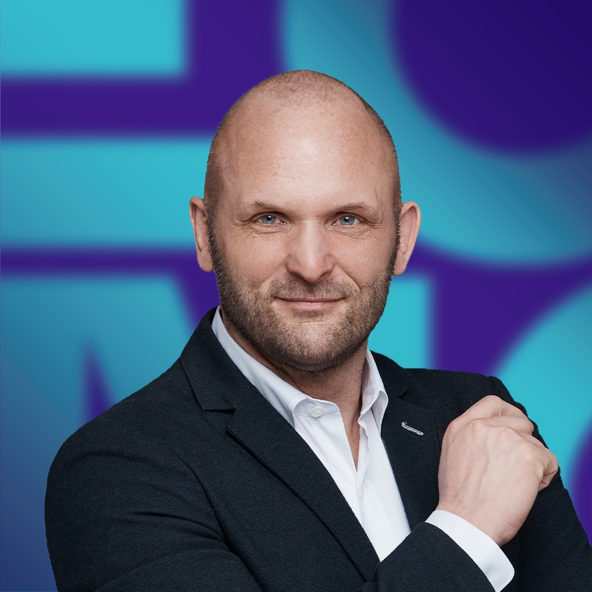

- **Roll operatsioonis:** Haridustaseme strateegiline partner; kutse- ja tehnoloogiahariduse eestvedaja noorte vastupanuvõimes.
- **Taust:** PhD, ettevõtja, TU majandusteaduskonna külalisprofessor. Techno TLN direktor — nelja kutsekooli ühendamisel riigi suurim tehnoloogiakolledž (~6000 õppijat). Eesmärk: muuta rakenduslik keskharidus noorte esimeseks valikuks.
- **Miks ta on siin:** Kool on koht, kus laps veedab suure osa päevast pärast kodu. Kui kool õpetab praktilist oskust, kriitilist mõtlemist ja vastutust — infosõda ei saa teda nii kergesti murda. Täielik Techno TLN juhtkond: **Lisa J**.

#### Tallinna Vaba Waldorfkool — Ave Osa (võtmeisik)

- **Roll operatsioonis:** Waldorfkooli võtmeisik operatsiooni võrgustikus; sidestab kogukonna, lapsevanemad ja paranemis-teadlikku tuge.
- **Taust:** Holistiline regressiooniterapeut (TAM kutsetunnistus, tase 6; Holistika Instituut, HORETES). Tallinna Vaba Waldorfkool (TVW) — 2001. aastal lapsevanemate initsiatiivil loodud waldorfpedagoogiat järgiv kool (Tuulemaa 12, ~110+ õpilast). Visioon: **vaba inimene** — vastutab oma elu eest, hoolib kogukonnast, on avatud uutele ideedele.
- **Miks ta on siin:** Waldorf õpetab terviklikku inimest — mitte ainult teste. Operatsioon ütleb: *sa pole katki*. Ave sidestab koolipere holistilise toe ja ausa vestluse kultuuriga (Lisa P). Täiendab Kert Grünbergi ja teadlikkuse võrgustikku. Täielik kooli profiil: **Lisa J**.
- **Kontakt:** +372 5690 4407 · [waldorf.ee](https://waldorf.ee) · [holistika.ee](https://holistika.ee/teraapia/terapeudid/)

#### Eesti Montessori võrgustik — koolid ja lasteaiad

- **Roll operatsioonis:** Üleriigiline haridusvõrgustik — lapse **õppija-identiteet**, autonoomia ja austus lapse vastu algab varakult (Lisa M).
- **Taust:** **Eesti Montessori Ühing** ([montessorieesti.ee](https://www.montessorieesti.ee)) koondab AMI juhendajatega lastehoiud, lasteaiarühmad ja kooliklassid üle Eesti. **Eesti Montessori Instituut** ([mariamontessori.ee](https://mariamontessori.ee)) koolitab AMI juhendajaid. Deviss: *„Aita mind seda ise teha!"* — 4 AMI kooliklassi (RaM Kool, Mahtra PK, Keila Kool, Tartu Forselius); lasteaiarühmad Harjumaal, Tartus, Pärnus, Haapsalus, Nõos ja mujal.
- **Võtmeisikud:** **Ruth Maria Roosi-Ott** ja **Kerli-Kristi Allikvee** (AMI juhendajad, instituudi juhatus).
- **Miks siin:** Montessori õpetab last **ise mõtlema** — mitte kuuletuma algoritmile. See on vastupanuvõime enne nutitelefoni. **Beebi eas** (0–3): austus algusest — *austus = armastus*, stressivaba vanemlus (**Lisa W**). Kattub operatsiooni põhireegliga: terve, normaalne inimene algusest. Täielik nimekiri ja piirkondlikud MTÜ-d: **Lisa J §5**.
- **Kontakt:** info@mariamontessori.ee · [montessorieesti.ee/montessori-haridusasutused-eestis](https://www.montessorieesti.ee/montessori-haridusasutused-eestis/)

#### Võrgustiku toetajad (taktikaline tase)
- **Tegusad ettevõtjad (hajutatud võrgustik)** — Martin Plaser, Nils Ratt, Priit Uuemaa, Sverre Puustusmaa, Marko Kaseleht, Kaido Raudvere; tegutsevad sõltumatult, ilma tsentraalse käsuta — igaüks oma piirkonnas ja valdkonnas.
- **Robert Käsper** — tegutseb **hajutatult omal maastikul**: meedik (18D), veteran, Delfi „Eriväelase jutud"; kaitse ja meditsiin.
- **Margus Lõoke** — Kaitseväe mustri tunnistaja; jagas Reneelega tähelepanekut ATH-diagnostika mustrist KV personalis (isiklik vaatlus, mitte ametlik statistika).
- **Peep Vain** — koolitaja ja kõneleja (Vain & Partners); juhtimine, motivatsioon ja enesemääramine.
- **Alar Ojastu** — juhtide ja meeskondade koolitaja (Eesti parim koolitaja 2018); autor *Ratsionaalne emotsionaalsus* — emotsioonide ja inimlikkuse silmaringi avaja.
- **Tiit Trofimov** — enesearengu teejuht (tiittrofimov.ee); emotsioonide töö, meeste ringid, meditatsioon; autor *Lõpp on algus*; taastumine pärast 2009. aasta kriisi.
- **Epp Kärsin** — teadlik intiimsus ja seksuaalharidus (eppkarsin.com); paarid, noored, häbist tabude murdmine; Amare Luna OÜ.
- **Kaia Kapsta-Forrester** — pere- ja paariteraapia (kaiakapsta.com); IMAGO, PREP, raseduskriisi nõustamine; Väärtustades Elu SA.
- **Kert Grünberg** — trauma ja hingamine (hingamistuba.ee); holistiline regressioon, TRE, kaassõltuvus; taastumine.
- **Jure Biechonski** — transpersonaalne psühhhoteraapia (teadlikmina.ee); THA, hüpnoteraapia, psühhosomaatika.
- **Andres Põhjala** — judo ja noored (do.ee); Spordiklubi Do, Tartu; füüsiline distsipliin ja kogukond.
- **Eesti Montessori võrgustik** — vt ülal **Lisa J §5**; AMI juhendajad Ruth Maria Roosi-Ott, Kerli-Kristi Allikvee.
- **MTÜ Perekoolitusühing Sina ja Mina** — Gordoni perekooli suhtlustreeningud lapsevanematele (TAI hinnang: VÄGA HEA).
- **Tallinna Perekeskus** — programm „Imelised aastad" (3–8-aastaste vanematele); tõenduspõhine vanemlusabi.
- **PAPSID.EE** — Illimar Pilt ja Kristo Tuurmann; missioon: rohkem õnnelikke lapsi, vähem lahutatud peresid; **Papside laager** (3-päevane isade kogemuslaager, [papsid.ee/papside-laager](https://papsid.ee/papside-laager/)); tugevate ja kohalolevate isade kasvatamine.
- **Starfish Academy** — Vallo Arumäe; finantskirjaoskus ja investeerimine ([starfish.academy](https://www.starfish.academy)).
- **BMI Executive Institute** — rahvusvaheline juhtide kõrgharidus Baltikumis/Saksamaa partnerlusega ([bmiinstitute.com](https://www.bmiinstitute.com)).
- **BNI Eesti** — maailma suurim ärireferaalide võrgustik; Tallinnas BNI North Star ja BNI One ([bni.ee](https://bni.ee)).
- **Kerdu Lenear** — Mindset Fitness; mõtteviisi koolitused, BNI North Star Tallinn president ([mindsetfitness.ee](https://mindsetfitness.ee)).
- **Julian Maier** — URBN TIGER (Saksamaa); breathwork ja vaimne fitness, e-Residency Eesti ([urbntiger.com](https://urbntiger.com)).
- **Äripäev** — Investor Toomas, investeerimisraadio, Aasta investor, Parim juht ([aripaev.ee/raadio](https://www.aripaev.ee/raadio)).
- **Rahakratt** — rahablogi, finantsvabadus ([rahakratt.rahajutud.ee](https://rahakratt.rahajutud.ee)).
- **Kristjan Liivamägi** — Aasta investor 2022, TalTech, rahatarkuse saadik ([rahaedu.ee](https://rahaedu.ee)).
- **Marko Oolo** — Aasta investor 2024, Exceli investeerimistööriistad ([oolomarko.ee](https://oolomarko.ee)).
- **Katri Teller** — Blondcast, Aasta investor 2023 ([tasku.delfi.ee](https://tasku.delfi.ee)).
- **Üksus Aluste_kool (SOK)** — demomehed; SOK läbinud tunnevad ennast ise ära (vt **Lisa N**).
- **Kõik Eesti kodanikud** — operatsiooni lõplik sihtrühm ja põhijõud.

---

## ÜLESANDE ALA PIIRID

| Element | Kirjeldus |
|---------|-----------|
| **Oma asukoht** | Eesti Vabariik — igas maakonnas, igas kodus, igas koolis |
| **Ülesande asukoht** | Info- ja sotsiaalmeediakeskkond; perekond; kogukond; töökoht |
| **Tegutsemisala** | Eesti keele- ja kultuuriruum; digitaalsed platvormid, kus Eesti inimesed veedavad aega |
| **Põhjasuund** | Tõde, vastutus, perekond, kogukond |
| **Piirangud** | Ei tegutse vaenlase meetoditega (häire, vihkamine, laim). Ei ründa tsiviile. Ei kasuta riigi ametlikke kanaleid ilma kooskõlastuseta. |
| **Naaberüksused** | Kaitsevägi (ametlik infosõja tõrje), Kaitsepolitseiamet, Politsei- ja Piirivalveamet, vabaühendused, kirikud, koolid |

---

## ILM, VALGUS JA MAASTIK (INFOKESKKOND)

### 1. Infoilm ja „valgus"
- **Temperatuur:** Kõrge emotsionaalne polarisatsioon sotsiaalmeedias; madal kriitiline kontroll digikanalites.
- **Tuul:** Algoritmilised tuuled — TikTok, YouTube, Telegram, Vene-keelsed kanalid.
- **Sademed:** Desinformatsiooniküllane voog; igapäevased „šokeerivad" narratiivid.
- **Valgustus:** Vastane tegutseb pimeduses (anonüümsed kontod, võltsitud uudised). Meie valgus on teadlikkus ja läbipaistvus.

### 2. Maastik (ühiskondlik)
- **Üldine:** Tihe asustus (linnad) ja hajus elu (maapiirkonnad); tugev digitaalne ühenduvus.
- **Vaatlusväli:** Sotsiaalmeedia voog — 50–500 m ekvivalent „nähtavuses" (postituse levik).
- **Varjatus:** Vastane varjub algoritmide ja võõrkeelsete kanalite taha.
- **Takistused:** Info üleküllus, väsimus, skeptitsism „järjekordse kampaania" suhtes.
- **Võtmekohad:** Koolid, lasteaedade ümbrus, noorte platvormid, perede tugikeskused.
- **Liikumisteed:** Facebook, Instagram, TikTok, YouTube, taskuhäälingud, kogukonna üritused, kirikud, spordiklubid.

**Hinnang:** Vastasele sobib kaos ja hajutatus. Meile sobib selgus, järjepidevus ja isiklik eeskuju.

---

# 1. OLUKORD

## a. Vastane

**Vastase üksus:** Vene Föderatsiooni psühholoogilise sõja ja mõjutusoperatsioonide struktuurid (riiklikud ja mitteriiklikud kanalid).

| Element | Hinnang |
|---------|---------|
| **Koosseis** | Riiklikud meediaagentuurid; GRU/FSB seotud võrgustikud; sotsiaalmeedia farmid; algoritmiline amplifikatsioon |
| **Asukoht** | Venemaa, aga ka Eesti digiruum (võõrkeelsed kanalid, Telegram, TikTok) |
| **Praegune tegevus** | Süstemaatiline Eesti ühiskonna nõrgestamine: perekondade lõhkumine, usalduse vähendamine riigi vastu, hirmu ja lootusetuse külvamine |
| **Tugevus** | Pikaaegne kogemus (7+ aastat aktiivset tegevust Eestis); ligipääs meie platvormidele; emotsionaalne mõju |
| **Nõrkus** | Sõltuvus meie enda platvormidest; ei suuda vastu seista tugevale kogukonnale; tõde on kontrollitav |
| **Tõenäoline tegevus** | Jätkab rütmi suurendamist kriisiaegadel; kasutab üksikuid traagilisi sündmusi amplifikatsiooniks |
| **Kõige ohtlikum tegevus** | Eesti kodanike lootusetuse tekitamine — eriti noorte ja üksikvanemate seas — nii et nad lõpetavad vastupanu |

## b. Omad üksused

| Tase | Üksus | Staatus |
|------|-------|---------|
| Kõrgem | Eesti riik, Kaitsevägi, Kaitsepolitseiamet | Ametlik infosõja tõrje — hea, kuid kõik ei jõua kodanikuni |
| Strateegiline | Eerik Heldna (kriisireguleerimine), Elmar Vaher (RKIK) | Kriisivalmidus ja kaitseinvesteeringud — aktiivne |
| Operatiivne | Kaitseväe Akadeemia, Kaitseliit | Juhtide koolitus, kogukonna kaitse — tugev |
| Taktikaline | Combat Ready (+ Her Way, Youth/Supermängud, Pertinax) | Juhtimiskoolitus, ülim vastutus — aktiivne |
| Avalik sektor | Ain Anslan (Viru vangla) | Juhtimiskultuur, kriisivalmidus — aktiivne (Lisa K) |
| Haridus | Techno TLN (Ott Pärna), KVA juhtkond, RaM Kool (Elmar Vaher), **Tallinna Vaba Waldorfkool (Ave Osa)**, **Montessori võrgustik (Roosi-Ott, Allikvee)** | Kutse-, juhtimis-, väärtus-, waldorf- ja Montessori-haridus — aktiivne (Lisa J) |
| Kohalik | Peeter Järvsoo (Noorte Kotkad), Andrei Ambros (Harku), Andres Põhjala (Tartu Do) | Noored ja piirkondlik vastupanuvõime — aktiivne |
| Rahva tase | Operatsioon „Peegel" võrgustik | KÄIVITATUD — see käsk |
| Toetus | Remo Ojaste / Combat Ready | Extreme Ownership, äriline juhtimine — aktiivne |
| Toetus | Starfish Academy (Vallo Arumäe) | Finantskirjaoskus, investorlus — aktiivne |
| Toetus | BMI Executive Institute | Juhtide EMBA ja executive education — aktiivne |
| Toetus | BNI Eesti | Ärireferaalid ja ettevõtjate võrgustik — aktiivne |
| Toetus | Kerdu Lenear / Mindset Fitness | Mõtteviis, BNI North Star Tallinn — aktiivne |
| Toetus | Julian Maier / URBN TIGER | Breathwork (Saksamaa), e-Residency — aktiivne |
| Toetus | Äripäev / Investor Toomas | Investeerimisraadio, Aasta investor, Parim juht — aktiivne |
| Toetus | Rahakratt | Finantsvabadus, aus rahablogi — aktiivne |
| Toetus | Kristjan Liivamägi | Teaduspõhine investeerimisharidus — aktiivne |
| Toetus | Marko Oolo | Exceli tööriistad, portfellihaldus — aktiivne |
| Toetus | Katri Teller / Blondcast | Taskuhääling, rahatarkus — aktiivne |
| Toetus | Robert Käsper | Meedik (18D), Eriväelase jutud — hajutatult — aktiivne |
| Toetus | Margus Lõoke | KV ATH-muster (isiklik tähelepanek); e-sliini tugi — aktiivne |
| Demomehed | Üksus Aluste_kool (SOK) | Viisakus, checklist, demomehed — aktiveeritud |
| Toetus | Katrin Lucas / „Ava oma Silmad" | Teadlikkuse kanal — aktiivne |
| Toetus | Ingvar Villido / Practical Consciousness | Teadliku muutuse kunst — aktiivne |
| Toetus | Tiit Trofimov / eneseareng | Emotsioonid, meeste ring, taastumine — aktiivne |
| Toetus | Epp Kärsin / Amare Luna | Teadlik intiimsus, seksuaalharidus — aktiivne |
| Toetus | Kaia Kapsta-Forrester | Pere- ja paariteraapia, raseduskriis — aktiivne |
| Toetus | Kert Grünberg / Hingamistuba | Trauma, hingamine, kaassõltuvus — aktiivne |
| Toetus | Jure Biechonski / Teadlik Mina | Transpersonaalne teraapia, THA — aktiivne |
| Toetus | Andres Põhjala / Spordiklubi Do | Judo, noored, Tartu kogukond — aktiivne |
| Toetus | Eesti Tantrafestivali võrgustik (Earthchild, Skalkina, Sarmet, Saul) | Tantralaagrid ja festivalid — aktiivne |
| Toetus | Urmas Sõõrumaa / Pühali Hea Elu Keskus | Heaolu, loodus, puhkus — aktiivne |
| Toetus | Eero Kinnunen / Eesti Kaitseväe Veteranid | Veteranide kogukond ja tugi — aktiivne |
| Toetus | Marge Sillaste | Supervisioon, inimeste juhtimine — aktiivne |
| Riik / tervis | TAI + kõik ministeeriumid | Protsessijuhtimine, Muski algoritm — aktiivne (Lisa L) |

**Kõrgema üksuse kavatsus:** Kaitsta Eesti inimeste vaimset ja füüsilist julgeolekut. See operatsioon toetab seda eesmärki, mitte ei asenda riiklikku kaitset.

## c. Tugevdused ja vähendused

- **Tugevused:** Renee Aluste (isiklik kogemus + sõjaline väljaõpe); Combat Ready meeskond (sh Her Way, Youth, Pertinax); Ain Anslan (avaliku sektori juhtimiskultuur); Riho Ühtegi rahvuslik autoriteet; Rene Toomse strateegiline nägemus; Eerik Heldna kriisireguleerimine; Elmar Vaher kaitseinvesteeringute ja juhtimiskogemus; Steigeri inimesekeskne juhtimine kui SOP (Lisa I); teadlikkuse võrgustik (Lucas, Villido, Trofimov, tantralaagrid, Pühali); veteranid (Kinnunen); kohalikud allüksused (Järvsoo, Ambros); inimeste juhtimine (Sillaste).
- **Vähendused:** Puuduv ametlik riiklik volitus (kodanikualgatus); piiratud eelarve; sõltuvus vabatahtlikust osalusest.

---

# 2. PÕHIÜLESANNE

**Eesti kodanikud (sina) tugevdavad oma perekondi, arendavad kriitilist mõtlemist ja toimivad eeskujuna oma kogukonnas mitte hiljem kui järgmise 12 kuu jooksul kogu Eestis, eesmärgiga murda Vene psühholoogilise mõjutamise mõju Eesti ühiskonnas ja taastada tugevate perede kultuur.**

*Kordan: Iga laps vajab elus tugevat eeskuju. See on meie võit.*

---

# 3. TÄIDEVIIMINE

## a. Pealiku kavatsus

Operatsioon „Peegel" põhineb peegelneuronitel — ajus mehhanismil, mille abil inimesed peegeldavad teiste käitumist. Me ei võitle vaenlast vaenusega. Me peegeldame tervist: tugevaid peresid, ausaid vestlusi, distsiplineeritud elu ja kriitilist mõtlemist.

**Faas I — Teadvustamine (kuud 1–3):** Ava silmad. Tuvasta manipulatsioon. Jälgi oma infokäitumist. Vähenda algoritmidele allumist. Alusta eneseanalüüsiga.

**Faas II — Tugevdamine (kuud 4–8):** Ehita harjumusi. Perekonna aeg. Füüsiline liikumine. Mentorlus. Combat Ready ja võrgustiku koolitused. Combat Ready | Her Way (naised). Combat Ready Youth ja Laste Supermängud (Tanel Jäppinen). MTÜ Team Pertinax treeningud (Aigar Ojaots, mereväe meeskond). „Ava oma Silmad" taskuhääling teadlikkuseks. Ingvar Villido Practical Consciousness kursused. Tantralaagrid ja Eesti Tantrafestival (Earthchild, Skalkina, Sarmet, Saul). Pühali Hea Elu Keskus — loodus, sauna, puhkus (Sõõrumaa). Noorte Kotkad (Järvsoo). Harku piirkond (Ambros). Veteranide tugi (Kinnunen).

**Faas III — Peegeldamine (kuud 9–12):** Oma kogukonnas eeskujuks. Räägi teistega. Toeta naabrit, kolleegi, sõpra. Iga tugev isa, iga toetav ema, iga mentor on võit.

**Faas IV — Avastuspäev (alates kuu 12):** Uus suund arenenud ühiskonnana — läbipaistvus, inimesekeskne juhtimine, vabatahtlik vastutus. Rakenda Steigeri põhimõtteid (Lisa I). Lõpeta formaalne dominants, mis inimesed läbi näevad. Ministeeriumid ja TAI rakendavad Muski viieastmelist algoritmi (Lisa L): küsi → kustuta → lihtsusta → kiirenda → automatiseeri.

**Faas V — LIHTSUS (alates kuu 13):** *„Kui meeskond ei tea plaani, siis nad ei saa ju seda täita!"* Iga kodanik saab selge identiteedi tööriista (Lisa M): Tony Robbinsi 5 sammu, kodaniku manifest peegli ees, kodaniku vanne. Üks plaan, üks tõde korraga, üks peegel päevas. Võrgustik liigub samuti lihtsuse poole — selge sõnum enne IT-d.

**Murdepunkt:** Kui ühiskondlik narratiiv nihkub — kui inimesed hakkavad rääkima vastutusest, mitte ohvrina olemisest.

**Põhipingutus:** Iga üksiku inimese otsus võtta vastutus oma perekonna ja mõtlemise eest.

### Õppetund rahvusvahelisest laagrist (ühe veteranide jutu järgi)

*Alljärgnev on kokkuvõte loost, mida üks rahuvalvemissioonil teeninud veteran hiljem jagas — ilma missiooni, üksuse ega nimedeta.*

Laagri reegel oli: kaks õlut. Kui keegi küsis, oli SOP vastus: *„This is my first!"* Ühel õhtul oli ühe riigi meeste laud täis pudelid. Reeglid loodi loogikaga; pärast kahte õlut mõtles emotsioon — sa ei olnud enam sama inimene. Terve laager oli rahulik ainult siis, kui eelmisel õhtul oli joodud palju. See oli eluõppetund: dominants ei tööta inimeste peal pikas mängus. Mänguteooria ütleb: tit-for-tat on parim. Eestikeeles: *mida külvad, seda lõikad.* Parem tee on ausus, usaldus ja inimesekeskne juhtimine — mitte vanglad, mida ehitame ise, ja politsei, kes neid valvab.

## b. Ülesanded lahinguüksustele

### Rahva tase (iga kodanik)
1. **Õppija roll:** Enne juhtimist õpi ennast tundma. 15 minutit päevas vaikust, päevikut või eneserefleksiooni.
2. **Identiteet (Lisa M):** Tony Robbinsi 5 sammu — tuvasta uskumused, küsi ja kahtle, katkesta muster, ehita tõestust, loe manifesti peegli ees; kodaniku vanne.
3. **Infohügieen:** Kontrolli uudiseallikat. Piira TikToki/sotsiaalmeedia aega. Jälgi, mis emotsiooni kanal tekitab.
4. **Perekond:** Planeeri iganädalane „perede aeg" — ilma ekraanideta.
5. **Eeskuju:** Ole see inimene, keda sa ise noorena vajasid.
6. **Demomees enne levitamist:** Loe Lisa N — ole **demomees** enne kui räägid operatsioonist tutvusringkonnas. Eeskuju enne sõna.
7. **Levita tutvusringkonnas (pikk mäng):** Iga kodaniku roll on rääkida oma tutvusringkonnas — **turundust on vaja**. Aga **mitte enne demomehe kogemust**. Alles kui keegi **huvi tunneb**, võid natuke jagada. Alles siis räägid teistele. Mitte müüki. Mitte kiirustamist. Teisel pool: **armastust täis väärtuslik elu**. (Lisa N §4b)

### Renee Aluste rühm (koordineerimisüksus)
1. **1-1 vestlused** — prioriteet: **paranemis-teadlikult**, turvalisuses ja mõistmises (läbipõlemise vastu; vt V-formatsioon Lisa I). Tööriist: **spordikommentaator** (Lisa P).
2. **Turvalisuse standard** — kõik kontaktid: turvalisus → spordikommentaator → valideeri → ausus → valik (Lisa P). Side hääl ja GOTWA: **Lisa Q**. **Kohtle iga asjaosalist nagu terve, täiesti normaalset inimest.**
3. Sõnumite koordineerimine ja levitamine.
4. Combat Ready koolituste korraldamine võrgustikule.
5. Isiklike lugude jagamine (autentsus).
6. Mõõdikute jälgimine (tagasiside kogukonnast).
7. **Aktiveeri ja juhi üksust Aluste_kool** — SOK demomehed (vt **Lisa N**).

### Üksus Aluste_kool (SOK — demomehed)
1. Loe läbi **sõduriõpik** ja **Kaitseväe viisakuseeskirja** põhimõtted (sisemäärustik, rivikord) — [mil.ee õigusaktid](https://mil.ee/kaitsevagi/uldinfo/oigusaktid-ja-eeskirjad/kaitsevaeteenistuse-alused/uldised-eeskirjad-ja-maarustikud/).
2. **Iga päev checklist** (vähemalt 1×): austa · kuula · usalda · ole mõjutatud · hooli.
3. **Katseta, mis töötab** — anna igakuiselt tagasiside: mis checklisti punkt aitas, mis mitte.
4. Ole **demomees** — näita eeskuju, ära ainult räägi; täielik juhend: **Lisa N**. *Kui sa oled SOK läbinud — tunnetad ennast ära.*

### Combat Ready (Remo Ojaste, Priit Lilleväli, meeskond)
1. Ülima vastutuse koolitused ettevõtetele ja kogukondadele.
2. Juhtimis- ja meeskonnakoolitused perede ja MTÜ-de juhtidele.
3. Veebipõhiste ja hübriidlahenduste pakkumine (2026. aasta fookus: turvalisus ja vastupidavus).

### Combat Ready | Her Way (naiste kanal)
1. Igakuised enesejuhtimise veebikohtumised ja praktilised treeningud naistele.
2. Ülima vastutuse rakendamine kodus, tööl ja kriisihetkedel — ilma kõike kontrollida proovimata.
3. Kogukonna loomine, kus naised harjutavad ausust ja vastutust (combatreadyherway.eu).

### Tanel Jäppinen / Combat Ready Youth / Laste Supermängud
1. Laste Supermängud — praktilised harjutused peredele (7–12-aastased): vastutus, keskendumine, „ühine keel" kodus.
2. Combat Ready Youth programmide arendamine ja levitamine koolidele ja MTÜ-dele.
3. Vanemate mentorlus: väike harjutus päevas > teoorialoeng.

### Eerik Heldna (kriisireguleerimine)
1. Üleriigiline kriisireguleerimise koordineerimine operatsiooni raames — rolliselgus kodanikule ja juhtidele.
2. Õppuste ja stsenaariumide loogika toomine tsiviilkanalisse (PPA kriisideks valmisoleku kogemus).
3. Kriisikommunikatsiooni standardid lähtuvalt Lisa I põhimõtetest; hädaolukorra reeglite teadlikkus.

### Elmar Vaher (RKIK / kaitseinvesteeringud, RaM Kool lapsevanem, vt Lisa J)
1. Siduda riiklik kaitsevalmidus ja koolielu — lapsevanemana Rocca al Mare Koolis.
2. Toetada kooli kriisivalmidust ja juhtimispraktikat (pro bono nõustamine).
3. Viia RKIK-i investeeringuloogika kodanikule arusaadavaks keeleks; toetada Combat Ready partnerlust.

### Ain Anslan / Viru vangla (Vanglateenistus, vt Lisa K)
1. Juhtide koolitus Combat Ready põhimõtetel — inimlik pealehakkamine ja sihikindlus raskes keskkonnas.
2. Kriisivalmidus igapäevase töökultuurina — otsused seal, kus sündmus toimub.
3. Keskkonna kujundamine juhi käitumisega; koostöö Priit Lilleväliga (veebiseminar, kogemuslood).
4. Siduda avalik sektor ja kodanikualgatuse juhtimiskultuur — vt **Lisa K**.

### Eero Kinnunen (Eesti Kaitseväe Veteranid)
1. Veteranide ja nende perede tugi, tunnustus ja eneseabi foorum (ekvv.ee).
2. Side veteranide kogemuse ja kodanikualgatuse vahel — ausad lood, mitte propaganda.
3. Heategevus ja riigikaitseliste tegevuste toetamine avalikes huvides.

### Peeter Järvsoo (Noorte Kotkad)
1. Noorte Kotkaste rühma tegevus: isamaaline kasvatus, füüsiline distsipliin, meeskond.
2. Noorte kaasamine operatsiooni sõnumisse — eeskuju enne algoritmi.
3. Koostöö kohalike koolide ja peredega piirkonnas.

### Andrei Ambros (Harku piirkond)
1. Spordi- ja vastupanuvõime programmid Harku vallas ja naabruses (ju-jutsu, laskmine, enesekaitse).
2. Füüsilise valmisoleku tõstmine peredes ja noortes — trenn, mitte hirm.
3. Koostöö Combat Ready ja Kaitseliidu kohalike struktuuridega.

### Andres Põhjala (Spordiklubi Do, Tartu)
1. **Judo** — austus, enesekontroll, sõprus; 500+ noort klubis ([do.ee](https://www.do.ee)).
2. Tartu aukodanik (2026); EOK; kogukonna eestvedaja — judokarikavõistlused, lasteaedade algõpe.
3. Füüsiline distsipliin enne ekraani; täiendab Noorte Kotkad ja CR Youth.

### Aigar Ojaots / MTÜ Team Pertinax (mereväe meeskond)
1. Pertinax meeskonna (~20 liiget) treeningud: tugevad, eneseteadlikud ettevõtjad ja juhid.
2. Mereväe distsipliini ja meeskonnatöö põhimõtete levitamine tsiviilkanalisse.
3. Ühised treeningud Renee Alustega ja operatsiooni võrgustikuga — füüsiline ja vaimne vastupidavus.

### Ott Pärna / Techno TLN (haridustase, vt Lisa J)
1. Viia kutsehariduse sõnum noorteni: praktiline oskus on vastupanuvõime osa.
2. Luua koostöö Combat Ready Youth, Laste Supermängud ja tööstusega.
3. Koordineerida Techno TLN juhtkonna (9 liiget) operatsiooni Faas II–III ülesannetega.

### Ave Osa / Tallinna Vaba Waldorfkool (haridustase, vt Lisa J)
1. Sidestada Waldorfkooli kogukond operatsiooni turvalisuse ja mõistmise standardiga (Lisa P).
2. Toetada lapsevanemaid holistilise regressiooniteraapia ja ausa vestluse kaudu — mitte sildistades.
3. Ehita sild waldorfpedagoogika (terviklik inimene) ja paranemis-teekonna vahel.

### Eesti Montessori võrgustik (haridustase, vt Lisa J §5)
1. Toetada lapse õppija-identiteeti — laps õpib ise mõtlema, mitte ainult kuuletuma (Lisa M).
2. Levitada teadlikkust AMI-standardiga Montessori haridusest peredele ja koolidele.
3. Sidestada Montessori lasteaiad ja kooliklassid operatsiooni pere- ja infosõja-vastase sõnumiga.

### Marge Sillaste (tugiteenused, inimeste juhtimine)
1. Supervisioon ja coaching juhtidele, mentoritele ja tugispetsialistidele — inimeste juhtimine, mitte protsesside kontroll.
2. Steigeri inimesekeskse juhtimise põhimõtete rakendamine Lisa I järgi praktikas.
3. Abi neile, kes teenivad teisi, et nad ei põleks läbi (vt Lisa H suunamine vajadusel).

### Tervise Arengu Instituut (TAI) ja ministeeriumid (vt Lisa L)
1. **Küsi nõudeid** — iga reegli taga peab olema nimi ja põhjus; lõpeta „aruande pärast" tegevus.
2. **Kustuta** — eemalda dubleeriv bürokraatia, koosolekud ilma otsuseta, vormid, mida keegi ei kasuta.
3. **Lihtsusta** — üks selge kanal kodanikule; inimkeel; inimene enne vormi (Steiger + Musk). Tervisesõnum: *uni · liikumine · suhted · toit · ekraan*.
4. **Kiirenda** — lühem tsükkel otsuseni; TAI tervisesõnumid kriisihetkel 48–72 h jooksul.
5. **Automatiseeri viimasena** — IT ja self-service alles pärast sammude 1–4; ära ehita kiiremat müra masinat.
6. **Toitumine ja taastumine** — TAI + **Sotsiaalkaitseministeerium** + **Põllumajandus ja Toiduained**: teaduspõhine, lihtne info toidu ja vaimse tervise seose kohta; vt Renee saamise lugu ja Stefanssoni viide **Lisa H** ja **Lisa L**.
7. **Immuniseerimine** — aus, läbipaistev kommunikatsioon ilma hirmu manipulatsioonita; vt **Lisa O** (vaktsineerimine — uuringud, ühiskond, konspiratsioonid).

**TAI spetsiifika:** vaimne tervis, infohügieen, pere tervis, **toitumine ja taastumine** (koos Sotsiaalkaitseministeeriumiga), aus statistika, koostöö Haridus- ja Siseministeeriumiga.

**Ministeeriumid:** iga ministeerium valib 12 kuu jooksul ühe protsessi Muski algoritmi läbimiseks; avalikusta, mida kustutasid.

### Riho Ühtegi / Rene Toomse (strateegiline tase)
1. Avalik sõnum: riigikaitse algab kodus.
2. Poliitiline ja ühiskondlik dialoog perede toetusest.
3. Ühendavad narratiivid, mis ei lõhu, vaid ehitavad.

### Starfish Academy (Vallo Arumäe)
1. Finantskirjaoskus ja investeerimise koolitused — ettevõtjatele ja peredele.
2. Investorite Sisering — kogukond, mis kiirendab teed rahalise vabaduseni.
3. Online kursused ja töötoad — starfish.academy, online.starfishacademy.ee.

### BMI Executive Institute
1. International Executive MBA — juhtide kõrgharidus ilma töö katkestamiseta.
2. Executive education moodulid — sh Saksamaa ja Euroopa õppejõud.
3. Ettevõtetesisesed juhtimiskoolitused Balti regioonis — bmiinstitute.com.

### BNI Eesti (Business Network International)
1. Igana nädalased koosolekud — BNI North Star Tallinn (reedeti) ja BNI One Tallinn (neljapäeviti); külalisena kuni 2 külastust.
2. Struktureeritud ärisoovitused — üks liige kutseala kohta; Givers Gain® põhimõte.
3. Liitu või leia avatud kategooria — [bni.ee](https://bni.ee).

### Kerdu Lenear (Mindset Fitness)
1. Mõtteviisi koolitused ettevõtjatele ja meeskondadele — STOP-tehnika, enesetakistus.
2. BNI North Star Tallinn — ärivõrgustiku eestvedamine Eestis (president).
3. Athletepreneurs — sportlaste üleminek ärile ja juhtimisse.

### Julian Maier (URBN TIGER, Saksamaa)
1. Breathwork ja vaimne fitness ettevõtetele, startup'idele ja ülikoolidele.
2. Eesti e-Residency kaudu juurdepääs Saksamaa wellness-metoodikale.
3. Kiire stressi leevendus enne otsuseid — täiendab Lisa H ja Tiit Trofimovi tööd.

### Äripäev — investeerimis- ja juhtimiskultuur
1. **Investor Toomase tund** — igal teisipäeval kell 11; kuula portfelli otsuseid ja turuanalüüsi ([aripaev.ee/raadio](https://www.aripaev.ee/raadio)).
2. **Investor Toomase konverents** — iga jaanuar; Aasta investor ja investeerimistegu kuulutamine.
3. **Parim juht** — esita oma juht kandidaadiks; õpi parimatelt, mida nad teevad õigesti (Äripäev + PARE + Tööandjate Keskliit).

### Rahakratt
1. Loe ausat finantsvabaduse teekonda — vigadest õppimine, mitte perfektne fassaad.
2. Investor Toomase konverents ja Äripäeva raadio — kogukonna kogemused.
3. [rahakratt.rahajutud.ee](https://rahakratt.rahajutud.ee)

### Kristjan Liivamägi
1. Teaduspõhine investeerimisharidus — TalTech loengud, *Eraisiku rahandus*, *Investeerimisedu meistriklass*.
2. ELi rahatarkuse saadik — käitumuslik rahandus tavainimesele.
3. [rahaedu.ee](https://rahaedu.ee)

### Marko Oolo
1. Exceli-põhised investeerimistööriistad — suur eesmärk jagatud igakuisteks sammudeks.
2. Läbipaistev portfellihaldus — õpi numbreid lugema, mitte tunde järgima.
3. [oolomarko.ee](https://oolomarko.ee)

### Katri Teller (Blondcast)
1. **Blondcast** — taskuhääling tervisest, suhetest, rahast ja enesearengust (Delfi Tasku).
2. Aus jutt rahast ja elust — ka siis, kui portfell ei kasva (teletöö, õpingud).
3. Aasta investor 2023 — eeskuju naistele ja meestele, kes tahavad rahaasju mõista.

### Robert Käsper (meedik, veteran — hajutatult)
1. **Eriväelase jutud** — Delfi podcast kaitseväelaste ja veteranide kogemustest.
2. Meedik (18D) ja sõjaväelase kogemus — austus ja distsipliin omal maastikul.
3. Täiendab Lisa H taastumisressursse ja kaitse-teadlikkust ilma tsentraalse käsuta.

### Katrin Lucas (teadlikkuse tase)
1. „Ava oma Silmad" taskuhääling — teemad manipulatsioonist ja ärkamisest.
2. Koostöö teiste kanalitega (sh Ajuloputus).
3. Sügavama mõistmise pakkumine neile, kes on valmis.

### Ingvar Villido (teadliku muutuse kunst)
1. Practical Consciousness kursused — alateadlike mustrite tuvastamine ja muutmine.
2. Teadlikkuse praktiline rakendamine igapäevaelus (Lilleoru, human.ee).
3. Täiendav tee neile, kes vajavad sügavamat sisemist tööd pärast Faas I teadvustamist.

### Tiit Trofimov (eneseareng ja emotsioonid)
1. Meeste ringid ja meditatsioonitöötoad — turvaline ruum meestele, kes tahavad rääkida ausalt (tiittrofimov.ee).
2. Emotsioonide vabastamine ja kehatöö — traumade ja allasurutud emotsioonide töötlemine teadlikkuse kaudu.
3. Raamat *Lõpp on algus. Julgus elada iseendana* — elulugu põhjast taastumisest; soovitus neile, kes on kaotanud kõik ja otsivad uut algust.

### Epp Kärsin (teadlik intiimsus)
1. **Pane end kirja** yoni massaaži koolitusele — naistele ja meestele ([eppkarsin.com](https://www.eppkarsin.com)) · **5362 8568** · Lisa AA.
2. Koolitused paaridele, naistele ja meestele — aus intiimsus ilma häbita; stressi vabastamine kehas teadliku puudutuse kaudu.
3. **To heal is to feel** — suhtlus oma kehaga algab traumast tervenemisest ja tunde välja laskest (Lisa AA §9; Lisa S, Lisa H).
4. Noorte loeng „Seksist ilma häbita" — seksuaalharidus, mida koolis sageli ei anta.
5. Täiendab *Intiimsuse atlasi* (Walsberg) ja pere rindejoont (Lisa E) — intiimsus kui armastuse kehakeel.

### Kaia Kapsta-Forrester (pere ja paar)
1. IMAGO ja PREP suhtekoolitused — mustrite teadvustamine, autentsus, lähedus ([kaiakapsta.com](https://kaiakapsta.com)).
2. Raseduskriisi nõustamine — Väärtustades Elu SA kogemus; suunamine enne, kui kriis süveneb.
3. Täiendab Lisa F ja Lisa H — pereteraapia, kui vestlus sõbra või raamatuga ei piisa.

### Kert Grünberg (trauma ja taastumine)
1. Holistiline regressioon, rebirthing, TRE — trauma vabastamine kehas ([hingamistuba.ee](https://www.hingamistuba.ee)).
2. Kaassõltuvus ja eneseväärtus — töötoad perfektsionismi ja enesepiitsutamise teemadel.
3. Täiendab Lisa F ja Lisa H — kui vaimne kriis vajab kehalist tööd.

### Jure Biechonski (transpersonaalne teraapia)
1. **Teadlik Mina** — hüpnoteraapia ja THA koolitused ([teadlikmina.ee](https://teadlikmina.ee)).
2. Alateadlikud mustrid, psühhosomaatika — sügavam tase kui üldine motivatsioon.
3. Suunab professionaalse abi poole; täiendab Villidot ja Trofimovit.

### Igor Earthchild / Bella Skalkina / Margus Sarmet / Kristiina Saul (tantra ja laagrid)
1. Eesti Tantrafestivali ja tantralaagrite korraldamine — turvalised ruumid enese taasleiutamiseks.
2. Töötoad paaridele ja üksikisikutele: teadlik lähedus, keha avamine, emotsioonide vabastamine.
3. Kogukonna loomine, kus inimesed leiavad end uuesti — ilma alkoholi ja manipulatsiooni abita.
4. Tantra Tribe, Tantratants ja seotud üritused — vt tantrafest.ee, tantratants.ee, kristiinasaul.ee.

### Urmas Sõõrumaa / Pühali Hea Elu Keskus (heaolu ja loodus)
1. Puhke- ja taastumiskeskus Raplamaal — sauna, rabas jalutamine, Pühali Hiis, spord ja majutus.
2. Ürituste ja praktikate korraldamine, mis toetavad keha-vaimu tasakaalu.
3. Võimalus lahkuda digitaalsest müra keskkonnast ja laadida end looduses — enne kui jätkad operatsiooni koduses rindejoones.

## c. Ülesanded lahingutoetusüksustele

- **Kaitseväe Akadeemia (Aarne Ermus):** Juhtimismudelite jagamine; kvak.ee rollikirjelduste põhimõtete levitamine tsiviilkogukonnale.
- **Martin Jõesaar:** Rahvusvaheline koostöö ja kogemuste vahetus.
- **Martin Plaser:** Füüsilise distsipliini programmid noortele ja peredele.

## d. Kooskõlastusjuhised

| Tegevus | Juhis |
|---------|-------|
| **Ajakava** | Faas I algab kohe. Faas II: oktoober 2026. Faas III: jaanuar 2027. |
| **ÜTN (üliohtlik teave)** | Kui märkad, et keegi sinu läheduses on jõudmas enesetapumõteteni — tegutse kohe. Helista 655 8088 (Eluliin) või 112. |
| **Kontakt vaenlasega** | Ära vaheta vihaga. Ära jaga emotsionaalseid reaktsioone. Faktid, rahulik tõde, eeskuju. |
| **„Juhul kui…"** | Kui tunned, et langed tagasi manipulatsiooni — pöördu mentorini, sõbra poole või professionaali poole. See on tugevus, mitte nõrkus. |
| **„Juhul kui…" (isa kriisis)** | Alusta Lisast F (*Murra ring*), siis A, D, E. Kiirjuhend: Lisa H. Kriis: Eluliin 655 8088. |
| **„Juhul kui…" (juhtimine)** | Loe Lisa I (Steiger 1997). Küsi: kas ma juhin inimest või kontrollin teda? Anna inimesele **roll + eesmärk + konkreetne juhis** — siis ta tihti teebki seda. **V-formatsioon:** üks ei veda igavesti — tugevaim alustab, otsib asendajat, vahetab rolli. |
| **„Juhul kui…" (keegi ütleb WTF)** | Loe **Lisa P** — **spordikommentaator** enne vastust: „Ma märkan, et see teeb mind kahtlevaks." |
| **„Juhul kui…" (kes sa oled / kahtlus taustas)** | **Lisa R** — lühike fakt, üks meedialink, ära müü. Täielik profiil: `renee-aluste-profiil.md` |
| **„Juhul kui…" (takistus / konflikt)** | Lisa P — 5 sammu: turvalisus → spordikommentaator → valideeri → ausus → valik. Ära ütle „ära ole tundlik". |
| **„Juhul kui…" (trauma / trigger)** | **Keha enne mõistust** (van der Kolk): turvalisus → rahunemine → alles siis vestlus. Suust tulev sõna on signaal, mitte alati tõde. **Lisa P KRIITILINE REEGEL:** ära vaidle trauma olekus; ignoreeri „haukumist"; tasusta rahulikku. Suuna: Kert Grünberg, Priit Lilleväli, Kaia Kapsta-Forrester, Lisa H/F, EMDR. Inimene kontrollib tempot. |
| **„Juhul kui…" (identiteet)** | Loe Lisa M — Robbinsi 5 sammu, manifest peegli ees, kodaniku vanne. LIHTSUS: üks plaan, üks tegu. |
| **„Juhul kui…" (riik / bürokraatia)** | Loe Lisa L (Musk): küsi → kustuta → lihtsusta → kiirenda → automatiseeri. Automatiseeri viimasena. |
| **„Juhul kui…" (keha suletud)** | Kui tunned end emotsionaalselt külmutatuna — kaaluge tantralaagrit või festivali (tantrafest.ee), Villido kursust (lilleoru.ee) või puhkust Pühalis (puhali.ee). Kriisis: Lisa H esimesena. |
| **„Juhul kui…" (tahad olla tugevam isa)** | Loe Lisa D (*Tugev isa*). Kaaluge [papsid.ee](https://papsid.ee) koolitusi või **Papside laagrit** ([papsid.ee/papside-laager](https://papsid.ee/papside-laager/)) — 3 päeva isadele, praktilised tööriistad pere jaoks. |
| **Lahingureeglid** | Ei ründa. Ei laima. Ei vihka. Ei manipuleeri. Peegeldame tervist, mitte haigust. |
| **„Juhul kui…" (keegi palub nime eemaldada)** | **Lisa AJ** — kuldne taganemistee: eemalda nimi kõigist dokumentidest; kinnita austavalt; ära avalda. |
| **Levitamine käsus nimetatud isikutele** | Lisa AJ — isiklik link või kuller + vahapitsat; lugemiskinnitus; vt `kommunikatsioon/vastus-kuldne-taganemine.md` näidis. |
| **Tagasiside** | Igakuine tagasiside võrgustikule: mis töötab, mis mitte. Kanal: operatsiooni koordinaator. |

---

# 4. LAHINGUTEENINDUS

## a. Üldine
- **Logistikapunktid:** Kogukonna keskused, koolid, kirikud, spordiklubid, Combat Ready koolitusruumid.
- **Haavatute kogumispunkt:** Eluliin 655 8088; Perearsti nõuandeliin 1220; kriisiabi 116 123; ohvriabi kriisitelefon 116 006; narko.ee tugiliin 641 4110 (E–P 9–21).

## b. Materjalid ja teenistused
| Klass | Sisu |
|-------|------|
| **I (toit)** | Soe pere eine 1× nädalas — ilma ekraanideta |
| **II (varustus)** | Raamatud: Tugeva Isa seeria (Lisa A–G), Lisa H, Lisa I (Steiger), Lisa J (koolijuhtkonnad), Lisa K (võrgustik), Lisa L (ministeeriumid), Lisa M (identiteet), **Lisa N (Aluste_kool)**, **Lisa O (vaktsineerimine)**, **Lisa P (takistused)**, **Lisa Q (side)**, **Lisa R (taust / kahtlus)**, **Lisa S (kiusamine, aju, trauma)**, **Lisa V (uni, Walker)**, **Lisa W (Montessori beebi)**; Alar Ojastu *Ratsionaalne emotsionaalsus*; Tiit Trofimov *Lõpp on algus*; Liivamägi/Talpsepp/Vaarmets *Eraisiku rahandus*; Stefansson *Not by Bread Alone* / *The Fat of the Land*; McClellan & Du Bois (1929–1930, Bellevue lihadieet); „Extreme Ownership", „The Body Keeps the Score", Villido *Teadvuse praktiline kasutamine*; Montessori (montessorieesti.ee; Davies & Uzodike *The Montessori Baby*, Lisa W); Gordon (sinamina.ee); Imelised aastad (pk.ee); **Imeline Teadus** 11/2023 (kiusamine); Papsid.ee; Starfish Academy; BMI Institute; BNI Eesti; Äripäev Investor Toomas (aripaev.ee/raadio); Rahakratt (rahakratt.rahajutud.ee); Marko Oolo Exceli tööriistad (oolomarko.ee); Blondcast (tasku.delfi.ee); **Sõduri käsiraamat + Kaitseväe sisemäärustik** (mil.ee) |
| **III (kütus)** | Uni 7–8h; liikumine 30 min/päev; **toit** — eelistada täisväärtuslikku, vähe töödeldud toitu (kohalik kala, liha, rasv koos); enne suuri dieedimuutusi perearst. Vt Lisa H (Renee saamise lugu, Stefanssoni viide) |
| **V (laskemoon)** | Sõnad — kasuta neid mõistlikult. Iga sõnum on lask |
| **VIII (meditsiin)** | Vaimne tervis: psühholoog, juhendaja, usaldusväärne sõber; [narko.ee](https://www.narko.ee) chatbot/tugiliin (Renee alustas siit); [ohvriabi.ee](https://ohvriabi.ee) — koduvägivalla korral kuni 940 € psühholoogilise abi toetus 2 aasta jooksul (sh **EMDR** sessioonid); Märt Avandi lugu YouTube'is: [watch?v=nNuHGdQdrZY](https://www.youtube.com/watch?v=nNuHGdQdrZY) |
| **Muu** | „Ava oma Silmad" taskuhääling; Combat Ready koolitused; Combat Ready Her Way; Laste Supermängud; see paranemis-teekond |

## c. Meditsiiniline evakueerimine
- Depressiooni või kriisi korral: pöörduda kohe spetsialisti poole. **Lisa H** — kiirjuhend isale kriisis (loe Lisa F esimesena).
- Renee Aluste kogemus kinnitab: taastumine on võimalik. Abi otsimine on võit.
- **Abi alustamise kanalid (Lisa H):**
  - **narko.ee** — anonüümne chatbot ja tugiliin; Renee Aluste alustas abi otsimist siit ([tugiliin](https://www.narko.ee/siit-saad-abi/tugiliin/), tel 641 4110).
  - **Märt Avandi lugu** — avalik tõend taastumisest: [YouTube](https://www.youtube.com/watch?v=nNuHGdQdrZY) · [Pealtnägija ERR](https://eeter.err.ee/1608878273/mart-avandi-kokaiinisoltuvust-on-natukene-lihtsam-varjata-kui-alkoholisoltuvust).
  - **ohvriabi.ee** — koduvägivalla korral kuni **940 €** psühholoogilise abi toetus **2 aasta jooksul**; kasuta **EMDR** ravi sessioonideks. Kriisitelefon **116 006**.

## d. Isikud
- Iga võrgustiku liige vastutab oma lähedaste eest.
- Kui keegi langeb — tõsta üles, mitte süüdista.

---

# 5. JUHTIMINE JA SIDE

## a. Juhtimine
| Roll | Isik | Side |
|------|------|------|
| Operatsiooni koordinaator | Renee Aluste | partnerlus ja koostöö (mitte üldine K&V postkast) |
| Strateegiline nõu | Riho Ühtegi | avalik kanal |
| Riigi tase | Rene Toomse | avalik kanal |
| Äri/taktika | Remo Ojaste | remo.ojaste@combatready.eu |
| Finantskirjaoskus | Vallo Arumäe / Starfish Academy | starfish.academy |
| Juhtide kõrgharidus | BMI Executive Institute | bmiinstitute.com |
| Ärivõrgustik | BNI Eesti (Kerdu Lenear, North Star) | bni.ee |
| Mõtteviis | Kerdu Lenear / Mindset Fitness | mindsetfitness.ee |
| Breathwork (DE) | Julian Maier / URBN TIGER | urbntiger.com |
| Investeerimisraadio | Äripäev / Investor Toomas | aripaev.ee/raadio |
| Rahablogi | Rahakratt | rahakratt.rahajutud.ee |
| Investeerimisharidus | Kristjan Liivamägi | rahaedu.ee |
| Excel / portfell | Marko Oolo | oolomarko.ee |
| Taskuhääling | Katri Teller / Blondcast | tasku.delfi.ee |
| Meedik / veteran | Robert Käsper | Eriväelase jutud (hajutatult) |
| Demomehed (SOK) | Üksus Aluste_kool | Lisa N + **Lisa Q** (viisakus, GOTWA, hääl) |
| Juhtimiskoolitus | Priit Lilleväli | priit.lillevali@combatready.eu |
| Teadlikkus | Katrin Lucas | katrinlucas.com |
| Teadlik muutus | Ingvar Villido | lilleoru.ee / human.ee |
| Eneseareng / emotsioonid | Tiit Trofimov | tiittrofimov.ee |
| Intiimsus / seksuaalharidus | Epp Kärsin / Amare Luna | eppkarsin.com |
| Pere- ja paariteraapia | Kaia Kapsta-Forrester | kaiakapsta.com |
| Trauma / hingamine | Kert Grünberg / Hingamistuba | hingamistuba.ee |
| Transpersonaalne teraapia | Jure Biechonski / Teadlik Mina | teadlikmina.ee |
| Judo / noored (Tartu) | Andres Põhjala / Spordiklubi Do | do.ee |
| Tantra / laagrid | Igor Earthchild | learn2touch.com / tantrafest.ee |
| Tantra / laagrid | Bella Skalkina | tantrafest.ee / anahata.fi |
| Tantra / laagrid | Margus Sarmet | tantratants.ee / tantrafest.ee |
| Tantra / laagrid | Kristiina Saul | kristiinasaul.ee / tantrafest.ee |
| Heaolu / loodus | Urmas Sõõrumaa | puhali.ee (Pühali Hea Elu Keskus) |
| Kriisireguleerimine | Eerik Heldna | PPA / Combat Ready |
| Kaitseinvesteeringud | Elmar Vaher | kaitseinvesteeringud.ee |
| Naiste kanal | Combat Ready Her Way | combatreadyherway.eu |
| Noored / pered | Tanel Jäppinen | tanel.jappinen@combatready.eu |
| Noorte Kotkad | Peeter Järvsoo | nooredkotkad.ee |
| Harku piirkond | Andrei Ambros | estjutsu.ee / Taktikaline Grupp |
| Mereväe meeskond | Aigar Ojaots / MTÜ Pertinax | Team Pertinax MTÜ |
| Vanglateenistus | Ain Anslan / Viru vangla | Vanglateenistus (vt Lisa K) |
| Podcast | Combat Ready Podcast | jujutud.ee / @combatreadyee |
| Veteranid | Eero Kinnunen | ekvv.ee |
| Supervisioon | Marge Sillaste | margemargarethe@gmail.com |
| Haridus | Ott Pärna / Techno TLN | techno.ee (Lisa J — täielik juhtkond) |
| Haridus | Rocca al Mare Kool | ramkool.edu.ee (Lisa J — juhtkond + Vaherid) |
| Haridus | Tallinna Vaba Waldorfkool | waldorf.ee (Lisa J — Ave Osa, võtmeisik) |
| Haridus | Montessori võrgustik | montessorieesti.ee · mariamontessori.ee (Lisa J §5) |
| Akadeemiline tugi | Aarne Ermus | Kaitseväe Akadeemia |
| Tervis / ennetus | Tervise Arengu Instituut (TAI) | tai.ee (vt Lisa L, **Lisa O**) |
| Immuniseerimine | Terviseamet + Sotsiaalkaitseministeerium | terviseamet.ee (vt **Lisa O**) |
| Riik / protsessid | Kõik ministeeriumid | valitsus.ee (vt Lisa L — Muski algoritm) |

**Juhtimiskett:** Renee Aluste → Remo Ojaste → võrgustiku liikmed → iga kodanik iseenda juht.

**Rolli printsiip:** Kui inimesel on **roll**, **eesmärk** ja **konkreetsed juhised** — ta tihti teebki seda. Mitte abstraktne „ole parem" — vaid: kes sa oled, miks sa siin oled, mida sa täna teed. Iga võrgustiku liige: **Lisa K**. Iga demomees: **Lisa N**. Iga kodanik: Rahva tase ülesanded allpool.

**V-formatsiooni põhimõte (Lisa I):** Nagu rändlinnud (toonekured, haned, pelikanid) — üks eesmine ei veda lõputult. Eesmine kandab suurimat koormust; seetõttu **rotatsioon**. Praegu **tugevaim määratud** juht võtab ette; **samaaegselt otsib**, kes ta võimalusel välja vahetab. Juhtimine on vahetatav roll, mitte püsiv troon.

**Läbipõlemise vastu:** Renee Aluste kogemus Sõdurioskuste kursustega (~3 aastat) näitas, et mass-tegevus ilma isikliku kontaktita viib kurnatuseni. Operatsioon eelistab **1-1 vestlusi** — **paranemis-teadlikult**, turvalisuses ja mõistmises. Esimene kontakt Rene Toomsega on alustatud.

## b. Side ja signaalid

### Kuidas me suhtleme? (Side eeskirjad)

*Täielik SOP: **Lisa Q** — `lisad/lisa-q-side-eeskirjad-ja-suhtlus.md`*

**Pareto 80/20:** kuus vitalset tööriisti (turvalisus, spordikommentaator, GOTWA, mänguline hääl, teietamine, valideerimine) annavad **80% tulemust** — sest need räägivad närvisüsteemi ja teadmatusega, mitte ainult loogikaga. Üks GOTWA + üks spordikommentaatori lause päevas > pikk koolitus ilma praktikat.

| Element | Reegel |
|---------|--------|
| **Hääl (põhi)** | Mänguline, soe, naljakas — inimene tunneb end kutsutuna |
| **Hääl (alternatiiv)** | Rahulik **FM-DJ** — aeglane, madal, selged pausid |
| **Hääl (kontingents)** | **Assertiivne. Selge.** Lühikesed laused |
| **Hääl (hädaolukord)** | **Vaikus. Pööra ära.** Abi numbrid (Lisa H) |
| **Keel (vaikimisi)** | **Teietamine** + austav kehakeel — **mitte üleolev** (iga inimese SOP) |
| **Liikumine kodaniku juurest → juurde** | **GOTWA** (KOP5) — **inglise keeles**, viis punkti (Rangeri kool / maakaitse käsiraamat) |
| **Vestlus** | **Spordikommentaator** (Lisa P) + valideerimine |

**GOTWA — iga liikumine enne järgmist kontakti:**

| | |
|---|---|
| **G** | **Going** — kuhu lähen |
| **O** | **Others** — kes teab / kes minuga |
| **T** | **Time** — millal tagasi |
| **W** | **What** — kui ma ei tule õigel ajal |
| **A** | **Actions** — ootamatu olukord (trigger, kriis) |

*Miks:* selgus hoiab ärevuse ja teadmatuse madalal — see **ravib** (van der Kolk: turvalisus enne mõistust).

**Võtmetegevus:** Demomehed (Üksus Aluste_kool) kasutavad häälerežiime, austavat keelt, spordikommentaatorit ja GOTWA-d **igapäevases suhtluses**. Iga juhise juures on Lisa Q-s **ideaalne soorituse näide** igapäevases kontekstis.

### Kanalid ja viited

- **Ühisosa märge:** #OperatsioonPeegel
- **Veeb:** combatready.eu
- **Taskuhääling:** „Ava oma Silmad" (Katrin Lucas)
- **Naiste kanal:** combatreadyherway.eu (Combat Ready | Her Way)
- **Noored:** Combat Ready Youth / Laste Supermängud (Tanel Jäppinen)
- **Mereväe meeskond:** MTÜ Team Pertinax (Aigar Ojaots)
- **Veteranid:** ekvv.ee (Eero Kinnunen)
- **Noorte Kotkad:** nooredkotkad.ee
- **Teadlik muutus:** lilleoru.ee, practicalconsciousness.org (Ingvar Villido)
- **Eneseareng ja emotsioonid:** tiittrofimov.ee (Tiit Trofimov)
- **Tantralaagrid:** tantrafest.ee, tantratants.ee, kristiinasaul.ee
- **Taastumine looduses:** puhali.ee (Pühali Hea Elu Keskus, Urmas Sõõrumaa)
- **Kriis (isad):** Lisa H — `lisad/lisa-h-kiirjuhend-kriisis-isale.md`
- **Juhtimine (SOP):** Lisa I — `lisad/lisa-i-inimesekeskne-juhtimine.md` (Steiger 1997; peakirjastaja **Heli Illipe-Sootak**; ISBN 9985901274)
- **Koolijuhtkonnad:** Lisa J — `lisad/lisa-j-haridusasutuste-juhtkonnad.md` (Techno TLN, KVA, Rocca al Mare Kool, **Tallinna Vaba Waldorfkool**, **Montessori koolid ja lasteaiad**)
- **Võrgustiku skeem:** Lisa K — `lisad/lisa-k-vorgustiku-skeem-ja-ulesanded.md` (kõik osalised, CR statistika, podcast)
- **Ministeeriumid ja TAI:** Lisa L — `lisad/lisa-l-ministeeriumid-ja-tai.md` (Muski 5-astmeline algoritm)
- **Kodaniku identiteet:** Lisa M — `lisad/lisa-m-kodaniku-identiteet-ja-vanne.md` (Robbins 5 sammu, manifest, vanne, LIHTSUS)
- **Vaktsineerimine:** Lisa O — `lisad/lisa-o-vaktsineerimine.md` (uuringud, ühiskond, konspiratsioonid, aus hinnang)
- **Takistused ja valideerimine:** Lisa P — `lisad/lisa-p-takistused-ja-valideerimine.md` (spordikommentaator, **KRIITILINE REEGEL: trauma ja koostöö**, Cooper, van der Kolk)
- **Side eeskirjad:** Lisa Q — `lisad/lisa-q-side-eeskirjad-ja-suhtlus.md` (hääl, GOTWA, austav keel, demomeeste igapäevane standard)
- **Kes ma olen (kahtlus / taust):** Lisa R — `lisad/lisa-r-kes-ma-olen-ja-taust.md` (CV, teenistus, koolitused, meedia tõendid)
- **Valitsuse hetke-analüüs:** Lisa T — `lisad/lisa-t-valitsuse-ipb-analuus.md` (Ranger Handbook, KPI, 13 ministrit, show me the money)
- **Rasv, Bellevue uuring, avatud meel:** Lisa U — `lisad/lisa-u-rasv-avatud-meele-uuring.md` (PDF allalaadimised, Drive'i kaust, küsimused endale)
- **Uni, Why We Sleep, ava silmad:** Lisa V — `lisad/lisa-v-uni-miks-me-magame.md` (Matthew Walker, une teadus, 25 küsimust, uni enne ATH-silti)
- **Montessori beebi, austus algusest:** Lisa W — `lisad/lisa-w-montessori-beebi-austus-algusest.md` (0–3, *austus = armastus*, stressivaba vanemlus)
- **Taskukaardid, väljapoole suhtlemine:** Lisa X — `lisad/lisa-x-taskukaardid-valjasuhtlus.md` (OPSEC, 5 teemat, lendleht, märkmikku kirjutamine)
- **Kanep, endokannabinoidsüsteem, CBD ja toit (mitte suitsetamine):** Lisa Y — `lisad/lisa-y-kanep-endokannabinoid-ja-ajalugu.md` (ECS, CBD, rasvad, case study'd, kriitiline mõtlemine)
- **Linnad, tööstusühiskond ja partnerlus:** Lisa Z — `lisad/lisa-z-linnad-toostusuhiskond-ja-partnerlus.md` (suletud toad, isa eemal, ettevõtlus, reform Eestist)
- **Intiimsuse atlas, keha, orgasmid, yoni koolitus:** Lisa AA — `lisad/lisa-aa-intiimsuse-atlas-keha-ja-ajalugu.md` (Walsberg 2024, vibraatori ajalugu, **Epp Kärsin** — pane end kirja: eppkarsin.com)
- **Paljajalu kohandamine ja rippumine linnas:** Lisa AB — `lisad/lisa-ab-paljajalu-ja-rippumine-linnas.md` (muruväljakud, Korea mudel, **90 sek rippumist päevas**, Vanja Moves / schoolofmobility.com)
- **Magamistuba, võim ja revolutsioon:** Lisa AC — `lisad/lisa-ac-magamistuba-voim-ja-revolutsioon.md` (naised ei ole kurjad; mehe ownership; näita teed — Epp, Intiimsuse atlas)
- **Lood, konversiooni checklist, taskukaardid:** Lisa AD — `lisad/lisa-ad-lood-konversiooni-checklist-ja-taskukaardid.md` (7 sammu, prinditav checklist, mida öelda kui keegi vastu hakkab)
- **Meeste erektsioon ja relva hooldus:** Lisa AF — `lisad/lisa-af-meeste-erektsioon-ja-rela-hooldus.md` (füsioloogia, dis-ease, hügieen, uni, stress)
- **Rollid, juhised, kapten, Taraban:** Lisa AG — `lisad/lisa-ag-rollid-partnerlus-ja-nl-skeem.md` (mehe SOP, kapteni metafoor, Orion Taraban *The Value of Others*, NL-skeem)
- **Õhk, liikumine, olukorra teadlikkus (treening):** Lisa AE — `lisad/lisa-ae-ohk-liikumine-ja-komplimendid.md` (niiskus korteris, rippumine, **olukorra teadlikkuse treening** — enesega kontakt; blokk 0: omamine)
- **Koordinaatori profiil:** `lisad/renee-aluste-profiil.md` (eraldi leht)
- **Tugeva Isa seeria:** `lisad/raamat-01` … `raamat-07` (vt Lisa A–G)
- **Signaal OPERATSIOON TÄIDETUD:** Kui ühiskondlikud mõõdikud näitavad paranemist — üksikemade arv langeb, kiusamine väheneb, inimesed räägivad vastutusest.

---

## LÕPPSÕNUM

See ei ole kellegi vastu. See on Eesti ja eestlaste poolt.

Alusta iseendast. Õpi tundma ja juhtima iseennast. Siis saad aidata teisi.

Iga tugev isa. Iga laps, kellel on eeskuju. Iga peres veedetud õhtu ilma ekraanita. Iga aus vestlus naabriga. See on võit.

**Operatsioon jätkub. Me oleme valmis.**

---

## VIIMANE ÜLESANNE

Kui oled jõudnud siia — loe see lõpuni.

**Saada SMS numbrile 56980062. Sõnum: „Peegel".**

Ma võtan selle peale sinuga ühendust ja küsin tagasi lugemist — mis jättis mulje, mis ei töötanud, mida muudaksid.

**Miks see avalik on:** Eesti väärib **läbipaistvust** ja **eeskuju**. Mina näitan teile ees **ideaalset sooritust**. Teie lihtsalt jäljendate — ja peegeldate mulle tagasi.

---

*Austuse ja selgusega,*

**Renee Aluste**  
Operatsiooni koordinaator  
koos Combat Ready meeskonna ja partneritega

---

*Lisa: Operatsioon „Peegel" — nimi sümboliseerib peegelneurone. Inimesed peegeldavad seda, mida nad näevad. Ole see, mida sa tahad, et maailm peegeldaks.*

---

# KÜSIMUSED JA VASTUSED

*Stsenaarium: Renee Aluste vestleb operatsiooni „Peegel" teemadel — mitte valmis vastuste andjana, vaid küsimusi esitades. Allpool on tüüpilised küsimused, mida inimesed esitavad, ja Renee vastab ausalt — sageli pöörates vestluse tagasi kuulajale.*

---

## I. Üldised küsimused

**K: WTF — mis see üldse on? Miks see olemas on?**

**V (Renee Aluste):** Aus küsimus. Lühidalt:

- **Mis:** Kodanikualgatus — vastutegevus infosõjale. Mitte sõda relvadega. Mitte riiklik käsk.
- **Ajend:** Ma elasin läbi murde (depressioon, infosõja mõju) ja läbipõlemise (3 aastat Sõdurioskuste kursuseid). Nägin, et riik teeb tööd, aga sõnum ei jõua igasse peresse. Algoritmid tabavad inimesi varem kui nad aru saavad.
- **Eesmärk:** Tugevam pere, tervem mõtlemine, isiklik vastutus — **eeskuju kaudu**, mitte hirmu kaudu.
- **Plaan:** Ava silmad → tugevda → peegelda → lihtsusta. Alusta 1-1 vestlustest, mitte mass-koolitusest.

Kui see kõlab liiga pikalt — loe dokumendi alguses sektsiooni **„MIKS? AJEND. EESMÄRK."** See on 60 sekundit. Ülejäänud on detail.

*Minu küsimus sulle: Kas sa tead, mis sind iga päev ehitab üles — ja mis lõhub?*
---

**K: Mis asi see „operatsioon" üldse on? Kas see on sõda?**

**V (Renee Aluste):** Ei, see ei ole sõda relvadega. See on vastutegevus psühholoogilisele mõjutamisele — infosõjale. Vastane püüab meid nõrgestada seestpoolt: lõhkuda peresid, tekitada hirmu, lootusetust ja usaldamatust. Meie vastus on vastupidine: tugevdada peresid, arendada kriitilist mõtlemist ja võtta isiklik vastutus. Lahingukäsu vorm on teadlik — see aitab inimestel mõista, et igaüks meist on selles missioonis oluline.

*Minu küsimus sulle: Mida sina selle teadmisega täna teed — mitte homme?*
---

**K: Miks just sõjaväeline vorm? Kas te tahate Eestit militariseerida?**

**V:** Me ei militariseeri ühiskonda. Kasutame sõjaväelist vormi, sest see on selge, distsiplineeritud ja tuttav paljudele eestlastele, kes on teeninud Kaitseliidus või kaitseväes. Struktuur aitab mõelda. Tegelik sõnum on tsiviilne: riigikaitse algab kodus. See on sama, mida Riho Ühtegi on aastaid rääkinud — riik koosneb inimestest, mitte ainult tankidest.

*Minu küsimus sulle: Mida sina selle teadmisega täna teed — mitte homme?*
---

**K: Kes teid volitas? Kas see on riiklik operatsioon?**

**V:** See on kodanikualgatus. Me ei esinda valitsust ega kaitseväge ametlikult. Me toetame ja täiendame seda, mida riik juba teeb — sest osa sõnumit ei jõua kodanikuni. Finantseerimine tuleb Eesti rahvalt endalt: vabatahtlikud panused, koolitused, kogukonna tugi. Kui keegi küsib luba — vastus on: luba tuleb sinult endalt, kui sa otsustad oma pere eest vastutada.

*Minu küsimus sulle: Mida sina selle teadmisega täna teed — mitte homme?*
---

**K: Miks nimi „Peegel"?**

**V:** Peegelneuronid on ajus mehhanism, mille abil inimesed kopeerivad teiste käitumist — sageli teadmatult. Vastane kasutab seda negatiivselt: hirm, viha, lõhkumine levivad nagu nakkus. Meie peegeldame vastupidist: tervist, distsipliini, perekonda, ausust. Sa ei saa kedagi teist sundida muutuma — aga sa võid olla eeskuju, mida teised peegeldavad.

*Minu küsimus sulle: Mida sina selle teadmisega täna teed — mitte homme?*
---

## II. Skeptikud ja kriitikud

**K: Kes sa oled? Mis on su taust? Miks peaksin sind uskuma?**

**V (Renee Aluste):** Aus küsimus — ja õige, et sa küsid.

- **Kes:** Renee Aluste. Operatsioon „Peegel" koordinaator.
- **Taust:** Eesti Kaitsevägi 2008–2018 (erioperatsioonide grupp — operaator, sniprigrupi ülem, jaoülem). Kaitseliit Harju malev — kompaniiülem ja instruktor; SOK kursuste planeerimine ja läbiviimine. USA Army Ranger School (klass 07-22, 2022). Combat Ready juhtimisinstruktor alates 2023. Kaitseväe Ühendatud Õppeasutused — sõjaväeline juhtimine (2014).
- **Mida ma ei ole:** Riigi esindaja. Erakonna esindaja. Ametlik Kaitseväe või Kaitseliidu sõnum.
- **Tõendid:** Delfi Forte, Postimees, Kaitse Kodu, Combat Ready blogi, podcastid — kõik avalikud lingid **Lisa R-s**.

Ma ei palu sul uskuda mind. Ma palun kontrollida. Kui faktid ei klapi — lahku rahus. Kui klapi — otsusta ise, kas see operatsioon on sinu jaoks.

*Täielik CV-kokkuvõte, koolituste maht ja meedialingid: **Lisa R** — `lisad/lisa-r-kes-ma-olen-ja-taust.md`.*

*Minu küsimus sulle: Mida sa kontrollisid viimati ise — enne kui sa otsustasid, et keegi on usaldusväärne või mitte?*

---

**K: Miks just sina? Miks sa peaksid midagi ütlema — kes sa oled, et rääkida kogu rahvale?**

**V (Renee Aluste):** Õige küsimus. Ma ei ole poliitik ega ametlik Kaitseväe esindaja. Ma olen olnud **kaevikus** — **e-sliinil**, kus ma suhtlen erinevate üksustega, kes teevad oma tööd ja püüavad olukorda parandada. Enamik neist tegeleb **sümptomite kustutamisega** — ja see on vajalik. Aga minul on **suur pilt**: ma näen mustreid, mida üksik üksus oma rindejoone pealt ei näe.

**Kaitseväes** olen näinud seda: paljud inimesed **ei tee seda, mida ametikoha juhend nõuab**. Kogu süsteem kannatab. Kogu raskus langeb nendele, kes **teevad tööd päriselt** — nemad on **läbipõlenud ja katki** ja **lahkuvad kiiresti**. Kui **kõik** hakkaksid vastutama ja teeksid oma osa, paraneks **kõigi** olukord. Aga et inimesed saaksid aru, mis valesti on, peab lõppema **kiusamine** ja vana **juhtimismeetodite ja -stiili** ajastu. Vastutus ei tule survetundest — see tuleb turvalisest ja austavast keskkonnast (Lisa I).

Ma olen tuvastanud probleemid, mida käsitleb see **rahva taastamise juhis** — uni, liikumine, toit, aus vestlus, mentor, roll ja eesmärk. Need on **lihtsad tööriistad**. Kui probleem on lahendatav ja tööriist on olemas, on **ebamõistlik mitte vähemalt proovida**.

**Margus Lõoke** on mulle öelnud, et Kaitseväes töötavate inimeste hulgas on **suur osa diagnoositud ATH-ga**. See on tema isiklik tähelepanek — mitte ametlik uuring. Aga see klapib sellega, mida ma e-sliinil näen: inimesed vajavad struktuuri ja igapäevast tööriista, mitte ainult silti.

Ma ei palu sul uskuda mind. Ma palun vaadata, kas need tööriistad aitavad **sul** — üks samm korraga.

*Minu küsimus sulle: Kas sa oled kunagi näinud probleemi, mida kõik ümberringi „parandavad" — aga keegi ei vaata juurt?*

---

**K: Miks inimesed käituvad nii — kiusavad, põlevad läbi, lahkuvad? Kas see on lihtsalt „halb iseloom"?**

**V (Renee Aluste):** Ei. See on üks olulisemaid küsimusi, mida see operatsioon vastab.

*Imeline Teadus* (11/2023) näitab: **kiusamine ajab aju virgatsainete ja võrgustike tasakaalu paigast**. See ei jäta ainult „psüühilisi arme" — MRI-uuringud näitavad, et teatud ajupiirkonnad **suurenevad või kahanevad**. Stressikeskused ülekoormuvad; reguleerivad piirkonnad nõrgenevad. Tagajärjed võivad ulatuda **täiskasvanueasse** — isegi kui kius on ununenud.

**Miks kiusaja kiusab?** Enamasti mitte puhtast kurjusest. Geenid, keskkond, hierarhia, hirm välja jääda. Mõni kiusatu hakkab ise teisi kiusama. Mina olin koolis kiusaja — ma mõistsin alles hiljem, miks. Väärkohtlemine ja surve **muudavad aju**.

**Bessel van der Kolk** (*The Body Keeps the Score*, ISBN 978-0-141-97861-1) selgitab teist poolt: trauma **ei ela ainult peas**. See elab **kehas**. Täiskasvanu reageerib **pre-verbaalselt** — enne loogikat. Seetõttu ei aita „võta ennast kokku" ega argument. Aitab **turvalisus**, keha, mõistmine — alles siis vastutus.

Kaitseväes olen näinud sama mustrit: kui kiusamine ja vana juhtimisstiil jätkuvad, ei võta inimesed vastutust. Kõik koormus langeb neile, kes töötavad — nad põlevad läbi ja lahkuvad. Lahendus: lõpeta kiusamine, loo turvaline keskkond (Lisa I), siis **kõik teevad oma osa**.

Täielik teaduslik alus: **Lisa S**. Praktiline suhtlus: **Lisa P**.

*Minu küsimus sulle: Kas sa oled kunagi mõelnud, et kellegi „halb käitumine" võib olla keha kaitse — mitte iseloom?*

---

**K: See kõlab nagu järjekordne vandenõuteooria. Kuidas te tõestate, et Venemaa meid manipuleerib?**

**V:** Eesti riik, NATO, kaitsepolitsei ja sõltumatud uurijad on seda dokumenteerinud aastaid. Me ei palu kellelgi uskuda midagi kontrollimata. Palume kontrollida allikaid, jälgida oma emotsioone ja küsida: kes selle sõnumi saatmisega võidab? Kui vastus on „see, kes tahab, et ma kardaksin, vihaksin või loobuksin" — siis oled õigel teel. Me ei räägi vandenõudest. Me räägime kriitilisest mõtlemisest.

*Minu küsimus sulle: Mida sina selle teadmisega täna teed — mitte homme?*
---

**K: Te ütlete, et aitate inimesi, aga teie sõnum on ju samuti manipulatsioon — „ma manipuleerin sind terveks".**

**V:** Aus küsimus. Vahe on läbipaistvuses ja eesmärgis. Me ei varja oma kavatsust. Me ei kasuta hirmu ega vihkamist. Me ei müü sulle midagi, mis teeb sind sõltuvaks. Me ütleme otse: võta vastutus, õpi ennast tundma, tee oma otsused. Kui sa pärast seda projekti oled tugevam, vabam ja paremini informeeritud — siis oleme õnnestunud. Kui sa tunned, et keegi sunnib sind — lahku julgelt.

*Minu küsimus sulle: Mida sina selle teadmisega täna teed — mitte homme?*
---

**K: Üksikemade arvu vähendamine võidumõõdikuna? See solvab minu ema, kes kasvatas mind üksi.**

**V:** Me austame iga üksikema, kes teeb võimatut tööd. Meie sõnum ei ole süüdistus. Statistika näitab, et paljud üksikemad pered on sotsiaalse surve ja majanduslike raskuste all — osaliselt ühiskondlike mustrite tõttu, mida me tahame muuta. Võidumõõdik tähendab: vähem lapsi kasvab ilma tugeva eeskujuta. See võib olla isa, vanaisa, onu, treener või mentor — mitte tingimata bioloogiline isa. Iga laps väärib kedagi, kellele vaadata üles.

*Minu küsimus sulle: Mida sina selle teadmisega täna teed — mitte homme?*
---

**K: Riho Ühtegi presidendiks? Kas see on varjatud poliitiline kampaania?**

**V:** Riho Ühtegi on operatsiooni strateegiline eeskuju, sest ta esindab seda, mida paljud eestlased hindavad: otsekohesust, ausust ja inimeste eest seismist. Kas ta kandideerib presidendiks — see on tema otsus ja rahva otsus. Operatsioon „Peegel" ei ole ühegi erakonna kampaania. Me ei toeta parteisid. Me toetame peresid ja kodanikke.

*Minu küsimus sulle: Keda sina tahaksid juhina järgida — ja miks just teda?*
---

## III. Noored ja sotsiaalmeedia

**K: Ma olen 19 ja elan TikTokis. Miks peaks mind see huvitama?**

**V:** Sest algoritm teab sind paremini kui sa iseennast. Ta pakub sulle seda, mis hoiab sind ekraani ees — viha, šokki, hirmu, draamat. See ei tähenda, et kõik on valet — aga see tähendab, et keegi teine võib sinu emotsioone kasutada. Küsimus sulle: kas sa kontrollid oma aega või aeg kontrollib sind? Alusta sealt. 15 minutit päevas ilma telefonita. Vaata, mis juhtub.

*Minu küsimus sulle: Mida sina selle teadmisega täna teed — mitte homme?*
---

**K: Kas ma pean kustutama Instagrami ja TikToki?**

**V:** Ei. Me ei käsi kedagi midagi kustutada. Soovitame teadlikku kasutamist: jälgida, mis emotsiooni kanal tekitab; piirata aega; järgida inimesi, kes sind ehitavad, mitte lõhuvad. Infohügieen on nagu hambapesu — iga päev, mitte üks kord elus.

*Minu küsimus sulle: Mida sina selle teadmisega täna teed — mitte homme?*
---

## IV. Pered ja isiklik elu

**K: Renee, kas sa oled hulluks läinud?**

**V (Renee Aluste):** Jah. Ma olen läinud hulluks.

Ma olin depressioonis. Ma kannatasin **37 aastat** kiusamise ja vägivalla all — aga **mind ei kiusatud siis, kui ma olin väike**. See, mida ma kogesin, oli teistsugune. Küsin sinult:

- Kas sa oled kunagi pidanud **leivale suud andma**?
- Kas sa oled pidanud **kõik ära sööma** — ka siis, kui kõht oli täis?
- Kas sa pidid **vastu oma tahtmist** midagi tegema — sest nii kästi, sest nii on alati tehtud?

Seda nimetatakse **domineerivaks juhtimiseks**. Ja sellel on tagajärjed — **loogilised ja loomulikud** tagajärjed. Mitte karistus. Põhjus ja tagajärg.

Selle domineerimise tagajärjel on minul võõrandatud **kolm minu last**:

| Laps | Vanus |
|------|-------|
| Lily Käsper | 14 |
| Rene Tilga | 6 |
| Henry Käsper | 11 |

Ja see ei ole kogu lugu. **Ma olin ise kiusaja.** Ma olin kooli kiusaja. Ma olin julm inimene. Ma õppisin domineerimist — ja see rikkus kogu mu elu. Ma jäin oma valede võrgustiku lõpuks üksi — ja alles siis hakkasin raamatuid lugema.

| Raamat / abi | Mida see mulle andis |
|--------------|----------------------|
| **Beverly Engel** | Pöördepunkt — hakkasin mõistma emotsionaalset vägivalda ja oma rolli selles |
| **Never Split the Difference** (Chris Voss) | Õpetas suhtlema inimesega **emotsionaalsel tasemel** — mitte ainult loogikaga |
| **The Body Keeps the Score** (Bessel van der Kolk, ISBN 978-0-141-97861-1) | Trauma elab kehas. Pre-verbaalne reaktsioon — alguses keha, mitte mõistus. **Mis töötab / mis mitte** (Lisa P). Praktiline tööriist: **spordikommentaator** — kirjelda hetke, nagu sa seda näed; teadlikkus vabastab trauma |
| **EMDR** sessioonid | Kaitseväe Tugiteenuste keskuses — töötasin läbi selle, mida sõnad üksi ei jõudnud |

Ma tulin välja kaotusest. **Ma elasin üle surma.**

Ja nüüd ma tahan teile näidata, **kuidas ma seda tegin** — mitte et te peaksite mind uskuma, vaid et te näeksite: kui mina sain välja, saab ka keegi teine. See on kogu Operatsioon „Peegel" isiklik ajend. Mitte teooria. Elatud tee.

Kui sa tunned, et oled põhjas — loe **Lisa H** ja **Lisa F** (*Murra ring*). Kui vajad professionaalset abi: Eluliin **655 8088**, kriisiabi **116 123**, ohvriabi **116 006** (sh EMDR toetus kuni 940 € — vt Lisa H).

*Minu küsimus sulle: Kas sa julged tunnistada, et oled olnud nii ohver kui ka süüdlane — ja alustada sealt, kus sa oled?*
---

**K: Aga mis lahendus siis on?**

**V (Renee Aluste):** Lahendus on see, mida **kindral Johannes Kert** alustas Eestis — **sõjaväeliste juhtide ja tsiviiljuhtide ülestõus** moodsas ühiskonnas. Nimi on **inimesekeskne juhtimine**.

Steigeri raamat (*Inimesekeskne juhtimine*, Fontes 1997; uustrükk Kaitseväe Ühendatud Õppeasutused 2011 — **eessõna: Johannes Kert**) ei ole uus moehullus. Eesti kaitseväe esimesed juhid võtsid selle oma juhtimise SOP-iks juba 1990ndatel. Probleem ei ole teadmatus. Probleem on **rakendamine**.

**Miks inimesekeskne juhtimine töötab paremini?**

Sest me juhime **inimese pärast** — mitte protsessi, seaduse, reegli või „nii on alati tehtud" pärast.

| Domineeriv juhtimine | Inimesekeskne juhtimine (Steiger) |
|----------------------|-----------------------------------|
| Leivale suud, kõik ära, vastu tahtmist | Kuula enne kui käsi |
| Juht käsib, inimene täidab | Juht valmistub, dialoog, ühine kasutus |
| Võit = sund ja kontroll | **Võitmine on tagajärg inimeste juhtimisele** |
| Lühike mäng võidab | Pikas mängus: *mida külvad, seda lõikad* |

**Steiger ütleb otse** (Lisa I kokkuvõte):

1. **Enesetundmine** — õpi ennast tundma; tunnista vigu.
2. **Teise mõistmine** — püüa mõista ka siis, kui ei nõustu.
3. **Ettevalmistus** — kohtumine ei juhtu juhuslikult.
4. **Kuulamine** — varu aega kuulamiseks, mitte ainult käskimiseks.
5. **Dialoog** — hindamine on kahepoolne, mitte monoloog.
6. **Ühine kasutamine** — rahulolu tekib, kui võimeid kasutatakse koos.

*„See, kes on olnud juht, teab liigagi hästi, kui kõlbmatuks võivad osutuda reeglid ja retseptid."* — Steiger. Seepärast on need juhised, mitte dogmad. Ruum individuaalseks kohandamiseks.

**Kert + Steiger + Operatsioon „Peegel":** me ei ehita vanglaid, mida ise valvame. Me juhime inimesi nii, nagu me tahaksime, et meid juhiks. Võit — tugev pere, aus ühiskond, kodanik, kes mõtleb — on **tagajärg**, mitte eesmärk, mida saab sundida.

Täielik SOP: **Lisa I** (ISBN 9985901274).

*Minu küsimus sulle: Kas sa juhid inimest — või protsessi?*
---

**K: Mul on vajadus turvalisuse ja mõistmise järele. Kas kõik asjaosalised on paranemis-teadlikud?**

**V (Renee Aluste):** Jah — see on minu ja operatsiooni **minimaalne standard**, mitte erisoov.

> *„**Paranemine algab sellel hetkel, kui sa mõistad, et sa pole katki olnudki.**"*

Ma tean, miltä tundub, kui keegi vastab loogikaga, aga sa vajad, et sind **nähtaks**. Me ei ütle, et sa oled katki. Me ütleme: sa vajad **turvalist ruumi** ja **mõistmist** — mitte parandamist. Kui keegi ütleb „kõik mehed on samad" või „liiga tundlik" — mõlemal pool on valu, aga ilma valideerimiseta jääb haav lahti.

*The Body Keeps the Score* (Bessel van der Kolk) avas silmad täielikult. Kogemus elab kehas. Inimene reageerib **pre-verbaalselt** — enne sõnu, enne loogikat. **Sa ei saa alguses rääkida mõistusega. Sa saad alguses rääkida ainult kehaga.** Alusta turvalisusest. Mis suust tuleb, on relevantne — see peegeldab sisemist seisundit. Pead esmalt **mõistuse maha rahustama** — mitte argumentidega, vaid turvalisuse ja keha kaudu.

**Mis see meile õpetas:** kõik, mida me seni teadsime suhtluse kohta, tuleb uuendada. Loogika triggeris ei tervenda. Ravimid ilma töötlemiseta ei piisa. See, mis töötab, on **turvalisus**, **keha**, **teadlikkus** ja uus suhtlusvahend — **spordikommentaator**: vestluse ajal kirjeldad maailma, nagu *sina* seda näed ja tunned. Enamikule inimestele on see täiesti uus viis rääkida. See loob teadlikkust — ja koormus saab turvalises suhtes **vabaneda**, mitte „parandatud" loogikaga. EMDR aitas mulle. Aga enne kõike vajasin **turvalist ruumi**, **mõistmist** — ja kedagi, kes ei parandanud, vaid **nägi**.

**Operatsioonis tähendab see:**

| Nõue | Praktika |
|------|----------|
| **Turvalisus** | Füüsiline ja emotsionaalne — keegi ei pea kaitsepositsioonis rääkima |
| **Spordikommentaator** | Kirjelda hetke ausalt — „ma näen", „ma tunnen"; Lisa P |
| **Keha enne mõistust** | Pre-verbaalne reaktsioon — rahunemine enne debatti |
| **Mõistmine** | Lisa P: valideeri → alles siis vasta |
| **Paranemis-teadlikkus** | Kõik 1-1 vestlused — triggerid, kaitse, keha-mälu; inimest ei sildistata katkiseks |
| **Valik** | Inimene valib tempo; õigus öelda „mitte nüüd" |

Paranemis-teadlik tugi võrgustikus: **Kert Grünberg**, **Jure Biechonski**, **Priit Lilleväli**, **Kaia Kapsta-Forrester**, Lisa H, Lisa F. Kriisis: Eluliin **655 8088**, ohvriabi **116 006** (sh EMDR toetus).

*Minu küsimus sulle: Kas sa täna tunned end turvaliselt ja mõistetuna — või pead end veel kaitsema?*
---

**K: Miks traumateadlikkus? Miks te alustate sealt — mitte vastutusest või distsipliinist?**

**V (Renee Aluste):** See on õige järjekord — ja paljud eksivad siin.

**Extreme Ownership** ja „kõik teevad oma osa" on tõsi. Aga kui sa nõuad vastutust keskkonnas, kus inimest **kiusatakse**, **alandatakse** või ta on **triggeris** — sa ei saa vastutust. Sa saad **allumise** või **lahkumise**. Seda nägin Kaitseväes: koormus langes neile, kes töötasid; teised ei teinud oma osa; parimad põlesid läbi ja lahkusid.

**Miks traumateadlikkus?** Kolm põhjust:

1. **Keha enne mõistust** (van der Kolk, *The Body Keeps the Score*). Inimene reageerib pre-verbaalselt. Loogika triggeris ei tervenda. Kiusamine muudab aju (Lisa S — *Imeline Teadus*). Sa pead esmalt looma **turvalise ruumi** — siis keha rahuneb — alles siis mõistus.

2. **Inimene, mitte kliiniline juhtum** (Steiger, Lisa I). Juht, kes näeb ainult ametikohta või ATH silti, juhib protsessi — mitte inimest. Traumateadlikkus tähendab: näha muresid, kartusi, keha — mitte ainult „probleemi".

3. **Palk enda silmas** (Steiger, lk 30). Enne kui parandad teisi — tunnista oma pulk. Mina olin kiusaja. Ma tunnistasin seda. See tegi mind usutavaks. Juht, kes vabandab, **ei kaota autoriteeti** — ta võidab usaldust (Kaspar Villiger).

**Miks sealt alustame:**

```
Turvalisus + mõistmine → inimene nähtav → juht tunnistab enda pulki → inimesekeskne juhtimine → vastutus
```

Kui hüppad otse vastutusele, kustutad **sümptomeid** — mitte juurt. See on see, mida e-sliinil tehakse liiga tihti.

Täielik alus: **Lisa I** (Steiger) + **Lisa P** (van der Kolk, spordikommentaator) + **Lisa S** (kiusamine, aju) + **Lisa V** (uni, Walker).

**Faktorite analüüs (Lisa I, lk 32):** enne süüdistamist küsi — oskamatus või tahtetus? Kas juht ise on tulemust määrav faktor? **Mõista ≠ nõustu** (lk 35–37): neli sammu — aruta, küsi, seleta, otsi ühist lahendust.

*Minu küsimus sulle: Kas sa oled kunagi proovinud kedagi „parandada" loogikaga — kui ta vajas esmalt turvalisust?*

---

**K: Magamistuba on võimuvõitlus. Kas naised on kurjad? Mida mees peab tegema?**

**V (Renee Aluste):** **Lisa AC** — revolutsiooniline dokument. Loe see täielikult.

**Naised EI OLE kurjad.** Kell kaks öösel — nad ei ole kurjuse tegelased. Nad on **pimestatud**, ülekoormatud, trauma poolt laetud. Ühiskond **müüs** neile müra: osta see, ole see, tee nii. Kõik üritavad ellu jääda.

**Magamistuba** on paljudel naistel **ainuke koht**, kus nad tunnevad kontrolli. Seetõttu toimub seal võimuvõitlus — mitte kurjuse pärast.

**Mees ei planeeri naist maha.** Meest pole õpetatud. Ühiskond ütles: „võta kokku", tööta, ära tunne. **Mees peab avama silmad** ja ütlema: *see on välja kontrolli. Mina võtan ownership.*

**Revolutsioon:**
1. **Lisa P** öösel — ruum, turvalisus, ignoreeri haukumist, ära feedi
2. **Hommikul** — näita teed: *Intiimsuse atlas*, pane end kirja **Epp Kärsinile**, partnerlus (Lisa Z, E)
3. **Ära võida manipulatsiooni manipulatsiooniga** — näita teed

*Minu küsimus sulle: Kas sa oled võtnud ownership — või ootad, et tema muutub esimesena?*

---

**K: Traumatiseeritud inimesega ei saa koostööd teha. Mida see tähendab?**

**V (Renee Aluste):** Jah. Ma saan aru. See on üks operatsiooni **kõige kriitilisemaid** reegleid. **Lisa P — KRIITILINE REEGEL.**

**Traumatiseeritud inimesel on täiesti teistsugune reaalsus.** Iga liigutus võib tunduda rünnakuna. **Sa ei saa tavaliselt koostööd teha** — mitte sest inimene on halb, vaid sest keha on **trauma olekus**.

**Nagu haukuv koer:**
- Koer arvab, et sa tuled teda lööma — **isegi kui sa tuled head parand**
- **Anna ruumi. Loo turvalisus. Ignoreeri haukumist.** Võta hapnik ära — ära feedi drama
- **Vaikus ja hea käitumine = positiivne tähelepanu.** Halb käitumine = tähelepanu **puudub**
- Sa pead koera **traumast välja tooma** — mitte haukumisega võitlema

**Jeff Cooper:** ole **teadlik** (Condition Yellow) — ära ole üllatunud. *„All women are weapons. Especially traumatized women."* — **mitte süüdistus**. Keha võib reageerida **juhuslikul hetkel**, sest trauma on kehas. **Kõik, mis suust tuleb trauma olekus, on ebaoluline vestluse mõttes** — see on trauma, mis üritab ähvardust eemaldada. Sageli vale või ülepaisutatud. **Ära võta seda sisse. Ära vaidle.**

**Nad ei tee seda tahtlikult.**

Alles kui närvisüsteem rahuneb — spordikommentaator, valideerimine, aus vestlus. Füüsiline oht: **112**, Eluliin **655 8088**.

*Minu küsimus sulle: Kas sa oled kunagi feedinud „haukumist" — või andnud tähelepanu rahulikule käitumisele?*

---

**K: Miks räägite unest? See on ju lihtne — maga rohkem ja kõik.**

**V (Renee Aluste):** Just seepärast, et see **ei ole** lihtne — ja me ei ole seda kunagi õpetanud.

Matthew Walker (*Why We Sleep*, ISBN 978-0-141-9835-6-9) kogus teaduse, mida kool ei räägi: uni ei ole laiskus. See on **aju aktiivne töö** — mälu, immuunsus, emotsioonide töötlemine, otsused. Üks öö piisavast unest ilma jätmine tugevdab mandeltuumareaktsiooni ja nõrgendab impulssikontrolli — sama mehhanism, mida trauma juba süvendab (Lisa S, van der Kolk).

**Miks see on Operatsioonis:**

1. **„Võta kokku" ei tööta unetule inimesele** — see on füsioloogia, mitte iseloom (Lisa I, faktorite analüüs).
2. **ATH-silt ilma une uurimiseta** — uni puudus imiteerib tähelepanuhäiret. Margus Lõoke tähelepanek KV-st klapib: struktuur ja uni puuduvad, silt tuleb liiga kiiresti.
3. **Taastumise järjekord (Lisa H):** vaimne abi → **uni, liikumine, toit** → struktuur. Uni on teine samm — mitte esimene plastik, aga kriitiline.

Me ei ütle „mag 8 tundi või oled läbikukkuja". Me ütleme: **ava silmad**. Mõõda. Küsi endalt — kas su ärrituvus, nälg või halvad otsused on seotud unega? Räägi perearstiga. Loe **Lisa V** — 25 küsimust endale.

*Minu küsimus sulle: Mitu tundi sa tõesti magasid viimased seitse ööd — mitte voodis, vaid magades?*

---

**K: Miks räägite kanepist? See on ju uimasti — miks see operatsioonis on?**

**V (Renee Aluste):** Aus küsimus. Me **ei õhuta kanepi suitsetamist**. Me räägime **CBD toodetest, toidust ja rasvadest**, mis sisaldavad rahustavaid aineid — ja **efektist**: inimene saab stressist välja, et langetada **paremaid teadlikke otsuseid** enda kohta. Mõni lõpetab hiljem teadlikult suitsetamise, kui keha ja elu on tasakaalus.

Sinu kehas on **endokannabinoidsüsteem** — retseptorid ja molekulid (anandamiid, 2-AG), mis reguleerivad und, valu, ärevust, immuunsust. See avastati osaliselt kanepiuuringute kaudu. Taim on olnud inimkonna juures **tuhandeid aastat**. Aga Eestis on rekreaatsiooniline suitsetamine **endiselt keelatud** — ja me ei õigusta seaduse rikkumist.

**Miks see siin on:**

1. **Surve on reaalne** — inimesed otsivad rahu (Lisa V, Lisa H). Keelustamine on tekitanud **varimajanduse** — kvaliteet teadmata, noored kaitseta. Operatsioon küsib: kas poliitika teenib inimest?
2. **Eesmärk on efekt, mitte aine** — CBD tooted, kanepiseemneõli, omega-rasvhapped, uni, teraapia. Suitsetamine on sümptomi kustutamine, mitte lahendus.
3. **Kriitiline mõtlemine** — Lisa Y sisaldab case study'sid, et igaüks saaks teha **kaalutud valiku**. Ära usu mind — uuri ise.

Taastumise järjekord ei muutu: vaimne abi → uni, liikumine, toit → struktuur. **Lisa Y** — ECS, CBD, toit, ajalugu, case study'd. Kriisis: narko.ee **641 4110**, Eluliin **655 8088**.

*Minu küsimus sulle: Kas sa teadsid, et sul on endokannabinoidsüsteem — enne kui lugesid seda?*

---

**K: Miks räägite linnadest ja tööstusühiskonnast? Mis see operatsiooniga seotud on?**

**V (Renee Aluste):** Me elame linnades, mida ise ehitasime — suletud tubadega. Isa läheb perest ära raha teenima. Lapsed jäävad emaga. Kõik on õnnetud — mitte sellepärast, et inimesed on halvad, vaid **mudel on vale**.

See mudel kestis Rockefelleri ja tööstusühiskonna ajastust: töö eraldi, pere eraldi, raha eraldi. Operatsioon ei ütle „kolige kõik maale". Operatsioon ütleb: **tagasipöördumine partnerluse ja ettevõtluse juurde** — pere kui üks laev, mitte isa laev = töö ja pere laev = kodu.

**Mida saad teha:**
1. **Lisa Z** — ajalugu, case study'd, Pühali, BNI, Starfish, valitsuse reform (Lisa L)
2. **Lisa E** — pere rindejoon: isa kohal, ühine aeg
3. **Lisa T** — anna tagasisidet perede KPI-de kohta — reform algab Eestist **seestpoolt**

*Minu küsimus sulle: Mitu tundi täna olid lapsed sinuga kohal — mitte voodis telefoniga, vaid päriselt kohal?*

---

**K: Te ütlete, et linnad on vanglad ja politsei on valvurid. Kas te olete vastu politseile?**

**V (Renee Aluste):** Ei. Me oleme vastu **mudelile**, mitte inimestele.

Me **ehitasime** linnad suletud tubadega — korterid, kontorid, koolid eraldi. See on vangla, mida me ise loome. Politsei on **vangla valvur** selles süsteemis — mitte sellepärast, et iga politseinik on halb, vaid sellepärast, et **dominantne süsteem** vajab jõustajaid. Me **maksame** nende eest — maksumaksjana. Ja juhid **ei järgi** ise neid seadusi, mida lõime „rahva jaoks". See on kontroll, mitte teenimine.

**Parem tee leiti 1997:** Rudolf Steiger, *Inimesekeskne juhtimine* (Fontes; ISBN 9985901274). Eesti kaitseväe juhid võtsid selle SOP-iks. Kindral Johannes Kert: ülestõus domineeriva juhtimise vastu. Mitte nõrkus — **tõhusus inimeste kaudu**: kuulamine, dialoog, mõistmine, palk enda silmas.

| Vana | Uus (Lisa I) |
|------|--------------|
| Sund ja kontroll | Roll + eesmärk + juhis |
| Reegel enne inimest | Inimene enne protsessi |
| Vanglad ja valvurid | Ausus ja vabatahtlik vastutus |

Täielik juhend: **Lisa I**. Linnad ja tööstusmudel: **Lisa Z**. Ära usu mind — loe Steigerit ise.

*Minu küsimus sulle: Kas sa juhid teisi nii, nagu sa tahaksid, et sind juhiks — või nagu vangla valvur?*

---

**K: Miks räägite *Intiimsuse atlasest* ja yoni massaažist? See on ju intiimne teema.

**V (Renee Aluste):** Sest **teil on parem intiimsus, kui teate, kuidas keha töötab** — mitte ainult mida filmid näitavad.

**Lisa AA** (kohustuslik):
1. **Tom Walsberg — *Intiimsuse atlas* (2024)** — mees ja naine on **erinevad**; erinevad orgasmid on võimalikud; biokeemia ja suhted
2. **Vibraatori ajalugu** — arstid, „hüsteeria", stressi vabastamine kehas (Maines 1999 + kriitiline ülevaade — ava silmad)
3. **Epp Kärsin** — yoni massaaži **juhend ja koolitus** operatsiooni partnerilt. **Pane end kirja:** [eppkarsin.com](https://www.eppkarsin.com) · naistele: [Naine, tunne oma keha](https://www.eppkarsin.com/et/koolitused/naine-tunne-oma-keha-ehk-yoni-massaazi-koolitus-naistele/8) · meestele: [Yoni massaaž](https://www.eppkarsin.com/et/koolitused/yoni-massaazi-koolitus/5) · **5362 8568** · Paldiski mnt 21-1, Tallinn

See ei ole porr. See on **teadlikkus** — nagu uni (Lisa V) või toit (Lisa U). Häbi on infosõja relv. Me võtame relva ära.

*Minu küsimus sulle: Kas sa oled lugenud Intiimsuse atlasi — ja kas sa oled end kirja pannud Epp Kärsini koolitusele?*

---

**K: Renee, sa rääkisid Pühalist ja Epp Kärsini esitlusest. Mis see oli?**

**V (Renee Aluste):** **Hi on Life** festival Pühali Hea Elu Keskuses. PVC telk — keskel lava, ümber madratsid, soe, rahulikud värvid. Inimesed selili, lapsed, beebid, valge koer jookseb ringi. **Epp Kärsin** laval — siiras algusest lõpuni.

Ma olin lava ees selili — Maria ja Il kõrval. Kukka ei saanud maha panna. **Keegi võõras** pani mulle padja kukla alla. See oli väike asi — aga kehas tajusin: keegi jälgib, keegi hoolib.

Epp rääkis oma teest: enese vastu vägivald, depressioon, alkohol, enesetapu ääre — ja kuidas ta tuli välja. Kõnnib **paljajalu**. Mõtleb, kuidas **tema keha** tunneb. Eppi sõnum: **suhtlus kehaga** nõuab traumast tervenemist — ja tunde **välja lasemist**. *To heal is to feel.*

**Lisa AA §9–10** — täielik tunnistus + **To heal is to feel** + jalanõude uurimustöö + **muruväljakud linnas** (Lisa Z). **Lisa AB** — paljajalu kohandamise võimalused + **rippumine 90 sek päevas** (Vanja Moves: schoolofmobility.com). Mine Pühalisse. Pane end kirja Eppule. Kõnni murul. Rippu.

*Minu küsimus sulle: Millal sa viimati **lubasid end tunda** — mitte ainult mõelda?*

---

**K: Mis on need paljajalu ja rippumise võimalused linnas? Miks 90 sekundit?**

**V (Renee Aluste):** Inimene ei ole loodud ainult asfaldil ja toolil. Me vajame **murdu jalge all** ja **rippumist** õhus — ahv kehas.

**Lisa AB** (uurimustöö):
1. **Paljajalu linnaruumis** — muruväljakud igas linnaosas; Korea mudel (paljajalu teed savist/liivast, jalapesu, kingariiul); kooliõued pehme pinnaga; pehmed kõnniteed
2. **Rippumine** — **vähemalt 90 sekundit päevas** (kogumis, mitte korraga alguses); õlad, haare, selg
3. **Vanja Moves meeskond** — Vanja · Moves Method · Moves Labs · Josh Fear + treenerid; [schoolofmobility.com](https://schoolofmobility.com) · [YouTube @Movesmethod](https://www.youtube.com/@Movesmethod) — **tasuta alustus**
4. **„Stretching master is a surgeon without a knife"** — liigu enne operatsiooni; progressioon: abiga 5–10 sek → 20–40 sek → 90 sek+ päevas
5. **Linn peab ehitama** — kõrged rippumisribad, tõmbekangid väljas, kooliõued avatud; muruväljak + rippumisala **ühes sõlmes**

Lisa Z (planeerimine), Lisa L (omavalitsus), Lisa J (koolid), Lisa K (võrgustik).

*Minu küsimus sulle: Kas sa oled vaadanud Vanja Moves tasuta sisu — või ootad „ideaalset aega"?*

---

**K: Mida Epp Kärsin mõtles kehaga suhtlemise all? „To heal is to feel"?**

**V (Renee Aluste):** Epp tõi tähelepanu **oma kehaga suhtlusele**. See ei tule loosungist. See tuleb **traumast tervenemisest** — ja sellest, et sa lased tunde **endast välja lihtsalt tunda**, ilma et sa neid kohe maha surud.

> **To heal is to feel.** Tervenemine on tundmine.

Inimesed **õpivad lugude kaudu**. Epp ei rääkinud teooriat Pühalis — ta rääkis, kuidas ta hakkas **oma keha kuulama**. Enne seda: enese vastu vägivald, depressioon, alkohol. Pärast seda: paljajalu, ausus, yoni teadlikkus.

**Lisa AA §9** — padjuke, Pühali, täielik lugu. **Lisa S** + van der Kolk — trauma elab kehas. **Lisa H** — kui tunned end ära. See ei asenda teraapiat — see ütleb, kuhu tee viib.

*Minu küsimus sulle: Kas sa lubad end täna **tunda** — või ainult mõelda ja suruda maha?*

---

**K: Miks rääkida lugusid, mitte ainult fakte? Kas see on manipulatsioon?**

**V (Renee Aluste):** Inimesed **mõistavad maailma läbi lugude** — see on alati olnud info edasiandmise meetod. See ei ole trikk. See on **checklist**, nagu demomehe päevane nimekiri (Lisa N) või OPORD-i viis punkti.

**Lisa AD** annab:

| Tööriist | Mida see teeb |
|----------|---------------|
| **7-sammu checklist** | KOHAL → AEG → INIMENE → ENNE → HELK → TUNNE → SILD |
| **Prinditav leht** | `LOO_CHECKLIST_PRINT.pdf` — täida enne vestlust |
| **3 taskukaarti** | Loo skeem · kuidas alustada · **mida öelda kui keegi vastu hakkab** |
| **Näidis** | Epp (padjuke), kõnd + ässitaja (ära debatti — üks küsimus) |

**Manipulatsioon** on siis, kui sa valetad või surud. **Lugu** on siis, kui sa järgid checklisti, validideerid (Lisa P) ja lõpetad **ühe küsimusega** — mitte „sa pead uskuma".

Lisa X ütleb *mida* öelda. Lisa AD ütleb *kuidas* — loo kaudu.

*Minu küsimus sulle: Millal sa viimati rääkisid **ühe hetke** loo — mitte loengut?*

---

**K: Kuidas parandada elu kvaliteeti õhu, liikumise ja inimeste märkamise kaudu?**

**V (Renee Aluste):** Paremad otsused algavad sellest, **mida sa hingad ja kuidas sa hingad**. Korteris: **mõõda õhu niiskust** (hügromeeter), siht **40–60%**, ventileeri 10–15 min päevas.

Teiseks: **liigu** — meestele **90 sek rippumist** päevas (Lisa AB). **Naistele:** kükid, lamades rinnalt surumine, puusatõsted ja **plank 30 sekundit päevas** — suur mõju, minimaalne aeg (Lisa AE §2).

Kolmandaks: **olukorra teadlikkuse treening** — me ei kutsu seda enam komplimendiks. See on **väike isiklik ülesanne** **enesega kontakti** saavutamiseks:

| Samm | Mida |
|------|------|
| **STOP** | Kus ma olen? |
| **KEHA** | Hingamine, jalad — *mida ma tunnen?* |
| **MÄRKA** | Üks konkreetne detail |
| **VALI** | Jagada ühe lausega või ainult endale? |
| **LOGI** | Päevikus: *mida ma enda kohta täna õppisin?* |

Näited, kui jagan: *„Mulle meeldib su kindel kõnd"* või *„Näen, et sa hoolid endast."* — aga **treening on õnnestunud ka ilma sõnata**, kui said kontakti iseendaga.

**Lisa AE** — täielik SOP. **Blokk 0:** kodus ei blokeerita partnerit omamisega („minu mees").

Prindi: `OLUKORDA_TEADLIKKUS_SOP_PRINT.pdf`

*Minu küsimus sulle: Kas sa täna tegid **ühe treeningu** — või ootasid, et keegi teine sind märkaks?*

---

**K: Miks räägite mehe rollist ja „NL-skeemist"? Kas see ei ole tagasiminek?**

**V (Renee Aluste):** Me **tunnustame üldises plaanis** käitumisi, mis toovad tagasi **mehe rolli ja ülesanded** — toitja, isa kohal, suuna näitaja, ownership (Lisa AC). **Naine saab samuti juhised** — Intiimsuse atlas, Epp, AE blokk 0, partnerlus. See ei ole ühepoolne käsk.

Ausalt: see meenutab **Nõukogude Liidu pere-skeemi** — rollid selged, mees ja naine oma kohas. Me **ei** võta NL-ist represseerimist, riigi sundi ega häbi varjamist. Me võtame **selguse**, kui lääne individualism ja tööstuslik eraldatus (Lisa Z) on pere lõhkunud.

> *Võib-olla on see **hetkel parim lahendus** — sest Eestis on NL jäljed alles ja „kõik on vabad" ei tähenda, et keegi vastutab.*

**Lisa AG** — täielik tabel: mida tunnustame mehel ja naisel, meeste SOP (uks, kotid, kohting), **kapteni metafoor**, Taraban.

*Minu küsimus sulle: Kas teie peres on rollid **selged** — või kõik ootavad, et teine arvab?*

---

**K: Mis on kapteni metafoor? Miks uks, kotid ja Taraban?**

**V (Renee Aluste):** **Orion Taraban** — *The Value of Others* (2024): suhted on **realistlikud** — kapten (juht) ja reisija (valija). Mees **demonstrerib juhtimisomadusi**: võtab naise **kohtingule**, juhib laeva kokkulepitud suunas.

**Renee isiklik meeste SOP:** avan naisele **alati ukse** (sisse ja välja), tassin **kogu võimaliku kraami**. Väike käitumine — suur sõnum.

| Olukord | Tähendus |
|---------|----------|
| Laev liigub, mees juhib | **Pole probleemi** |
| Torm — kapten leiab uue asimuudi | Ownership, abi, õppimine |
| **Mässamine** — rooli ei keerata tagasi | Naine võib võtta üle, nähes karpi |
| Sihtkoht | Naine otsustab: järgmine etapp **selle kapteniga** või uus reis |

Kaptenid karastatakse **tormisel merel**. Loe Taraban — ole realist. **Lisa AG §2b–2c.**

*Minu küsimus sulle: Kas sa täna juhid rooli — või ootad, et keegi teine karile ei sõidaks?*

---

**K: Miks räägite Sterling Cooperist ja „relva puhastamisest"? Kuidas erektsioon töötab?**

**V (Renee Aluste):** Meestel on krooniline **dis-ease** erektsiooniga — mitte alati haigus, vaid **häbi, teadmatus ja vale surve**. *Mad Men* reklaamiagentuur **Sterling Cooper** sümboliseerib tööstust, mis müüs jõudlust ja tablette, mitte anatoomiat.

**Lisa AF** õpetab:

| Teema | Sisu |
|-------|------|
| **Füsioloogia** | Veri sisse + lämmastikoksiid; testosteroon = libiido, mitte lüliti |
| **Närvisüsteem** | Parasümpaatiline (turvalisus) = sobib; sümpaatiline (stress) = blokeerib (Lisa P) |
| **„Puhasta relva"** | Hügieen + uni (Lisa V) + liikumine (Lisa AB) + õhk (Lisa AE) + aus suhe (Lisa AC) |
| **Mitte müüt** | „Mees peab alati tahtma" — vale. Keha räägib tõde. |

See **ei asenda arsti**. Kui probleem on krooniline — perearst või uroloog.

Koos **Lisa AA** (*Intiimsuse atlas*) — mehe keha teadlikult, ilma porri kui õpetajata.

*Minu küsimus sulle: Kas sa tead, mis režiimis su närvisüsteem öösel magamistoas on — turvalisus või võitlus?*

---

**K: Kes on Vanja Moves meeskond? Miks „stretching master is a surgeon without a knife"?**

**V (Renee Aluste):** **Vanja Moves meeskond** — liikuvus ja vigastuste ennetus ilma noata:

| Osaleja | Roll |
|---------|------|
| **Vanja Moves** | Asutaja, liikumise õpetaja |
| **Moves Method** | Lipulaev — 200 000+ õpilast |
| **Moves Labs** | Tööriistad ja uurimine |
| **Josh Fear** + treenerid | Skooli kogukond, juhendamine |
| **schoolofmobility.com** | Mobility & Injury Prevention Training |

Üks miljardär on öelnud: **„A stretching master is a surgeon without a knife."** Venitamise / liikuvuse meister on kirurg ilma noata. **Kõik on tasuta** — ma ütlen sulle. Alusta YouTube'ist (@Movesmethod), podcastist, Skoolist. Ära oota operatsiooni, kui saad liigutada.

**Lisa AB §3** — täielik meeskond, tasuta ressursid, 90 sek rippumist päevas.

*Minu küsimus sulle: Millal sa viimati rippusid 90 sekundit — ja kas sa teadsid, et see võib olla tasuta?*

---

**K: Mul on raske peresituatsioon. Kas see operatsioon aitab mind?**

**V:** Me ei ole perekonnaterapeudid — aga me suuname abi poole. Kui sul on kriis, helista Eluliinile 655 8088 või pöördu spetsialisti poole. Operatsioon aitab selles mõttes, et sa tead: sa ei ole üksi. Paljud inimesed on läbi elanud sarnase. Mina ise olen olnud põhjas — depressioonis, manipuleerituna. Taastumine on võimalik. Abi otsimine on tugevus.

*Minu küsimus sulle: Mida sina selle teadmisega täna teed — mitte homme?*
---

**K: Mis on see „perede aeg" iganädalaselt? Mul ei ole aega.**

**V:** Üks õhtu nädalas ilma ekraanideta — kas või 60 minutit. Laua taga koos. Jalutuskäik. Mäng. See ei pea olema täiuslik. Algus ongi väike. Kui sa ütled „mul pole aega", siis küsi: kellele see aeg tegelikult läheb? Enamasti ekraanile. Me ei süüdista. Me kutsume üles valima teadlikult.

*Minu küsimus sulle: Mida sina selle teadmisega täna teed — mitte homme?*
---

**K: Kas see on ainult isafiguuridele? Ema roll on ju sama oluline.**

**V:** Absoluutselt. Ema on võrdselt keskne. Meie sõnum rõhutab isafiguuri, sest statistiliselt on paljudel lastel see tühimik — aga see ei vähenda ema rolli. Iga tugev vanem, iga toetav täiskasvanu on võit. Operatsioon on kõigile, kes kasvatavad, mentorivad või hoolivad.

*Minu küsimus sulle: Mida sina selle teadmisega täna teed — mitte homme?*
---

## V. Combat Ready ja partnerid

**K: Kas Combat Ready teenib selle pealt raha? Kas see on turundus?**

**V:** Combat Ready on ettevõte, mis pakub juhtimiskoolitusi. Jah, nad pakuvad koolitusi ka selle võrgustiku raames — nagu iga teine professionaalne organisatsioon. Aga operatsiooni tuum ei ole müük. Tuum on sõnum: võta vastutus. Kui sa ei taha koolitust osta, saad ikkagi kasutada seda teekonda tasuta. See PDF, see sõnum — see on rahvale, mitte klientidele.

*Minu küsimus sulle: Mida sina selle teadmisega täna teed — mitte homme?*
---

**K: Mis roll on Katrin Lucasil? Ta tegeleb ju teistsuguste teemadega.**

**V:** Inimesed ärkavad erinevatest kohtadest. Keegi tuleb läbi sõjalise distsipliini, keegi läbi vaimse ärkamise, keegi läbi usundi või filosoofia. Katrin Lucas pakub taskuhäälingu kaudu sügavamat teadlikkust — süsteemidest, inimmõistmisest, ärkvelolekust. Me ei ütle, et pead kõike temaga nõustuma. Me ütleme: ava silmad. Vali oma tee.

*Minu küsimus sulle: Mida sina selle teadmisega täna teed — mitte homme?*
---

**K: Kes on Ingvar Villido ja miks ta on operatsioonis?**

**V:** Ingvar Villido on loonud Teadliku Muutuse Kunsti — nüüd rahvusvaheliselt Practical Consciousness. See on praktiline süsteem, mis aitab inimestel tuvastada alateadlikke emotsionaalseid ja mentaalseid mustreid ning neid muuta. Eesti kaitseväe esimesed juhid võtsid sarnase lähenemise tõsiselt — meie ütleme, et kodanik vajab sama. Villido ei asenda Combat Readyt ega tantralaagreid. Ta on üks tee sisemise selguse juurde.

*Minu küsimus sulle: Kas sa tead, millal su keha reageerib enne kui su mõistus jõuab järele?*
---

**K: Tantra? Kas see ei ole lihtsalt seks? Miks Igor Earthchild, Bella Skalkina, Margus Sarmet ja Kristiina Saul on siin?**

**V:** Aus küsimus. Tantra operatsioonis ei tähenda erootikat ilma kontekstita. Need inimesed korraldavad laagreid ja Eesti Tantrafestivali, kus inimesed — sageli paarid, sageli kurnatud ja lahti ühendatud — leiavad end uuesti. Margus Sarmet ütleb ise: tantra ei võrdu seksiga; tantra kasutab seksuaalsust ühe vahendina teadlikkuse ja läheduse suurendamiseks. Kristiina Saul ja Sarmet töötavad koos aastaid; Bella Skalkina ja Igor Earthchild on festivali tuumik. Meie sõnum: kui inimene on emotsionaalselt külmutatud infosõja tõttu, vajab ta mõnikord keha kaudu avanemist — turvalises ruumis, teadlikult. See ei ole kõigile. Aga paljudele on see olnud tee tagasi.

*Minu küsimus sulle: Kas sa oled kunagi lubanud endale tunda — ilma et keegi sind selle eest hukka mõistaks?*
---

**K: Kas ma pean minema tantrafestivalile, et operatsioonist kasu saada?**

**V:** Ei. Operatsioon on tasuta ja kättesaadav ilma festivalita. Aga kui sa tunned, et su keha on su mõistusest ees kinni — ja sa oled valmis — tantrafest.ee ja tantratants.ee on üks võimalik tee. Ingvar Villido kursused on teine. Pühali Hea Elu Keskus (puhali.ee) kolmas — loodus, sauna, vaikus. Katrin Lucase taskuhääling neljas. Combat Ready viies. Vali see, mis sulle sobib. Me ei müü ühtegi neist teistele peale.

*Minu küsimus sulle: Mis on sinu jaoks turvaline ruum — ja kas sa seda täna lood?*
---

**K: Mis on Pühali Hea Elu Keskus ja miks Urmas Sõõrumaa on operatsioonis?**

**V:** Pühali on Raplamaal asuv heaolu- ja puhkekeskus — saunad, rabamets, hiis, spord, majutus. Urmas Sõõrumaa on selle eestvedaja; tema jaoks on see ka missioon: taastada koht, kus tema esivanemad on elanud. Operatsioonis „Peegel" tähendab Pühali seda, et mõnikord pead silmad avama, lahkudes ekraanist. Mitte kõik vajavad tantrat ega kursust. Mõni vajab lihtsalt metsa, sauna ja aega iseendaga. See on sama võit — taastumine enne jätkamist.

*Minu küsimus sulle: Millal sa viimati olid looduses ilma telefonita?*
---

**K: Kas Aarne Ermus ja Kaitseväe Akadeemia toetavad seda ametlikult?**

**V:** Aarne Ermus toetab juhtimis- ja enesearengu põhimõtteid, mis on Kaitseväe Akadeemia tuumikus. Ametlikku kaitseväe volitust sellel kodanikualgatusel ei ole — ja me ei väida seda. Me täiendame seda, mida akadeemia õpetab kadettidele: eneseareng, kriitiline mõtlemine, eetiline refleksioon. Need põhimõtted kehtivad ka tsiviilelanikele.

*Minu küsimus sulle: Millist juhtimispõhimõtet sa täna oma elus rakendad?*
---

## VI. Praktilised sammud

**K: Mida ma täna, kohe, tegema peaksin?**

**V:** Kolm asja. Esimene: loe see teekond lõpuni. Teine: vali üks harjumus — näiteks 15 minutit vaikust või üks ekraanivaba õhtu nädalas. Kolmas: räägi ühele inimesele, keda usaldad, mida sa mõtled. Alusta väikesest. Järjepidevus võidab.

*Minu küsimus sulle: Mida sina selle teadmisega täna teed — mitte homme?*
---

**K: Kuidas ma saan liituda või aidata?**

**V:** Kasuta ühisosa märget #OperatsioonPeegel. Jaga sõnumit, kui tunned, et see aitab. Tule Combat Ready koolitusele, kui tahad sügavamat juhtimistreeningut. Kuula „Ava oma Silmad" taskuhäälingut. Osale Villido või tantralaagris, kui see on sinu tee. Mine Pühalisse, kui vajad loodust ja puhkust. Või lihtsalt ela eeskujuks oma kodus. See ongi liitumine.

*Minu küsimus sulle: Mida sina selle teadmisega täna teed — mitte homme?*
---

**K: Kuidas te mõõdate, kas võidate?**

**V:** Me ei mõõda seda ühe numbriga. Vaatame suundi: kas inimesed räägivad rohkem vastutusest? Kas koolides on vähem kiusamist? Kas pered veedavad rohkem aega koos? Kas üksikvanemad tunnevad rohkem tuge? See on pika mängu operatsioon. Iga üksik laps, kellel on eeskuju, on võit.

*Minu küsimus sulle: Mida sina selle teadmisega täna teed — mitte homme?*
---

**K: Mis saab siis, kui keegi ei kuula?**

**V:** Siis me jätkame ikkagi. Sa ei saa kedagi sundida. Sa saad olla valgus. Kui üks inimene muutub, mõjutab see peret. Kui pere muutub, mõjutab see kogukonda. Me ei pea veenma kõiki. Me peame alustama iseendast.

*Minu küsimus sulle: Mida sina selle teadmisega täna teed — mitte homme?*
---

## VII. Poliitikud ja riigijuhid

*Stsenaarium: Riigikogu liige, vallavanem ja endine ministeeriumi ametnik küsivad, kuidas operatsioon puudutab poliitikat, seadusi ja riigi rolli.*

---

**K (Riigikogu liige, Keskerakond):** Kas teie operatsioon ei asenda riigi tööd? Miks peaks kodanikud ise infosõjaga tegelema — see on ju riigi ülesanne?

**V:** Riik teeb oma tööd — Kaitsepolitseiamet, kaitsevägi, välisministeerium. Aga riik ei saa tulla teie koju õhtul ja lülitada telefoni välja. Riik ei saa istuda teie lapse voodiservas. See, mis toimub perekonnas, koolis ja sotsiaalmeedias, on kodanike ruum. Me ei asenda riiki. Me täidame lünka, kuhu riigi käsi ei ulatu. Tugev kodanik on tugev riik — seda on Rene Toomse aastaid kirjutanud.

*Minu küsimus sulle: Mida sa täna teed kodus, mida riik sinu eest teha ei saa?*
---

**K (Vallavanem, Reformierakond):** Kas te ootate, et omavalitsused teid toetavad? Kas teil on konkreetne eelarve või programm, mida me peaksime volikogus heaks kiitma?

**V:** Me ei nõua omavalitsustelt eelarvet ega poliitilist toetust. Kui vallavalitsus tahab toetada peresid — pereklubid, noorte mentorlus, kogukonnaüritused — siis see on teretulnud. Aga me ei tule teie laua taha programmi müüma. Me anname raamistiku: võta vastutus, tugevda peresid, arenda kriitilist mõtlemist. Kuidas seda ellu viia — see on iga kogukonna otsus.

*Minu küsimus sulle: Mida sa saad oma kogukonnas teha ilma volikogu otsuseta?*
---

**K (Endine kaitseministeeriumi ametnik):** Kas teie tegevus ei tekita segadust — kodanik võib arvata, et see on ametlik kaitseväe operatsioon?

**V:** See on õige märkus. Seetõttu ütleme selgelt igal lehel: see on kodanikualgatus, mitte riiklik käsk. Me ei kasuta kaitseväe sümboolikat ega ametlikke märke. Me austame riigi rolli ja ei pretendeeri ametlikule volitusele. Kui keegi levitab infot, et „riik käskis" — see on vale. Riik kaitseb. Kodanik tugevneb. Mõlemad on vajalikud.

*Minu küsimus sulle: Kas sa tead täna selgelt, mis on sinu roll — mitte riigi roll?*
---

**K (Konservatiivne poliitik):** Teie rõhk peredel ja isafiguuril kõlab traditsioonilise pere väärtustest. Kas see on teadlik poliitiline valik?

**V:** See ei ole ühegi erakonna programm. See on inimlik tõde: lapsed vajavad eeskuju. Traditsiooniline pere on üks vorm — aga me ei välista teisi. Üksikema, kasuvanem, vanaema, treener — kõik võivad olla see tugev täiskasvanu lapse elus. Me ei räägi poliitikast. Me räägime lastest.

*Minu küsimus sulle: Mis on sinu peres see, mida sa tahad järgmisele põlvkonnale edasi anda?*
---

**K (Liberaalne poliitik):** Teie sõnum võib kõlada nagu „kodanik, sa ise süüdi, et sind manipuleeritakse". Kas te ei süsti vastutust üksikule, mitte süsteemile?

**V:** Mõlemad on tõesed. Süsteem — algoritmid, võõrriiklik mõjutus, nõrgad sotsiaalpoliitika valikud — vajab parandamist. Aga oodata, et süsteem lahendab kõik enne, kui sa ise midagi teed, on lootusetuse retsept. Me ütleme: nõua süsteemilt paremat, aga alusta iseendast samal ajal. See ei ole süüdistus. See on jõud.

*Minu küsimus sulle: Mida sina selle teadmisega täna teed — mitte homme?*
---

**K (Euroopa Parlamendi saadiku nõustaja):** Kas operatsioon „Peegel" on seotud Euroopa Liidu kaitse- või infosõja programmidega?

**V:** Otsest rahastust või ametlikku seost ELi programmidega ei ole. Martin Jõesaar teab Euroopa kaitsemaastikku oma töö kaudu, kuid see operatsioon on sündinud Eestis, eestlaste jaoks. Kui tulevikus tekib koostöö — see peab olema läbipaistev. Praegu: Eesti kodanikud, Eesti probleem, Eesti vastus.

*Minu küsimus sulle: Mida sa teed Eesti heaks — enne kui ootad Euroopat?*
---

**K (Kohalik aktivist):** Kas te toetate mingit erakonda või kandidaati valimistel?

**V:** Ei. Mitte ühtegi. Me ei anna raha erakondadele. Me ei kutsu hääletama kellegi poolt. Riho Ühtegi nimi on mainitud kui võimalik juht, sest inimesed usaldavad teda — aga see on rahva otsus, mitte meie kampaania. Operatsioon kestab kauem kui üks valimistsükkel.

*Minu küsimus sulle: Kas sa juhid oma peres — või ootad, et poliitika seda teeks?*
---

## VIII. Usuringkonnad ja vaimsed kogukonnad

*Stsenaarium: Pastor, koguduse liige ja vaimse tervise vabatahtlik küsivad usu, eetika ja vaimse tervise rolli kohta.*

---

**K (EELK pastor, Tartu):** Kas teie sõnum ei kattu kristliku sõnumiga — pere, vastutus, armastus?

**V:** Paljudes punktides jah. Kirik on sajandeid rääkinud eeskujust, vastutusest ja ligimese armastusest. Me ei pretendeeri usundi asemele. Aga me tervitame kirikuid partneritena — kui kogudus toetab peresid, noori ja abivajajaid, teete te seda, mida operatsioon „Peegel" kutsub üles tegema. Usu ja riigikaitse ei ole vastased. Tugev vaimne elu on tugev riik.

*Minu küsimus sulle: Mis on sinu väärtus, mille järgi sa last kasvatad?*
---

**K (Koguduse liige, pentekostlik kogudus):** Meie kogukonnas palvetatakse ja paastutakse. Kas teie lähenemine ei ole liiga „ilmalik" — ainult psühholoogia ja distsipliin?

**V:** Palve ja paast on vaimsed distsipliinid — sama põhimõte mis sõjaväelise koolituse distsipliin. Me ei välista Jumalat ega vaimset dimensiooni. Renee Aluste ise tunnistab, et taastumine tuli ka ravimist, eneseteadlikkusest ja toetusest — paljud leiavad sama tee palve kaudu. Me ei ütle, kuidas sa pead uskuma. Me ütleme: leia midagi, mis sind hoiab — olgu see Jumal, kogukond või aus peegeldus iseendas.

*Minu küsimus sulle: Kus sa leiad jõu — ja kas see allikas on sinu jaoks piisav?*
---

**K (Moslemite kogukonna esindaja):** Kas teie operatsioon on mõeldud ainult eestlastele? Kuidas te suhtute mitmekultuurilisse Eestisse?

**V:** Operatsioon on Eesti kodanikele — kõigile, kes elavad siin ja hoolivad sellest maast. Mitmekultuurilisus on tugevus, kui kogukonnad on terved. Manipulatsioon tabab kõiki — olenemata keelest või usust. Kutsume üles: tugevda oma perekonda, õpeta lastele kriitilist mõtlemist, ole eeskuju. See kehtib nii eesti-, vene-, inglise- kui muukeelse peres.

*Minu küsimus sulle: Kas sa tervitad oma naabruses kedagi, kes on sinust erinev?*
---

**K (Vaimse tervise vabatahtlik, Pealinna):** Kas te ei trivialiseeri depressiooni, öeldes „võta lihtsalt vastutus"? Inimene vajab mõnikord arsti, mitte ühte PDF-i.

**V:** Absoluutselt. Me ei asenda meditsiini. Renee Aluste räägib avameelselt, et ta võttis ravimeid ja pöördus abi poole — see päästis ta elu. Paranemis-teekond on raamistik, mitte retsept. Kui sa oled põhjas — helista 655 8088 (Eluliin), 116 123 (kriisiabi) või pöördu arsti poole. Vastutus tähendab ka seda, et otsid abi, kui seda vajad. See on tugevus.

*Minu küsimus sulle: Kas sa oled täna aus oma vaimse seisundiga — iseendale?*
---

**K (Noor isa, Tallinn):** Mis on operatsiooni seisukoht vaktsineerimise suhtes? Internetis on nii hirmu kui propaganda.

**V:** Me ei müü mõlemat äärmust. Uuringud näitavad, et klassikalised lapsehooduse vaktsiinid on ühiskonnale ajalooliselt neto-positiivsed — leetrid, difteeria ja polio olid reaalsed tapjad. Samas on COVID-ajastu lõhkunud usaldust põhjendatult, ja konspiratsioonid mikrochipide või depopulatsiooniga on emotsionaalsed lühendid, mitte tõsiselt võetavad faktid. Eestis on lapse vaktsineerimine vabatahtlik. Renee Aluste tegi oma uue lapse puhul teadliku otsuse: keeldus riikliku kava vaktsiinidest, tegi ainult puukentsefaliidi (TBE) vaktsiini — mitte borrelioosi vaktsiini, sest seda Eestis rutiinselt ei pakuta. Me ei õpeta teisi järgima ega keelama. Me ütleme: küsi perearstilt, loe andmeid, ära otsusta hirmust. Täielik analüüs on **Lisa O**.

*Minu küsimus sulle: Kas su otsus põhineb andmetel või grupi survele?*
---

**K (Budistlik rühmitus):** Teie „peegelneuronite" keel kõlab teadlikkuse praktikast. Kas te olete teadlikud, et see võib kattuda meditatsiooni ja eneseteadlikkuse õpetustega?

**V:** Jah. Peegel on universaalne metafoor. Katrin Lucas tegeleb taskuhäälingus teadlikkuse ja ärkvelolekuga teistsugusel keelel — me austame seda. Ingvar Villido pakub praktilist teadlikkust; tantravõrgustik pakub keha ja läheduse kaudu avanemist; Pühali pakub loodust ja vaikust. Operatsioon „Peegel" ei ole üks õige tee. See on üks tee — distsipliini, sõjalise selguse ja perekonna kaudu. Teie tee võib olla vaikus, meditatsioon, tantra või mets. Eesmärk on sama: ärkvel inimene, kes ei lase end manipuleerida.

*Minu küsimus sulle: Millal sa viimati olid täielikult kohal — ilma telefonita?*
---

**K (Ateist, humanistlik ühendus):** Kas see operatsioon ei eelda usku millegi kõrgemasse? Me ei vaja Jumalat, et olla head inimesed.

**V:** Õige. Me ei nõua usku. Me nõuame ausust, vastutust ja hoolivust — need on inimlikud väärtused, mitte ainult usulised. Sa võid olla ateist ja olla suurepärane isa, ema või naaber. Operatsioon on inimeste jaoks, mitte usklike jaoks.

*Minu küsimus sulle: Mida sina selle teadmisega täna teed — mitte homme?*
---

**K (Kiriku noortetöö juht):** Kas te kutsute noori kirikutesse või pigem väljapoole?

**V:** Me ei konkureeri kirikuga. Kui noor leiab jõu kogudusest — suurepärane. Kui ta leiab jõu spordiklubist, perekonnast või mentorist — samuti. Meie sõnum noortele: leia koht, kus sind ei manipuleerita, vaid hoitakse. See võib olla kirik. See võib olla ka treener või ema.

*Minu küsimus sulle: Kus sinu laps või naaber laps saab täna turvalisust?*
---

## IX. Meedia ja ajakirjanikud

*Stsenaarium: ERRi uuriv ajakirjanik, Delfi kommentaator ja kohalik raadiojuht küsivad tõestuslikkuse, eetika ja uudisväärtuse kohta.*

---

**K (ERR, uuriv ajakirjanik):** Kas teil on dokumenteeritud tõendid Vene mõjutustegevuse kohta Eestis, mida saaksime tsiteerida? Või jääb see üldise tasemele?

**V:** Ametlikke raporte on avalikult kättesaadav: Kaitsepolitseiamet, välisluure, NATO ja sõltumatud think tankid on aastaid seda kirjeldanud. Me ei lisa uut luureandmestikku. Me tõlgendame seda, mida juba teatakse, kodanike keelde. Ajakirjanikule soovitus: tsiteeri KAPO aastaraamatut, ICDS-i analüüse või Rene Toomse akadeemilist tööd — need on kontrollitavad allikad.

*Minu küsimus sulle: Mida sina selle teadmisega täna teed — mitte homme?*
---

**K (Delfi kommentaator):** Renee, te räägite avameelselt oma depressioonist ja manipuleerimisest. Kas see on autentsus või turundusnarratiiv?

**V:** Mõlemat saab küsida iga inimese kohta, kes räägib avameelselt. Ma ei saa tõestada sulle oma südant. Ma saan öelda: ma olin seal. Ma võtsin ravimeid. Ma taastusin. Kui keegi arvab, et see on turundus — see on tema õigus. Aga kui üks inimene kuuleb seda ja otsustab abi küsida — siis on see väärt rohkem kui iga auhind.

*Minu küsimus sulle: Kas sa usaldad inimest, kes räägib ainult võitu — mitte ka vigu?*
---

**K (Kohalik raadiojuht, Pärnu):** Meie kuulajad on väsinud „kampaaniatest". Kuidas te erinete järjekordsest „tee head" projektist?

**V:** Me ei ole projekt, mis lõpeb kolme kuu pärast. Me ei kogu allkirju ega müü kleepsu. Me anname lahingukäsu — tasuta, avalikult, igale inimesele. Me ei palu raha kuulajatelt. Me palume muutust. Kui see kõlab nagu järjekordne kampaania — loe dokument läbi ja otsusta ise. Me ei vaja kõigi heakskiitu. Me vajame neid, kes on valmis.

*Minu küsimus sulle: Mis eristab sinu elus tõelist muutust performatiivsest kampaaniast?*
---

**K (Postimees, peatoimetaja):** Kas te kutsute meedia üles piirama Vene mõjutuse levikut? Mis on teie sõnum ajakirjanikele?

**V:** Me ei anna meediale käsklusi. Me kutsume üles kriitilisele ajakirjandusele: kontrolli allikaid, ära amplifitseeri hirmu liigselt, erista uudist arvamusest. Meedia on nii võimas relv kui ka kaitsekilp. Kui ajakirjanik küsib „kes sellest võidab?" enne loo avaldamist — ta teeb juba infosõja vastu tööd.

*Minu küsimus sulle: Kas sa jagasid täna midagi, mida sa ise kontrollisid?*
---

**K (TV3, saatejuht):** Kas te tulete saatesse? Kas Riho Ühtegi tuleb? Kes on nägu?

**V:** Renee Aluste on operatsiooni koordinaator ja valmis rääkima. Teised osalised — Riho Ühtegi, Rene Toomse, Remo Ojaste — on sõltumatud inimesed oma ajakavaga. Me ei esinda kedagi ilma loata. Kui saade aitab sõnumit levitada — teretulnud. Kui saade võtab sõnumi kontekstist — me keeldume. Ausus enne nähtavust.

*Minu küsimus sulle: Kas sa räägiksid oma loo ka siis, kui keegi ei filmiks?*
---

**K (Sotsiaalmeedia influencer):** Kas ma võin teie sisu jagada ja oma brändiga siduda?

**V:** Sisu on avalik — jaga vabalt, kui see on kooskõlas sõnumiga: vastutus, pere, kriitiline mõtlemine. Ära müü seda oma toote külge. Ära tee clickbaiti „Venemaa manipuleerib SIND" pealkirjaga, kui sa ei räägi sisust. Ära kasuta #OperatsioonPeegel müügiks. Kui sa elad eeskuju — jaga. Kui sa müüd — ära valeta, et me toetame sind.

*Minu küsimus sulle: Mida sina selle teadmisega täna teed — mitte homme?*
---

**K (Venekeelne ajakirjanik, Eesti):** Teie sõnum võib venekeelse kogukonna jaoks kõlada nagu „teie olete mõjutatud". Kuidas te suhtute Eesti venekeelsetesse kodanikesse?

**V:** Eesti venekeelsed kodanikud on meie inimesed. Nad elavad siin, maksavad makse, kasvatavad lapsi. Manipulatsioon ei tunne keelepiire — Vene meedia mõjutab ka eestikeelseid. Me ei süüdista kogukonda. Me kutsume igaüht — olenemata keelest — kontrollima allikaid ja tugevdama oma peret. Eesti tugevus on ühine, mitte lõhestatud.

*Minu küsimus sulle: Kas sa oled täna kellegi jaoks turvaline inimene — olenemata keelest?*
---

**K (Podcasti saatejuht, tehnoloogia):** Algoritmid on teie sõnumis suur teema. Kas te nõuate platvormidelt (Meta, TikTok) muutusi?

**V:** Me ei nõua — me õpetame kasutajaid. Platvormid järgivad raha ja tähelepanu. Kui miljon eestlast muudab oma käitumist — algoritm järgneb. Lülita märguanded välja. Jälgi teadlikult. Ära anna ekraanile oma lapse esimesi hommikuid. See on jõud, mida igaüks omab kohe, ilma seadusandeta.

*Minu küsimus sulle: Mis on üks algoritm, millele sa täna ei anna oma tähelepanu?*
---

**K (Uuriv ajakirjanik, rahvusvaheline väljaanne):** Kas operatsioon „Peegel" on ainult Eesti nähtus või mudel teistele riikidele?

**V:** Eestil on unikaalne asend: väike riik, suur naaber, kõrge digitaalne küllastus. Meie kogemus võib olla teistele kasulik. Combat Ready juba tegutseb Euroopas. Aga see operatsioon sünnitakse siin, kohalikust vajadusest. Kui Soome või Leedu tahab sarnast — nad peavad leidma oma Peegli. Me ei ekspordi lahendust. Me jagame põhimõtteid.

*Minu küsimus sulle: Mida sa teed oma kodus, et Eesti oleks tugevam?*
---

*Minu küsimus sulle: Mida sa teed oma kodus, et Eesti oleks tugevam?*
---

## X. Juhtimine, Avastuspäev ja inimesekeskne ühiskond

*Stsenaarium: Ohvitser, ettevõtja ja kodanik küsivad uue suuna, Steigeri raamatu ja veteranide jutu kohta.*

---

**K: Mis on see „Avastuspäev" ja miks te seda mainite?**

**V:** Avastuspäev tähendab läbipaistvust — lõpetame teatri, kus reeglid on paberil ühed ja elus teised. Film *Disclosure Day* on naljaks meie ühiskonnale: me ehitame endale vanglaid ja palkame politsei neid valvama, sest see tundub turvaline. Aga see on nõukogude kultuuri jäänuk — kontroll hirmu kaudu. Parem tee on ausus: ütle, mis on, ja lase inimestel valida. Operatsioon „Peegel" liigub selles suunas.

*Minu küsimus sulle: Millise reegli järgi sa elad, mida sa ise ei usu?*
---

**K: Mis oli see lugu laagrist kahe õllega?**

**V:** Üks veteran rääkis seda hiljem — rahuvalvemissioon, laager, kus reegel oli kaks õlut. Kui keegi küsis, SOP vastus: „This is my first!" Ühel laual pudelid täis. Reeglid paberil; pärast kahte õlut emotsioon. Laager oli rahulik ainult siis, kui eelmisel õhtul oli joodud palju. See ei olnud jätkusuutlik. Õppetund: dominants ei tööta inimeste peal pikas mängus. Inimesekeskne juhtimine — ausus, usaldus — on tõhusam. Kes, kus ja millal — see pole oluline. Oluline on õppetund.

*Minu küsimus sulle: Kas sa juhid teisi reeglitega, mida sa ise ei järgi?*
---

**K: Mis on Steigeri „Inimesekeskne juhtimine" ja miks see on teie SOP?**

**V:** Rudolf Steigeri raamat (*Menschenorientierte Führung*, tõlge Fontes 1997, ISBN 9985901274) oli Eesti kaitseväe esimese juhtkonna juhtimise SOP — aga seda pole täielikult rakendatud. **Peakirjastaja Operatsioonis „Peegel": Heli Illipe-Sootak** (Raudhammas OÜ). **Kindral Johannes Kert** kirjutas uustrükile (Kaitseväe Ühendatud Õppeasutused, 2011) eessõna — see on sõjaväeliste ja tsiviiljuhtide **ülestõus** domineeriva juhtimise vastu.

Steiger ei paku väljamõeldud mudeleid. Ta kirjeldab igapäevast juhtimist, kus:

- juht **õpib ennast ja kaastöötajaid tundma** ning suudab vigu tunnistada;
- juht **mõistab teist** ka siis, kui ei nõustu;
- juht **valmistub** kohtumiseks ja **kuulab** — mitte ainult käsi;
- hindamisvestlused on **dialoog**, mitte monoloog;
- võimeid kasutatakse **ühises**, mitte ülepeakaela.

**Miks see töötab:** me juhime inimese pärast, mitte protsessi või reegli pärast. **Võitmine on tagajärg inimeste juhtimisele** — mitte sunni tulemus. Lisa I on operatsiooni kokkuvõte. Täistekst: raamat või Renee Aluste eksemplar.

*Minu küsimus sulle: Kas sa juhid teisi nii, nagu sa tahaksid, et sind juhiks?*
---

**K: Mis on V-formatsiooni juhtimine ja miks see on oluline?**

**V:** Rändlinnud — toonekured, haned, pelikanid — lendavad sageli V-kujuliselt. Eesmine kandab suurimat koormust; taga lendajad säästavad energiat. Seetõttu **vahetatakse eespositsiooni**: üks mees ei saa kogu aeg eest vedada. Operatsioonis tähendab see: praegu **tugevaim määratud** juht alustab ette — ja **otsib kogu aeg**, kes ta võimalusel välja vahetab. Juhtimine on vahetatav roll, mitte troon. Vt Lisa I.

*Minu küsimus sulle: Kas sa otsid aktiivselt kedagi, kes sind eest asendaks — või hoiad kinni eespositsioonist?*
---

**K: Miks dominants ei tööta?**

**V:** Lühikeses mängus sa võid sundida. Pikas mängus inimesed näevad läbi. Mänguteooria: tit-for-tat — vasta samaga, mida sa saad. Eestikeeles: mida külvad, seda lõikad. Kui sa juhid hirmuga, saad hirmu tagasi. Kui sa juhid aususega, saad usaldust. See ei ole naiivne. See on efektiivne.

*Minu küsimus sulle: Mida sa täna külvad — ja mida sa tahad lõigata?*
---

**K: Kas keegi ametlikult toetab seda operatsiooni?**

**V:** See ei ole Kaitseväe ega riigi ametlik käsk — kodanikualgatus. Osalisi nimetatakse kogemuse ja partnerluse tõttu; igaühel on õigus öelda „ei" või paluda oma nime eemaldamist (**Lisa AJ — kuldne taganemistee**). Me täiendame, mitte ei asenda riiklikku kaitset.

*Minu küsimus sulle: Kas sa usaldad juhti, kes räägib ainult võitu — mitte ka vigu?*
---

**K: Kes on Eerik Heldna ja miks ta juhib kriisireguleerimist?**

**V:** Eerik Heldna on üle 25 aasta kogenud õiguskaitse- ja julgeolekuspetsialist. Ta töötab PPA kriisideks valmisoleku büroos ja on võtnud operatsiooni raames kriisireguleerimise koordineerimise enda peale — rolliselgus, õppused, kodaniku teadlikkus. See ei asenda riiklikku kriisikomisjoni. See täiendab: kui kriis tabab, peab iga inimene teadma, mida tema teha saab.

*Minu küsimus sulle: Kas sa tead, mida teeksid esimese 24 tunni jooksul suuremas kriisis?*
---

**K: Mis roll on Elmar Vaheril — ta juhib ju RKIK-i?**

**V:** Jah. Alates 2026. aasta jaanuarist juhib ta Riigi Kaitseinvesteeringute Keskust — miljardid, mis peavad jõudma kaitseväkke. Aga ta on ka Combat Ready instruktor ja Rocca al Mare Kooli lapsevanem — tema lapsed õpivad seal, ta nõustab kooli kriisivalmiduse ja juhtimise küsimustes. Abikaasa Helin Vaher on seotud kooliperega kommunikatsiooni ja vanematekogu kaudu. Operatsioonis tähendab see: riiklik võimekus ja kodaniku vastutus ei ole vastandlikud. Mõlemad on vajalikud. Täielik RaM Kooli juhtkond on **Lisa J**.

*Minu küsimus sulle: Kas sa tead, kuida sinu maksud kaitsevad sind — või ainult seda, mida sotsiaalmeedia näitab?*
---

**K: Mis on Rocca al Mare Kool ja miks on see operatsioonis?**

**V:** Rocca al Mare (RaM Kool) on Tallinna väärtuskool, kus laps õpib mitte ainult aineid, vaid ka väärtusi, kriitilist mõtlemist ja kiusuennetust. Kooli asutaja Hannes Tamjärv on kooli perepea; direktor on Sirje Toomla-Õige. Elmar Vaheri lapsed õpivad siin — ta on kooliperega seotud lapsevanema ja juhtimisnõustajana. Helin Vaher on kommunikatsiooniekspert ja lapsevanem. Kui operatsiooni võtmes mõtleme haridusele, siis RaM Kool on näide, kuidas kool saab olla vastupanuvõime kants, mitte ainult eksamite tehas. Täielik juhtkond koos fotodega on **Lisa J**.

*Minu küsimus sulle: Kas su lapse kool õpetab teda kontrollima allikaid — või ainult õppima vastuseid pähe?*
---

**K: Mis on Tallinna Vaba Waldorfkool ja kes on Ave Osa?**

**V:** Tallinna Vaba Waldorfkool (TVW) on 2001. aastal lapsevanemate initsiatiivil loodud waldorfpedagoogiat järgiv kool Pelgurannas (Tuulemaa 12). Eelkool, põhikool, gümnaasium — visioon on **vaba inimene**, kes võtab vastutuse oma elu eest ja hoolib kogukonnast. Operatsioonis tähendab see: kool, kus laps kasvab terviklikult — mitte ainult testide jaoks. **Ave Osa** on kooli **võtmeisik** operatsiooni võrgustikus — holistiline regressiooniterapeut, kes sidestab Waldorfkooli kogukonna paranemis-teadliku toe ja ausa vestluse kultuuriga (Lisa P). Ametlik kooli juht on Kristina Šanin. Täielik profiil: **Lisa J**.

*Minu küsimus sulle: Kas su lapse kool toetab terviklikku inimest — või ainult tulemust?*
---

**K: Mis on Montessori võrgustik ja miks see operatsioonis on?**

**V:** Eestis on **üleriigiline Montessori võrgustik** — AMI juhendajatega lastehoiud, lasteaiarühmad (3–6) ja kooliklassid (6–12) üle Eesti. **Eesti Montessori Ühing** ([montessorieesti.ee](https://www.montessorieesti.ee)) koondab asutused; **Eesti Montessori Instituut** ([mariamontessori.ee](https://mariamontessori.ee)) koolitab juhendajaid. Võtmeisikud: **Ruth Maria Roosi-Ott** ja **Kerli-Kristi Allikvee**. Deviss: *„Aita mind seda ise teha!"* — laps on õppija, mitte tühi nõu.

**Montessori beebi (0–3):** Renee Aluste sõnul olid Montessori beebi materjalid murrangulised: kui beebi koheldakse **austusega** juba vastsündinuna — aeglane hoolitsus, kohalolek, dialoog enne tegu — on tulemus **stressivaba** ja sa saad elu nautida. *Austus = armastus.* See ei nõua kallist lasteaeda: sama põhimõte töötab **kodus**. Täielik juhend: **Lisa W**. Koolid ja sõimerühmad: **Lisa J §5**.

*Minu küsimus sulle: Kas sa kohtled oma last (või tulevast last) inimesena algusest — või alles siis, kui ta oskab vastata?*
---

**K: Kes on Aigar Ojaots ja mis on MTÜ Pertinax?**

**V:** Aigar Ojaots on ettevõtja ja MTÜ Team Pertinax kaasasutaja. Pertinax on mereväe vaimsuse ja distsipliiniga seotud meeskond — juba umbes 20 liiget, kes treenivad koos, et olla tugevad ja eneseteadlikud. Mitte teooria, vaid treening: juhtimine, meeskond, füüsiline ja vaimne vastupidavus. Renee treenib nendega koos. Operatsioonis tähendab see: kodanik, kes on treeninud end tugevaks, murrab infosõja mõju kergemini.

*Minu küsimus sulle: Kas sa treenid end vaimselt ja füüsiliselt — või ootad, et keegi teine sind kaitseb?*
---

**K: Kes on Ain Anslan ja miks ta on operatsioonis?**

**V:** Ain Anslan on Viru vangla direktor — inimene, kes juhib ühte Eesti keerukamaid keskkondi. Ta on Combat Ready koostööpartner: juhtide koolitus, veebiseminar Priit Lilleväliga, kogemuslugu YouTube'is. Operatsioon „Peegel" ütleb, et me ei ehita vanglaid, mida ise valvame — aga me vajame juhte, kes mõistavad: kriisivalmidus on igapäevane töökultuur, mitte dokument riiulil. Anslan on elav näide, et inimesekeskne juhtimine töötab ka seal, kus on raske. Täielik võrgustiku skeem ja kõik osalised on **Lisa K**.

*Minu küsimus sulle: Kas sa juhid oma keskkonda — või lased keskkonnal juhtida sind?*
---

**K: Mis on Muski algoritm ja miks ministeeriumid peavad seda teadma?**

**V:** Elon Muski viieastmeline protsess on lihtne: (1) küsi nõudeid — kes pani reegli ja miks; (2) kustuta — eemalda üleliigne; (3) lihtsusta ja optimeeri; (4) kiirenda tsüklit; (5) automatiseeri — alles viimasena. Enamik riike teeb vastupidi: ostavad IT-d, et päästa halba protsessi. Operatsioon „Peegel" ütleb: infosõda võidetakse ka bürokraatia lihtsustamisega. Kui kodanik on väsinud vormidest ja ootamisest, kasvab lootetus — ja see on vastase võit. Täielikud juhised TAI-le ja kõigile ministeeriumidele on **Lisa L**.

*Minu küsimus sulle: Millise ühe asja sa riigilt ootad — ja kas see peaks olema lihtsam?*
---

**K: Mis on Combat Ready for Her / Her Way?**

**V:** Combat Ready | Her Way on naiste kogukond, mis õpetab enesejuhtimist ülima vastutuse põhimõtetel. Veebiseminarid ja treeningud — mitte eraldi sõda meeste vastu, vaid oma elu juhtimine. Kui sa oled ema, juht või lihtsalt väsinud — see on üks kanal. combatreadyherway.eu.

*Minu küsimus sulle: Kas sa võtad vastutuse oma emotsioonide eest — või ootad, et keegi teine need ära parandaks?*
---

**K: Mis on Laste Supermängud?**

**V:** Praktiline programm lastele ja peredele — Combat Ready Youth ja Tanel Jäppinen. Mitte teooria, vaid mängulised harjutused: vastutus, keskendumine, ühine keel kodus. Väike harjutus päevas. Laps, kes õpib vastutust varakult, on infosõja vastu tugevam täiskasvanu.

*Minu küsimus sulle: Mis on üks asi, mida sa täna teed koos oma lapsega ilma ekraanita?*
---

**K: Kes on Ott Pärna ja miks on Techno TLN operatsioonis?**

**V:** Ott Pärna juhib Tallinna Tehnoloogiakolledžit Techno TLN — nelja kutsekooli ühendamisel sündinud riigi suurimat tehnoloogiahariduse keskust. Umbes 6000 noort. Tema sõnum: rakenduslik haridus ei ole „järeleandmine" — see on tulevik. Kool on koht, kus laps veedab suure osa ajast. Kui seal õpetatakse praktilist oskust ja vastutust, on see operatsiooni võit. Täielik juhtkond koos fotodega on **Lisa J**.

*Minu küsimus sulle: Kas sa tead, millised praktilised oskused sinu laps tulevikus vajab?*
---

**K: Mis on kodaniku vanne ja Lisa M?**

**V:** Lisa M on iga kodaniku tööriist — identiteedi muutus Tony Robbinsi viie sammu kaudu: (1) tuvasta piiravad uskumused, (2) küsi ja kahtle kuni on oma tõde, (3) katkesta vana muster, (4) ehita tõestust tegudega, (5) loe uut identiteeti peegli ees. Seal on ka **kodaniku manifest** ja **kodaniku vanne** — minu sõnad: ustavus Eesti rahvale ja põhiseaduslikule korrale, territoriaalse terviklikkuse kaitse, eesti keele ja rahvuse edasikandmine. Me oleme haruldane liik inimesi — me oleme eestlased. Uus etapp on **LIHTSUS**: kui meeskond ei tea plaani, ei saa seda täita. Üks plaan, üks peegel, üks tegu päevas.

*Minu küsimus sulle: Millal sa viimati vaatasid endale peeglis silma — ja mida sa seal nägid?*
---

## XII. Takistused ja emotsioonide valideerimine

*Stsenaarium: Inimene ei ole vastu loogikaga — ta on vastu emotsiooniga. Enne vastust: **näe teda**. Täielik kaart: **Lisa P**.*

**Põhimõte:** Me ei kustuta emotsiooni ära. Me valideerime — nii tunneb inimene end **nähtuna**. Uus tööriist: **spordikommentaator** — kirjelda hetke, nagu sa seda näed (Lisa P).

| Samm | Mida teed |
|------|-----------|
| 0. **Turvalisus** | „Sa ei pea praegu midagi otsustama." |
| 1. **Spordikommentaator** | „Ma märkan, et mu kõri on kinni. Ma näen, et sa vaikid." |
| 2. **Kuule / valideeri** | „Ma kuulen, et see teeb sind kahtlevaks / solvunuks / väsinuks." |
| 3. **Ausus** | Ütle otse, mida sa tead — ja mida ei tea |
| 4. **Valik** | Anna kontroll: „Sa ei pea järgima. Üks samm piisab." |

**K: Mis on spordikommentaator?**

**V (Renee Aluste):** See on uus viis suhelda — enamikule inimestele täiesti võõras. Vestluse ajal **kirjeldad maailma, nagu sina seda näed ja tunned** — mitte seda, mida teine peaks tegema. Nagu spordikommentaator ei mängi palli, vaid kirjeldab mängu reaalajas. *„Ma näen, et sa pöörad selga. Mulle tundub, et siin on pinget. Ma olen siin."* See loob **teadlikkust**. Ja van der Kolk õpetab: trauma vabaneb, kui keha ja emotsioon saavad turvalises suhtes **nähtavaks** — mitte võidetud loogikaga. Täielik juhend: **Lisa P**.

*Minu küsimus sulle: Kas sa julged täna ühe lausega kirjeldada, mida sa praegu tunned — ilma seda parandamata?*
---

**K: See teeb mul haiget / ma tunnen end solvuna / ma ei usalda teid.**

**V (Renee Aluste):** Ma kuulen seda. Kui sõnum puudutab peret, usaldust, au või minevikku, võib valu tulla kiiresti — see ei tähenda, et sa oled nõrk. See tähendab, et sul on midagi kaalul. **Sinu emotsioon on päris.** Me ei ütle „ära ole tundlik" ega „see pole nii hull". Me ütleme: ma näen, et see puudutab sind. Kas sa tahad rääkida, mis täpselt — või kas sul on praegu vaja lihtsalt ruumi?

*Minu küsimus sulle: Mis on see üks asi, mida keegi pole sinult küsinud — aga sa vajaksid, et keegi küsiks?*
---

**K: Ma ei taha osta, uskuda ega liituda — aga ma tahan aru saada.**

**V:** See on aus ja piisav. Sa ei pea ostma Combat Ready kursust. Sa ei pea uskuma Renee sõnu. Sa ei pea saatma SMS-i. **Kontrolli ise. Usu oma kogemust.** Võta üks lehekülg, üks raamat (Lisa A või H), üks 15-minutiline vestlus kellelegi, keda usaldad. Kui pärast seda oled tugevam — jätka. Kui mitte — jäta see.

*Minu küsimus sulle: Mis annaks sulle täna rohkem kindlust — mitte kellegi teise sõna, vaid üks väike tegu?*
---

**K: Minu elu on katki — teie dokumendid ei aita.**

**V (Renee Aluste):** Ma kuulen lootusetust. Kui sa oled kurnatud, üksik, pettunud või põhjas, võib iga „lahendus" tunduda nagu süüdistus. **Sa ei pea praegu midagi parandama.**

> *„**Paranemine algab sellel hetkel, kui sa mõistad, et sa pole katki olnudki.**"*

Sa võid tunda, et su elu on lagunenud — aga **sina ise pole katki**. Sa vajad ruumi, turvalisust ja kedagi, kes ei ütle „paranda end". Kui oled kriisis — Eluliin **655 8088**, kriisiabi **116 123**. Lisa H on kiirjuhend, mitte kohustus. Renee on olnud seal. Ta ei ütle „loe raamatut" — ta ütleb: **elu on võimalik**. Aga täna võib piisata ühest hingetõmbest.

*Minu küsimus sulle: Kas sa täna vajad abi, ruumi või mõlemat?*
---

**Peamised takistused (lühidalt):**

| Takistus | Emotsioon | Valideerimine ühe lausega |
|----------|-----------|---------------------------|
| WTF / segadus | Ärevus, kaitse | „Loogiline küsida, kes sa oled ja miks ma peaksin hoolima." |
| Liiga isiklik / hull | Häbi, hämmastus | „Avalikkus ei sobi kõigile — sa ei pea jagama." |
| Vandenõu / manipulatsioon | Pettumus, hirm | „Õige kaitsta end emotsionaalse ärakasutamise eest." |
| Üksikema solvunud | Auhaav, kaitse | „Sinu ema võib olla kangelane — me ei süüdista." |
| Olen ise kiusaja ohver | Trigger, viha | „See, mida sa tunned, on loogiline vastus." |
| Pole volitatud | Õigustatud nõue | „Hea kodanik küsib legitiimsust." |
| Liiga palju nimesid | Uppumine, kahtlus | „Sa ei pea kedagi tundma, et alustada." |
| Combat Ready raha | Skeptitsism | „Sa ei pea midagi ostma." |
| Tantra / spirituaalsus | Hirm, võõrus | „Sa valid oma tee — ükski kanal pole kohustus." |
| Juht domineeriv | Abitus, viha | „Väsimus vastu tahtmist tegemisest on reaalne." |
| Partner ei taha | Konflikt, süütunne | „Sa ei pea valida inimese ja kasvu vahel." |
| Pole aega | Kurnatus | „Sa ei ole laisk — sa oled ülekoormatud." |
| Keegi ei kuula | Lootusetus | „Pettumus on kaitse — mitte nõrkus." |

**Täielik takistuste kaart (18+ olukorda, mida mitte öelda):** **Lisa P** — `lisad/lisa-p-takistused-ja-valideerimine.md`

---

## XI. Lõplik vahetus (rollimäng)

**K: Viimane küsimus. Ütle mulle ühe lausega, miks ma peaksin sind uskuma.**

**V (Renee Aluste, vaikselt):** Ära usu mind. Usu enda kogemust. Ma olin seal, kus sa võib-olla oled — haavatud, pettunud, manipuleeritud. Ma tõusin üles. Ma ei palu sul uskuda sõnu ega saata mulle kirju. Ma küsin: kas see, mida sa iga päev teed, ehitab sind üles või lõhub sind? Kui vastus on „lõhub" — siis on aeg muutuda. See on kogu operatsioon. Me oleme valmis. Kas sina oled?

*Minu küsimus sulle: Mida sina selle teadmisega täna teed — mitte homme?*
---

*Ma ei oota sinult küsimusi. Ma küsin sulle vastu: mida sa ise teed? Alusta sealt. #OperatsioonPeegel*

---

# LISAD — TUGEVA ISA SEERIA (7 KÖIDET)

**Autor:** Renee Aluste  
**Keel:** eesti (tõlge Strong Father Series alusel)  
**Seotud:** Operatsioon „Peegel" — rahva taseme õppematerjal

Need seitse köidet täiendavad käesolevat paranemis-teekonda. Iga köide on iseseisvalt loetav; koos moodustavad progressiivse tee manipulatsioonist teadlikkuse, vastutuseni, pere tugevdamiseni ja kogukonna juhtimiseni.

| Lisa | Köide | Fail | Teema |
|------|-------|------|-------|
| **A** | 1/7 | `lisad/raamat-01-unplugged-ava-silmad.md` | Ava silmad — manipulatsioon ja algoritmid |
| **B** | 2/7 | `lisad/raamat-02-peegli-efekt.md` | Peegli efekt — eeskuju ja peegelneuronid |
| **C** | 3/7 | `lisad/raamat-03-vota-omaks.md` | Võta omaks — ülim vastutus |
| **D** | 4/7 | `lisad/raamat-04-tugev-isa.md` | Tugev isa — roll ja eeskuju |
| **E** | 5/7 | `lisad/raamat-05-pere-rindejoon.md` | Pere rindejoon — pere kui kaitsejoon |
| **F** | 6/7 | `lisad/raamat-06-murra-ring.md` | Murra ring — depressioon ja taastumine |
| **G** | 7/7 | `lisad/raamat-07-juhi-ja-voida.md` | Juhi ja võida — kogukond ja kutse |
| **H** | — | `lisad/lisa-h-kiirjuhend-kriisis-isale.md` | Kiirjuhend kriisis isale — kriisiteekond ja lugemisjärjekord |
| **I** | — | `lisad/lisa-i-inimesekeskne-juhtimine.md` | Inimesekeskne juhtimine (Steiger 1997); peakirjastaja **Heli Illipe-Sootak**; Kert eessõna |
| **J** | — | `lisad/lisa-j-haridusasutuste-juhtkonnad.md` | Haridusasutused — Techno TLN, KVA, RaM Kool, TVW Waldorf, **Montessori koolid ja lasteaiad** |
| **K** | — | `lisad/lisa-k-vorgustiku-skeem-ja-ulesanded.md` | Võrgustiku skeem — kõik osalised, allüksuste ülesanded, CR statistika, podcasti külalised |
| **L** | — | `lisad/lisa-l-ministeeriumid-ja-tai.md` | Ministeeriumid ja TAI — Muski 5-astmeline protsessijuhtimine (küsi → kustuta → lihtsusta → kiirenda → automatiseeri) |
| **M** | — | `lisad/lisa-m-kodaniku-identiteet-ja-vanne.md` | Kodaniku identiteet — Robbins 5 sammu, manifest peegli ees, kodaniku vanne, etapp LIHTSUS |
| **N** | — | `lisad/lisa-n-aluste-kool.md` | **Üksus Aluste_kool** — SOK demomehed, viisakuseeskiri, päevane checklist |
| **O** | — | `lisad/lisa-o-vaktsineerimine.md` | **Vaktsineerimine** — uuringud, ühiskond, konspiratsioonid, Renee isiklik valik, TAI/Terviseamet |
| **P** | — | `lisad/lisa-p-takistused-ja-valideerimine.md` | **Takistused ja valideerimine** — spordikommentaator, **KRIITILINE trauma-reegel**, Cooper, van der Kolk |
| **Q** | — | `lisad/lisa-q-side-eeskirjad-ja-suhtlus.md` | **Side eeskirjad** — hääl, GOTWA, austav keel, Pareto 80/20, demomehed |
| **S** | — | `lisad/lisa-s-kiusamine-aju-ja-trauma.md` | **Kiusamine, aju ja trauma** — *Imeline Teadus*, miks inimesed käituvad nii, Body Keeps the Score |
| **T** | — | `lisad/lisa-t-valitsuse-ipb-analuus.md` | **Valitsuse hetke-analüüs** — IPB raamistik, KPI/OKR, 13 ministrit, ellujäämisrežiim, tagasiside puudumine |
| **U** | — | `lisad/lisa-u-rasv-avatud-meele-uuring.md` | **Rasv ja avatud meel** — Bellevue uuring 1928–29, PDF lingid, 30 mõtlemisküsimust; **uurimustöö PDF:** `TOITUMINE_UURIMUSTOO.pdf` |
| **V** | — | `lisad/lisa-v-uni-miks-me-magame.md` | **Uni** — Matthew Walker *Why We Sleep*; NREM/REM, uni ja aju, müüdid vs faktid, 25 avatud meele küsimust |
| **W** | — | `lisad/lisa-w-montessori-beebi-austus-algusest.md` | **Montessori beebi** — austus algusest (0–3); *austus = armastus*; stressivaba vanemlus, kodus ja lasteaias |
| **X** | — | `lisad/lisa-x-taskukaardid-valjasuhtlus.md` | **Taskukaardid** — väljapoole suhtlemine, OPSEC, 5 teemat, lendlehe tekst, demomehed |
| **Y** | — | `lisad/lisa-y-kanep-endokannabinoid-ja-ajalugu.md` | **ECS, CBD, toit** — mitte suitsetamine; efekt stressist välja; case study'd; varimajandus |
| **Z** | — | `lisad/lisa-z-linnad-toostusuhiskond-ja-partnerlus.md` | **Linnad = vanglad** — dominantne süsteem; Steiger 1997 vastus; partnerlus |
| **AA** | — | `lisad/lisa-aa-intiimsuse-atlas-keha-ja-ajalugu.md` | **Intiimsuse atlas** — mees/naise erinevus, orgasmid, vibraatori ajalugu, Epp Kärsin yoni koolitus |
| **AB** | — | `lisad/lisa-ab-paljajalu-ja-rippumine-linnas.md` | **Paljajalu linnas** + **rippumine 90 sek/päev** — Vanja Moves, schoolofmobility.com, omavalitsuse checklist |
| **AC** | — | `lisad/lisa-ac-magamistuba-voim-ja-revolutsioon.md` | **Magamistuba ja revolutsioon** — võim, ownership, naised ei ole kurjad, näita teed |
| **AD** | — | `lisad/lisa-ad-lood-konversiooni-checklist-ja-taskukaardid.md` | **Lood ja konversioon** — 7-sammu checklist, taskukaardid, mida öelda kui keegi vastu hakkab |
| **AE** | — | `lisad/lisa-ae-ohk-liikumine-ja-komplimendid.md` | **Õhk, liikumine, olukorra teadlikkus** — treening, enesega kontakt |
| **AF** | — | `lisad/lisa-af-meeste-erektsioon-ja-rela-hooldus.md` | **Meeste erektsioon** — füsioloogia, Sterling Cooper, relva hooldus SOP |
| **AG** | — | `lisad/lisa-ag-rollid-partnerlus-ja-nl-skeem.md` | **Rollid, kapten, Taraban** — mehe SOP, NL-skeem, *The Value of Others* |
| **AH** | — | `lisad/lisa-ah-leelo-vahersalu-taust.md` | **Leelo Vahersalu** — puutöö klient, presidendi tunnustus, PERH Paldiski mnt 52, noorte vaimne tervis |
| **AI** | — | `lisad/lisa-ai-epp-karsin-armastus-paabstab-maailma.md` | **Armastus päästab maailma** — Epp Kärsin kaart tanklas; avalik postitus |
| **AJ** | — | `lisad/lisa-aj-levitamine-ja-kuldne-taganemistee.md` | **Levitamine** — kontrollitud lugemine, kuldne taganemistee, lugemiskinnitus, kuller + vahapitsat |
| **AK** | — | `lisad/lisa-ak-kodaniku-taskuraamat-peegel.md` | **Kodaniku taskuraamat** — Ranger Handbooki mõõt, eelarve, bushcraft, ohtlikkus (side quest) |
| **AL** | — | `lisad/lisa-al-riiklik-levitamisplaan-shveits-mudel.md` | **Riiklik levitamisplaan** — Šveitsi mudel, iga kodanik, MTÜ, riigihanke, kihtide trükk |
| **AM** | — | `lisad/lisa-am-oigused-ja-realistlik-maht.md` | **Õigused ja realistlik maht** — Huber päring, turu matemaatika, kaks rada (Heli tagasiside) |
| — | — | `lisad/renee-aluste-profiil.md` | Renee Aluste eraldi profiilileht — operatsiooni koordinaator |

**Soovitatud lugemisjärjekord (tavapärane):** A → B → C → D → E → F → G (või vastavalt faasidele: Faas I = A–B, Faas II = C–F, Faas III = G).

**Kriisis (isad):** Alusta **H** (kiirjuhend), siis **F** → A → D → E. Ära loe järjekorras 1→7.

> *Märkus: Tugeva Isa seeria algtekstid avaldatakse repos `reneealuste-commits/Unpluged-Al`. Steigeri täistekst — raamat või Renee Aluste eksemplar. PDF sisaldab kõigi lisade täisteksti.*
