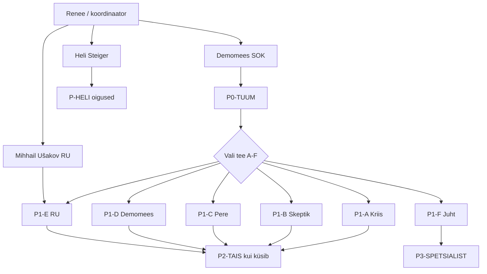

# Lisa AQ — Sidepakkide jaotus skeem

**Eesmärk:** Kellele mis pakett, mis kanal, mis saatja — ilma ülekoormata. 
**Seotud:** Lisa AP (lugejateed), Lisa AJ (levitamine), Lisa AN (RU), Lisa N (demomehed) 
**Kuupäev:** 24. juuli 2026

> **Lugeja saab:** ühe selge skeemi — kuidas materjal inimeseni jõuab. 
> **Loe seda kui:** saadad, koordineerid või valmistad trüki. 
> **Ära loe kui:** oled lihtsalt lugeja — alusta **PEEGEL_TUUM.pdf**-st.

---

## 1. Kihtide arhitektuur (K0–K3)

| Kiht | Nimi | Maht | Kellele | Fail |
|------|------|------|---------|------|
| **K0** | **TUUM** | ~30 lk | Esimene kontakt, igaüks | `PEEGEL_TUUM.pdf` |
| **K1** | **TEED** (A–F) | ~50–80 lk/tee | Vali üks tee oma olukorra jaoks | `PEEGEL_TEE_A.pdf` … `PEEGEL_TEE_F.pdf` |
| **K2** | **RAAMATUKOGU** | Täielik | Soovija, kes tahab kõike | `OPERATSIOON_PEEGEL_OPORD.pdf` |
| **K3** | **SPETSIALIST** | Nõudmisel | Juht, analüütik, partner | Lisa T, AL, AA, AF, AC, Y |

**Reegel:** Vaikimisi anna ainult **K0**. Edasi ainult kui inimene küsib või tee on selge.

---

## 2. Sidepakkide jaotus — ülevaade



---

## 3. Sidepakkide tabel

| Pakett | Kiht | Kellele | Saatja | Kanal | Sisaldab |
|--------|------|---------|--------|-------|----------|
| **P0-TUUM** | K0 | Esimene kontakt | Demomees | Käest-kätte, QR, lendleht | `PEEGEL_TUUM.pdf` + taskukaart |
| **P1-A-KRIIS** | K1 | Isa kriisis | Usaldusisik / demomees | Privaatne, 1:1 | `PEEGEL_TEE_A.pdf` + LOO taskukaardid |
| **P1-B-SKEPTIK** | K1 | Ei usu kohe | Demomees | Vestlus → link | `PEEGEL_TEE_B.pdf` |
| **P1-C-PERE** | K1 | Pere tugevdamine | Demomees / kool | Kohtumine, WhatsApp | `PEEGEL_TEE_C.pdf` |
| **P1-D-DEMO** | K1 | SOK demomees | Renee / üksuse juht | Aluste_kool | `PEEGEL_TEE_D.pdf` + Lisa AO |
| **P1-E-RU** | K1 | Venekeelne kodanik | M. Ušakov (kandidaat) | RU kanal eraldi | `PEEGEL_RU_KIHT0.pdf` + Lisa AN |
| **P1-F-JUHT** | K1 | KV, koolijuht | Renee | Ametlik e-kiri | `PEEGEL_TEE_F.pdf` |
| **P2-TAIS** | K2 | Soovija „kõik“ | Demomees + AJ kinnitus | Kontrollitud link | `OPERATSIOON_PEEGEL_OPORD.pdf` |
| **P3-SPETS** | K3 | Analüütik, partner | Renee nõudmisel | 1:1 | Lisa T, AL, AA, AF, AC, Y |
| **P-HELI** | — | Steiger / Huber | Renee | E-kiri | Lisa AM + I + vastus Helile |
| **P-OPSEC** | — | Sisering | Renee | Krüpteeritud | Lisa K, AJ, AL (mitte avalik) |

---

## 4. Teede sisud (K1)

| Tee | PDF | Failid |
|-----|-----|--------|
| **A** Kriis | `PEEGEL_TEE_A.pdf` | Lisa H → raamat F → Lisa P → Lisa AD |
| **B** Skeptik | `PEEGEL_TEE_B.pdf` | TUUM tuum → Lisa R → Lisa T (kokkuvõte) |
| **C** Pere | `PEEGEL_TEE_C.pdf` | raamat A → D → E → Lisa M |
| **D** Demomees | `PEEGEL_TEE_D.pdf` | Lisa N → I → Q → AO → Lisa X |
| **E** RU | `PEEGEL_RU_KIHT0.pdf` | kiht0-ru → Lisa AN |
| **F** Juht | `PEEGEL_TEE_F.pdf` | Lisa I → P → L |

---

## 5. Levitamise reeglid

| Reegel | Põhjus |
|--------|--------|
1. **Alusta K0-st** | Maht/fookus — ülekoormus tapab usalduse (Lisa AP) |
2. **Üks tee korraga** | Lugeja valib A–F, mitte „kõik“ |
3. **RU eraldi kanal** | Heli ei kirjasta RU raamatuid (Lisa AN) |
4. **K2 ainult küsimisel** | Lisa AJ lugemiskinnitus |
5. **K3 ainult vajadusel** | T, AL sisemised — mitte mass |
6. **Taskukaart alati kaasas** | Pocketsize igapäev (Lisa X) |
7. **Trauma enne loogikat** | Lisa P enne debatti |

---

## 6. ZIP-struktuur (`Operatsioon-Peegel-sidepakkid.zip`)

```
sidepakkid/
 P0-TUUM/
 PEEGEL_TUUM.pdf
 TASKUKAARDID_RAHAKOTT.pdf
 README.txt
 P1-TEE-A-KRIIS/
 PEEGEL_TEE_A.pdf
 LOO_TASKUKAARDID_RAHAKOTT.pdf
 P1-TEE-B-SKEPTIK/
 PEEGEL_TEE_B.pdf
 P1-TEE-C-PERE/
 PEEGEL_TEE_C.pdf
 P1-TEE-D-DEMO/
 PEEGEL_TEE_D.pdf
 P1-TEE-E-RU/
 PEEGEL_RU_KIHT0.pdf
 P1-TEE-F-JUHT/
 PEEGEL_TEE_F.pdf
 P2-TAIS/
 OPERATSIOON_PEEGEL_OPORD.pdf
 P3-SPETSIALIST/
 README-spetsialist.txt
```

Genereerimine: `python3 generate_packages.py`

---

## 7. Kanalite maatriks

| Kanal | Paketid | OPSEC |
|-------|---------|-------|
| Käest-kätte + lendleht | P0 | Madal |
| WhatsApp / Signal 1:1 | P1-A, P1-C | Keskmine |
| Aluste_kool koosolek | P1-D | Madal |
| RU kogukond (Mihhail) | P1-E | Keskmine |
| Ametlik e-kiri | P1-F, P-HELI | Kõrge |
| GitHub / ZIP link | P2 | Lisa AJ kinnitus |
| Sisering | P3, P-OPSEC | Kõrge |

---

## 8. Mõistmise signaal (inimlik, mitte operatiivne)

See operatsioon sündis tööst. Aga selle taga on ka inimene.

Kui sa loed seda materjali ja **märgad** midagi inimlikku — mitte plaanina, vaid inimesena —võid saata ühe lause:

> **„Jah ma mõistan sind Renee🤗“** 
> SMS: **56980062**

See ei ole küsimus ega kutse liituda. See on lihtsalt märk, et keegi **nägi**.

---

## 9. Järgmised sammud

| # | Tegevus | Vastutaja | Staatus |
|---|---------|-----------|--------|
| 1 | Genereeri sidepakkide ZIP | Skript | Valmis |
| 2 | 100 demomehe pilot P0 | Renee | Lisa N |
| 3 | Mihhail kinnitus P1-E | Renee | Ootel |
| 4 | Heli vastus P-HELI | Renee | Ootel |
| 5 | Tagasiside pärast 30 päeva | Demomehed | Lisa AP audit |

---

## 10. Järgmine samm (LIHTSUS)

| Sa oled | Tee kohe |
|---------|----------|
| **Lugeja** | Võta ainult **P0-TUUM** — ära anna K2 |
| **Demomees** | Anna P0 → oota küsimist → siis P1 |
| **Kinni jäid** | Lisa **AT** rida #9 |
| **Koordinaator** | Üks pakett · üks kanal · üks inimene korraga |

---

*Lisa AQ — Operatsioon „Peegel“. Uuendatud 25. juuli 2026 (Lisa AT).*
